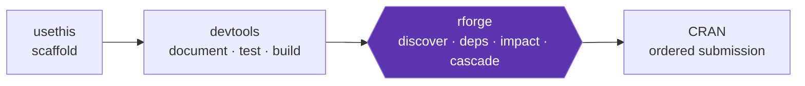

# RForge Landing Page Redesign — Proposal (2026-06-13)

> Brainstorm via the craft `docs-architect` skill. Concept-only — no files changed.
> Target: `docs/index.md` (189 lines). Working artifact (repo root, not built into site).

## The core problem

The page is **~63% changelog**: 13 "What's new in vX.Y.Z" sections (lines 57–129) bury
the value prop and calls-to-action. Entry points that should be clickable cards (the
"Where to start" personas, the headline commands) are a table and a raw bash block.

Material for MkDocs supports **grid cards**, content tabs, mermaid, and macros — all
unused on the landing page today.

---

## Direction A — "Card Funnel" (minimal-risk, highest-ROI)

Keep the IA, but (1) evict the changelog to a single current-release section, (2) convert
the personas table and the headline-commands bash block into Material **grid cards**.

**Order:** H1+badges → TL;DR → Where-to-start (6 cards) → Headline commands (4 cards) →
What rforge is/isn't → What's new in `{{ rforge.version }}` (single) → How it works →
Requirements → Installation → Principles → More docs → License.

Grid-card example (personas) and the single-changelog collapse — see the recommendation.

- Maintenance: **lowest** (drops the recurring "add a 14th What's-new section" chore).
- Mobile: **best** (cards auto-stack). Authoring fragility: **lowest**. ~1 hr.

## Direction B — "Value-First Hero + Mermaid Mental Model" (medium-risk)

Lead with the differentiator (rforge vs usethis/devtools) as a **mermaid lifecycle
diagram** (`usethis → devtools → rforge → CRAN`), then funnel into cards. Best for
first-time-visitor conversion; the diagram answers "why not just devtools?" in one glance.

- Maintenance: low-med (one static diagram). Mobile: good (test mermaid at 360px; prefer
  `flowchart TB`). ~2 hrs.

## Direction C — "Tabbed Dashboard" (higher-risk)

`[Get started] [Daily commands] [What's new]` content tabs as the organizing primitive.
Most dense, but tabs hide content from Ctrl-F / SEO, and grid-cards-inside-tabs is the
most fragile authoring pattern. ~2–3 hrs. **Not recommended.**

---

## Comparison

| | A — Card Funnel | B — Hero + Mermaid | C — Tabbed |
|---|---|---|---|
| Fixes changelog bloat | ✅ | ✅ | ✅ |
| Newcomer "what is this" | good | **best** | good |
| Returning "what's new" | good | ok | ok (1 click) |
| Maintenance | **lowest** | low-med | medium |
| Mobile | **best** | good (test mermaid) | mixed (Ctrl-F gap) |
| Fragility | **lowest** | low | highest |
| Effort | ~1 hr | ~2 hrs | ~2–3 hrs |

---

## Recommendation: **A+** (Direction A, with B's mermaid diagram grafted in)

A solves the stated problem with the smallest, least-fragile diff and removes a recurring
drift source. B's uniquely strong idea — the mermaid lifecycle diagram — grafts in cheaply
as the page's best "why rforge?" visual.

### Implementation checklist (ordered)

1. **Delete** the 12 older "What's new" sections, keep only
   `## What's new in {{ rforge.version }}` (current release bullets + CHANGELOG link).
2. **Convert "Where to start"** table → 6-card `<div class="grid cards" markdown>` block
   (personas; keep `{{ rforge.command_count }}` in the Refcard card).
3. **Convert "The 3 headline commands"** bash block → 4-card grid with the **speed
   annotation as the card headline** (`<10s`, `~30s`, per-pkg, 2–5 min).
4. **Add the mermaid lifecycle diagram** (`usethis → devtools → **rforge** → CRAN`) at the
   top of "What rforge is — and isn't". Use `flowchart LR`; fall back to `TB` if it
   overflows at 360px.
5. **Reorder** per Direction A.
6. **Verify renders:** `mkdocs serve` — grid cards render as cards (needs `md_in_html` +
   blank line after `markdown>`), mermaid renders, macros interpolate, scannable at 360px.
7. **Grep guard:** `grep -c "What's new in v" docs/index.md` must return **1**; record in
   doc-conventions memory that future releases append to `CHANGELOG.md`, not `index.md`.

### Card-block reference snippets

```markdown
<div class="grid cards" markdown>

-   :material-rocket-launch: **Just want it working**

    ---
    3-minute install + first command.

    [:octicons-arrow-right-24: Quick Start](QUICK-START.md)

-   :material-card-text: **Looking up command syntax**

    ---
    All {{ rforge.command_count }} commands, one page.

    [:octicons-arrow-right-24: Reference Card](REFCARD.md)

</div>
```

```markdown
<div class="grid cards" markdown>

-   :material-flash: **`/rforge:quick`** · <10s

    ---
    Ultra-fast snapshot. Run before every commit.

-   :material-magnify-scan: **`/rforge:analyze "<change>"`** · ~30s

    ---
    Impact + recommendations after a change.

</div>
```


