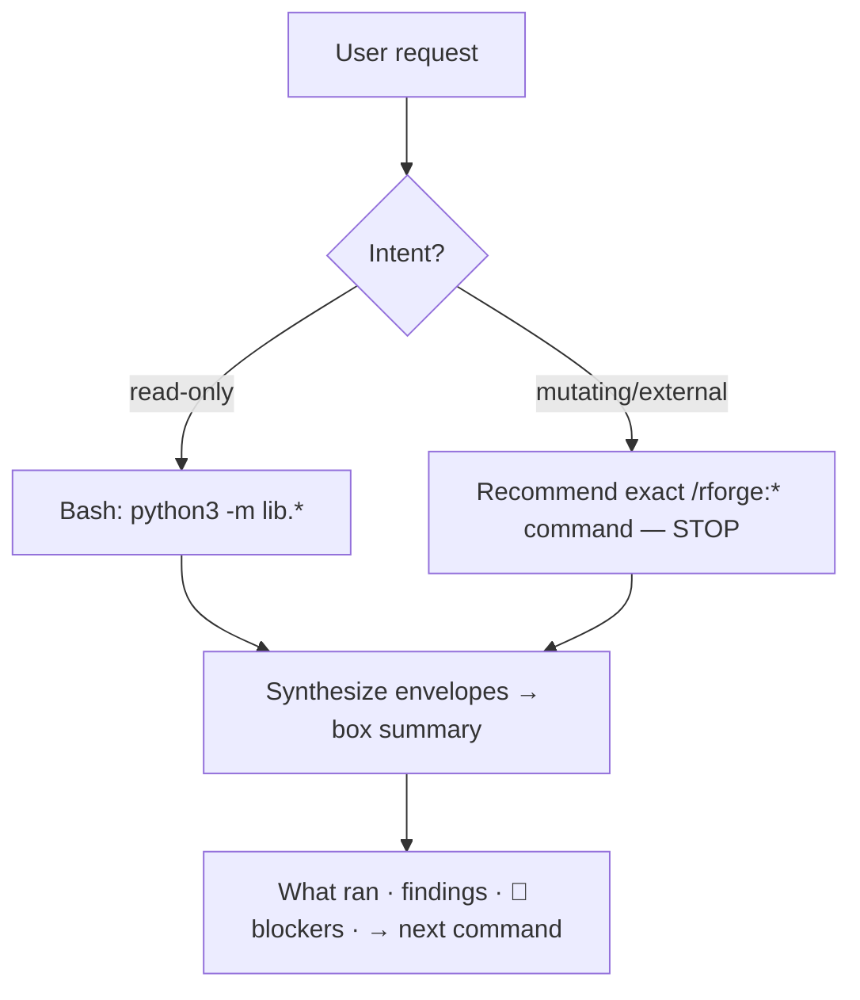

# SPEC: Phase 4 — orchestrator rewrite (lib-envelope delegation)

- **Status:** Draft — awaiting user review  <!-- Draft → In Progress → Shipped (vX.Y.Z) | Abandoned -->
- **Date:** 2026-06-12  <!-- creation date, not ship date -->
- **Target version:** v2.9.0
- **Author:** brainstormed with Claude (deep brainstorm, `/workflow:brainstorm -d -s`)
- **Related:** [SPEC-phase3-namespacing-2026-05-11.md](SPEC-phase3-namespacing-2026-05-11.md),
  [SPEC-mcp-absorb-2026-05-10.md](SPEC-mcp-absorb-2026-05-10.md),
  `agents/orchestrator.md`, `lib/rcmd.py`, `lib/discovery.py`, `lib/deps.py`,
  `lib/status.py`, `lib/deps_sync.py`, `lib/cranlint.py`, `lib/runiverse.py`;
  issue #9 (rename ergonomics — "feeds Phase 4")

## Summary

Rewrite the single existing agent, `agents/orchestrator.md`, in place. The current
file is **stale**: it delegates to 13 `rforge_*` MCP tools (43 references) that were
removed when rforge-mcp was absorbed into pure-Python `lib/` modules in v1.3.0 — those
tools no longer exist. The rewrite replaces MCP delegation with **lib-envelope
delegation**: the orchestrator maps each R-package *intent* to concrete
`python3 -m lib.*` calls, runs them via Bash, and synthesizes the JSON envelopes into an
ADHD-friendly summary. This is the last craft-parity roadmap item ("Phase 4 — discovery
engine + agents"; the discovery half shipped in v2.4.0). **Surface unchanged** — still 1
agent, still 35 commands; no new agent files.

## Motivation

Two forces converge:

1. **Correctness debt.** `agents/orchestrator.md` references `rforge_quick_impact`,
   `rforge_quick_tests`, `rforge_launch_analysis`, `rforge_get_results`, and 9 other
   MCP tool names. rforge-mcp was a local-only prototype, tombstoned 2026-05-11, never
   public; its capabilities now live in `lib/` (`lib.discovery`, `lib.deps`,
   `lib.status`, `lib.rcmd`, …). An agent that names dead tools either silently fails
   or hallucinates a tool call. This is a latent bug, not a feature gap.
2. **The last parity item.** Phase 4 has been bumped from v2.2.0 forward repeatedly and
   is the only unshipped craft-parity work. craft ships an orchestrator agent
   (`orchestrator-v2`); rforge's equivalent should actually function against rforge's
   real (post-MCP) architecture.

The delegation crux: a Claude Code subagent cannot invoke `/rforge:*` slash commands
(those are user-facing); it acts through its **tools** (Bash, Read). So "delegate to
`/rforge:impact`" must resolve to a real mechanism. The brainstorm evaluated three
(lib-envelope / command-file-follow / prompt-routing-only) and chose **lib-envelope
delegation** — the only option that is both honest about the post-MCP architecture and
does real work, while reusing the exact tested `lib/` layer the commands already use.

## Goals

- Remove **all** `rforge_*` MCP references from `agents/orchestrator.md` (target: 0).
- Define an explicit **intent → lib-call** mapping table as the agent's single source of
  delegation recipes.
- Auto-run only **read-only/analysis** lib calls; **recommend-only** (never auto-execute)
  any intent that mutates files or touches the outside world.
- Synthesize envelopes into a box summary: what ran, key findings, 🔴 blockers,
  → recommended next command.
- Lock the regression out with a `tests/test-all.sh` gate that fails if `rforge_` ever
  reappears in an agent file.
- Keep agent/command surface counts unchanged (1 agent, 35 commands).

## Non-goals

- **No new agent files.** Single domain orchestrator (decided in brainstorm). A
  multi-agent split (cran-shepherd / ecosystem-auditor / impact-analyst) is explicitly
  deferred — revisit only if real usage shows the single orchestrator is overloaded.
- **No command-file-follow or prompt-only delegation** (rejected approaches B and C).
- **No auto-execution of mutating/external commands** — see Safety boundary. rforge's
  "never auto-submit" principle (from `r:submit`) extends to the agent.
- **No resolution of issue #9's naming decision** — this spec only records how the agent
  layer *interacts* with `quick`/`thorough` (see Open questions). The rename decision
  stays in #9.
- **No new `lib/` modules.** The rewrite consumes existing envelopes only.

## Scope

### In scope (decided)

Intent taxonomy and the lib calls each intent auto-runs:

| Intent | Triggers (examples) | Auto-runs (read-only) | Synthesis |
|--------|--------------------|----------------------|-----------|
| **CODE_CHANGE** | "update/refactor/modify X" | `lib.discovery`, `lib.deps`, `lib.rcmd --kind test` | impacted pkgs + test status |
| **NEW_FUNCTION** | "add/implement function" | `lib.discovery`, `lib.rcmd --kind document` | structure + roxygen readiness |
| **BUG_FIX** | "fix/broken/error/failing" | `lib.rcmd --kind test`, `lib.deps` | failing tests + blast radius |
| **DEPS_AUDIT** | "dependencies/imports/DESCRIPTION" | `lib.deps_sync` (dry-run), `lib.deps` | missing / misclassified / unused |
| **CRAN_READINESS** | "cran-ready?/prep for CRAN" | `lib.rcmd --kind cran-prep`, `lib.cranlint`, `lib.runiverse` (advisory) | gate status; **stops at handoff** |
| **ECOSYSTEM_HEALTH** | "status/health/overview" | `lib.status`, `lib.discovery`, `lib.deps` | rollup dashboard |

All `--kind` values above are real `lib.rcmd` choices (verified against
`python3 -m lib.rcmd --help`: `load,document,test,check,coverage,build,install,site,cycle,lint,spell,urlcheck,style,winbuilder,rhub,revdep,goodpractice,cran-prep`).

### Out of scope (YAGNI / deferred)

- **Recommend-only intents** are *named* but never executed (Safety boundary). The agent
  prints the exact command and stops.
- Multi-agent decomposition → deferred (Non-goals).
- Issue #20 (`manifest_order`), #26 (`r:s7-review`) → separate items, separate sessions.
- A `quick`/`thorough` rename → stays in issue #9.

## Architecture

Single file rewrite: `agents/orchestrator.md` (currently 14 KB, ~43 MCP refs).

Structure of the rewritten agent prompt:

1. **Role** — domain orchestrator for R-package ecosystems; acts via Bash + Read only.
2. **Intent recognition** — the table above (triggers → intent).
3. **Delegation recipes** — for each intent, the literal `python3 -m lib.*` invocations,
   run from the package/ecosystem root. `lib/` is a package: invoke as
   `python3 -m lib.<module>` (never `python3 lib/<module>.py`) per the lib convention.
4. **Safety gate** — classify the resolved actions; auto-run read-only, recommend-only
   the rest.
5. **Synthesis** — parse each JSON envelope's `status`/`blockers`/`hints`; render the box.

No code changes to `lib/` — the agent is a consumer of existing CLIs. `lib.ghrelease` has
no CLI entrypoint (used internally by `r:submit`); the agent never calls it directly and
routes CRAN/GitHub-release work to the recommend-only path.

## Dependencies

- **No new dependencies.** Python 3 stdlib + existing `lib/` modules.
- `lib.rcmd` engines (R-side: `rcmdcheck`/`testthat`/`roxygen2`/…) are already guarded by
  `lib.rcmd` itself; the agent inherits whatever degrade behavior `lib.rcmd` emits when an
  engine is absent (warn envelope, never raise). The agent must surface, not swallow, a
  `warn`/`error` envelope.

## Error handling

- A lib call that returns a non-`ok` envelope (`warn`/`error`) is reported verbatim in the
  synthesis under 🔴 blockers — the agent never claims success it didn't get.
- A lib call that fails to run (non-zero exit, no JSON) is reported as a tool failure with
  the command shown, so the user can reproduce it. The agent does not retry blindly.
- If intent is ambiguous, the agent states its best-guess intent and the recipe it will
  run **before** running, so a wrong guess is visible.

## Testing

Both gates must pass: `python3 -m pytest tests/` and `bash tests/test-all.sh`.

New `tests/test-all.sh` checks (the agent is prose, so checks are structural):

1. **MCP-reference regression guard (P0):** `grep -L 'rforge_' agents/*.md` — fail if any
   agent file contains the string `rforge_` (the exact bug this spec fixes; locked out
   permanently).
2. **Valid agent frontmatter:** `agents/orchestrator.md` has `name:` and `description:`.
3. **No phantom engines:** every `--kind <x>` named in `agents/orchestrator.md` is in
   `lib.rcmd`'s actual `--kind` choices (parse `lib/rcmd.py` argparse choices; assert
   subset). Prevents the agent from drifting to a non-existent engine.

No new pytest cases expected (no `lib/` code change); if check 3 is implemented as a tiny
Python helper, it may live as a pytest case instead of inline shell.

## Documentation impact

- `agents/orchestrator.md` — the rewrite itself.
- `CHANGELOG.md` — `[Unreleased]` → `[2.9.0]` entry.
- `.STATUS` — mark Phase 4 shipped; clear it from the roadmap/Next Action.
- `CLAUDE.md` — note the orchestrator delegates via `lib.*` (not MCP); update the
  "Current state" line and test-gate counts (test-all.sh check count + the new guards).
- Architecture doc / `docs/` page describing hooks-and-agents, if present — describe the
  intent table and safety boundary.
- No `scripts/gen_lib_reference.py` impact (no `lib/` change). No command frontmatter
  change (no command added/removed). No REFCARD command-count change.
- `version_sync.py` after bumping `package.json` to 2.9.0 (+ manual `marketplace.json`).

## Implementation order

1. **(worktree)** `git worktree add … -b feature/phase4-orchestrator dev`. Code +
   agent-file changes need a feature branch (agent `.md` is a behavioral artifact, not
   docs — treat as code).
2. Rewrite `agents/orchestrator.md`: role, intent table, lib recipes, safety gate,
   synthesis. Delete every `rforge_*` reference.
3. Add the three `tests/test-all.sh` checks (esp. the `rforge_` regression guard).
4. Run both gates green.
5. Version bump to 2.9.0 (`package.json` → `version_sync.py` → manual `marketplace.json`);
   CHANGELOG; .STATUS; CLAUDE.md.
6. PR feature → dev; then release dev → main per the standard pipeline (+ tap sync).

Steps 2–4 are code (worktree). Step 5's doc edits land with the same PR. This spec file
itself is docs-only and is committed on `dev`.

## Open questions / risks

- **Risk — duplication of orchestration logic.** Approach A re-states lib-call recipes
  that also live in command `.md` files. *Resolution:* keep the orchestrator a *thin
  intent-router* — one mapping table, no bespoke logic beyond it; the commands remain the
  authoritative per-task surface.
- **Issue #9 interaction (the folded-in note).** #9 asks whether `quick`/`thorough`
  should become `analyze:quick`/`analyze:thorough`. The orchestrator does **not** depend
  on those names — it routes by *intent*, not by command name, so it is naming-agnostic
  and does not block or pre-empt the #9 decision. If #9 later renames them, only the
  ECOSYSTEM_HEALTH recipe's *recommended next command* string changes (a one-line edit),
  not the agent's behavior. *Resolution:* Phase 4 ships independently of #9; #9 stays open.
- **Behavior change for existing users:** anyone invoking the `rforge:orchestrator` agent
  today gets dead-tool behavior; post-rewrite they get real delegation. Strictly an
  improvement; no migration needed.

## Sources

- rforge `CLAUDE.md` — lib/ package convention (`python3 -m lib.<module>`), public module
  list, "rforge-mcp is gone" section.
- `python3 -m lib.rcmd --help` — authoritative `--kind` engine list (verified 2026-06-12).
- `agents/orchestrator.md` (current) — the 43-reference / 13-tool stale surface.
- [SPEC-mcp-absorb-2026-05-10.md](SPEC-mcp-absorb-2026-05-10.md) — the v1.3.0 MCP→lib
  absorption that orphaned the orchestrator's tool references.
