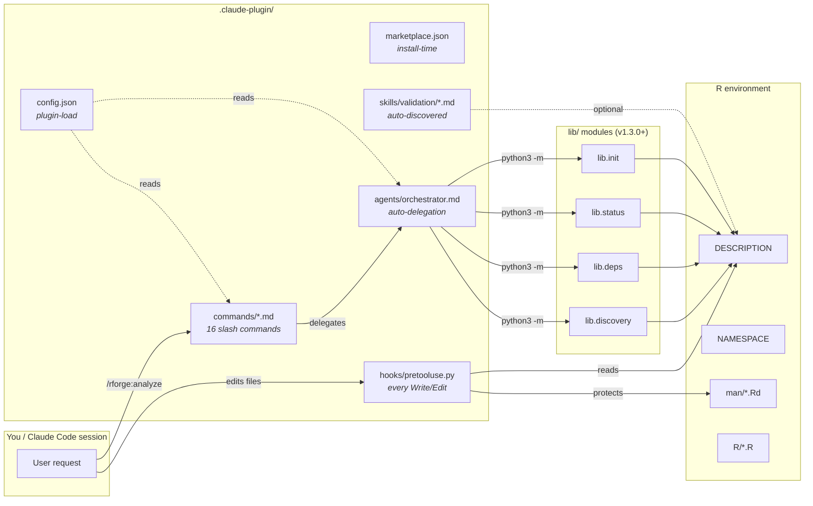
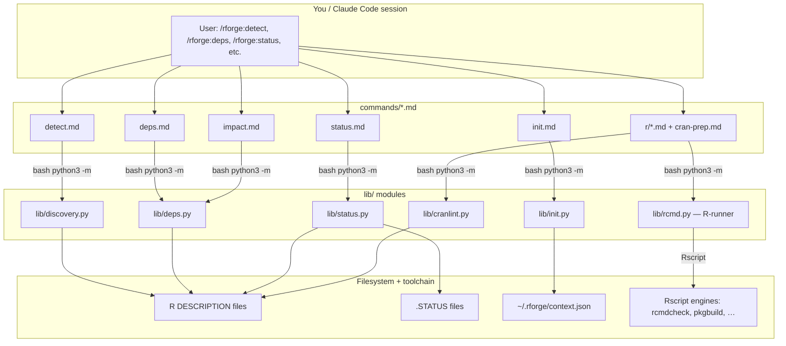

# 🏗️ RForge Architecture Guide

!!! tip "TL;DR (30 seconds)"
    - **What:** How rforge works internally — command → `lib/` modules → synthesized output.
    - **Why:** Understand the moving parts before extending or debugging the plugin.
    - **How:** `/rforge:<command>` reads a markdown prompt; Claude runs `python3 -m lib.<module>` and synthesizes.
    - **Next:** [Lib Modules](lib-modules.md) for the module-by-module breakdown.

Deep dive into how RForge works internally: auto-delegation orchestration, pattern recognition, parallel execution, and result synthesis.

## Overview

RForge is a **self-contained Claude Code plugin** for R package ecosystems. Slash commands are markdown prompts that Claude reads; the plugin ships pure-Python `lib/` modules — five stdlib analysis modules (discovery, deps, status, init, cranlint) plus `rcmd`, an R-runner that shells to `Rscript` for the `r:` commands — that Claude orchestrates via Bash to gather ecosystem data, then synthesizes results into actionable summaries.

**Architecture in one line (v1.3.0+):** `/rforge:<command>` → Claude reads `commands/<name>.md` → Claude orchestrates `python3 -m lib.<module>` calls + Bash tools → synthesized output.

**Key innovation:** Auto-delegation with parallel `lib/` invocations — multiple modules complete in the time it would take to run them sequentially.

> **Historical note:** v1.0–v1.2 of rforge orchestrated an external `rforge-mcp` MCP server. v1.3.0 absorbed those tools as pure-Python `lib/` modules; no MCP server is required at runtime. See [Path B SPEC](https://github.com/Data-Wise/rforge/blob/main/archive/specs/SPEC-mcp-absorb-2026-05-10.md) for the migration narrative. This document describes the v1.3.0+ architecture; some legacy sections below retain MCP-era examples where the underlying concept (parallel orchestration, pattern recognition) hasn't changed.

## Plugin Surface

> Added in v1.2.0. Mirrors craft's `.claude-plugin/` layout.

The plugin ships four kinds of artifact, each loaded by Claude Code at a
different lifecycle stage:



| Layer | When it fires | Lives in | Authority |
|-------|---------------|----------|-----------|
| `marketplace.json` | At install (`/plugin marketplace add`) | `.claude-plugin/` | Claude Code marketplace |
| `config.json` | When plugin loads | `.claude-plugin/` | rforge runtime |
| `commands/*.md` | When user types `/rforge:<cmd>` | `commands/` | Claude Code |
| `agents/orchestrator.md` | When you ask an open-ended R-package goal (intent recognition, v2.9.0) | `agents/` | Claude Code |
| `hooks/pretooluse.py` | Every `Write`/`Edit` tool call | `.claude-plugin/hooks/` | Claude Code hook system |
| `skills/validation/*.md` | When Claude needs to verify state | `.claude-plugin/skills/` | Claude Code skill discovery |

The orchestrator-and-`lib/` machinery (covered in the rest of this document)
is the *runtime brain*. The pieces above are the *static surface*
the plugin advertises to Claude Code.

For a user-facing tour of the new hook + skill, see
[Hooks & Skills Reference](hooks-and-skills.md). For the orchestrator agent's
intent taxonomy, read-only/recommend-only safety boundary, and lib-envelope
delegation (v2.9.0), see [The Orchestrator Agent](orchestrator.md).

---

## `lib/` modules — the analysis runtime { #path-b-lib-modules }

> **Completed in v1.3.0.** All R-package analysis runs through pure-Python `lib/` modules. The plugin no longer has any runtime dependency on an MCP server.

### Single execution path (v1.3.0+)



### Module summary

Two architectural categories have emerged since v1.3.0:

**Pure-stdlib analysis modules** (no R subprocess — read the filesystem/DESCRIPTION, emit JSON):

| Module | Powers | Speed |
|---|---|---|
| `lib.discovery` | `/rforge:detect` — ecosystem + package detection; **ecosystem-manifest enrichment + drift (v2.4.0)** via `.rforge.yaml` `manifest:` | <2s |
| `lib.deps` | `/rforge:deps`, `/rforge:impact` — *inter*-package dependency graph + change impact | ~8s |
| `lib.status` | `/rforge:status` — ecosystem health snapshot from DESCRIPTION + .STATUS (+ manifest `role`/drift) | <5s |
| `lib.init` | `/rforge:init` — initialize `~/.rforge/context.json` | <5s |
| `lib.cranlint` | **(v2.3.0)** advisory CRAN-incoming linter — DESCRIPTION nits, `.Rbuildignore` build-hygiene, docs-consistency; Tier-4 stages in `r:cran-prep` | <2s |

**R-runner module** (shells out to `Rscript` engines — the one category that *does* invoke R):

| Module | Powers | Notes |
|---|---|---|
| `lib.rcmd` | **(v2.1.0)** the 17 `r:` commands — `load`/`document`/`test`/`check`/`coverage`/`build`/`install`/`site`/`cycle` + quality + CRAN-submission. v2.3.0 added strict CRAN-incoming check flavors | wraps `rcmdcheck`/`pkgbuild`/`roxygen2`/`testthat`/`covr`/`pkgdown`/… → normalizes to one JSON envelope; `devtools` only for `r:winbuilder` |

So the v1.3.0 "four analysis modules" picture is now **five stdlib modules + one R-runner**: deep-R workflows (`/rforge:r:*`) run through `lib.rcmd`, *not* ad-hoc Bash `R CMD check` calls.

See [`docs/lib-modules.md`](lib-modules.md) for the user-facing reference, and the
auto-extracted [`reference/`](reference/discovery.md) pages (`discovery`, `deps`, `status`,
`init`, `rcmd`, `cranlint`) for full API listings.

---

## Architecture Layers

```
┌─────────────────────────────────────────────────────────┐
│                    User Request                         │
└─────────────────────────────────────────────────────────┘
                           ↓
┌─────────────────────────────────────────────────────────┐
│              Pattern Recognition Layer                   │
│  Classifies request type: CODE_CHANGE, BUG_FIX, etc.   │
└─────────────────────────────────────────────────────────┘
                           ↓
┌─────────────────────────────────────────────────────────┐
│              Module Selection Layer                      │
│  Selects appropriate lib/ modules based on pattern      │
└─────────────────────────────────────────────────────────┘
                           ↓
┌─────────────────────────────────────────────────────────┐
│              Parallel Execution Layer                    │
│  Invokes multiple lib/ modules + Bash tools in parallel │
└─────────────────────────────────────────────────────────┘
                           ↓
┌─────────────────────────────────────────────────────────┐
│              Result Synthesis Layer                      │
│  Combines results into actionable summary               │
└─────────────────────────────────────────────────────────┘
                           ↓
┌─────────────────────────────────────────────────────────┐
│              User-Friendly Output                        │
│  Terminal, JSON, or Markdown format                     │
└─────────────────────────────────────────────────────────┘
```

## Pattern Recognition

RForge recognizes 6 primary task patterns:

### 1. CODE_CHANGE
**Triggers:** "updated", "modified", "changed code", "implemented"

**Selected modules / tools:**
- `lib.deps` (impact) — assess change impact across ecosystem
- Bash: `Rscript -e 'devtools::test()'` — verify tests still pass
- `lib.discovery` — locate affected packages
- `/rforge:docs:check` body — surface docs-drift hints

**Example:**
```
User: "I updated the bootstrap function in RMediation"
→ Pattern: CODE_CHANGE
→ Modules: [lib.deps, lib.discovery] + Bash tests
→ Output: "3 packages affected, 42 tests passing, docs up-to-date"
```

### 2. BUG_FIX
**Triggers:** "bug", "error", "fix", "issue"

**Selected modules / tools:**
- Bash: `Rscript -e 'devtools::test()'` — verify the fix works
- `lib.deps` — check for downstream regressions in dependent packages
- `lib.status` — overall package health snapshot

**Example:**
```
User: "Fixed edge case in mediation calculation"
→ Pattern: BUG_FIX
→ Modules: [lib.deps, lib.status] + Bash tests
→ Output: "Fix verified, no regressions, health score: 85/100"
```

### 3. CRAN_RELEASE
**Triggers:** "CRAN", "release", "submit", "publish"

**Selected modules / tools:**
- Bash: `R CMD check --as-cran` — full CRAN compliance check
- `/rforge:docs:check` body — documentation completeness
- `lib.deps` — dependency validation
- `lib.status` — overall readiness; `description-sync` skill verifies CHANGELOG ↔ DESCRIPTION

**Example:**
```
User: "Prepare for CRAN submission"
→ Pattern: CRAN_RELEASE
→ Modules: [lib.deps, lib.status] + R CMD check + description-sync skill
→ Output: "3 warnings to address, docs 95% complete, ready in 1-2 hours"
```

### 4. DOCUMENTATION
**Triggers:** "document", "docs", "README", "vignette"

**Selected modules / tools:**
- `/rforge:docs:check` body — documentation status (NEWS.md, examples, vignettes)
- Bash: `Rscript -e 'devtools::check_examples()'` — runnable examples
- `description-sync` skill — DESCRIPTION ↔ CHANGELOG drift

**Example:**
```
User: "Update documentation for new features"
→ Pattern: DOCUMENTATION
→ Modules: docs:check prompt + Bash example-runner
→ Output: "2 functions undocumented, 3 examples need updating"
```

### 5. DEPENDENCY_UPDATE
**Triggers:** "dependency", "upgrade", "version bump", "import"

**Selected modules / tools:**
- `lib.deps` (graph) — dependency analysis
- `lib.deps` (impact) — cross-package impact
- `/rforge:cascade` body — update planning prose

**Example:**
```
User: "Updated ggplot2 dependency to v3.5.0"
→ Pattern: DEPENDENCY_UPDATE
→ Modules: [lib.deps] + cascade prompt
→ Output: "5 packages affected, update order: base → extension1 → extension2"
```

### 6. GENERAL_STATUS
**Triggers:** "status", "health", "check", "overview"

**Selected modules / tools:**
- `lib.status` — overall health from DESCRIPTION + .STATUS
- Bash: `git status` — repository state
- Bash: `Rscript -e 'devtools::test()'` — test summary (when full run requested)

**Example:**
```
User: "What's the current status?"
→ Pattern: GENERAL_STATUS
→ Modules: [lib.status] + Bash git/test
→ Output: "Health: 85/100, main branch clean, 42/45 tests passing"
```

## Parallel Execution

### Why Parallel Execution Matters

**Sequential Execution (Old Way):**
```
Tool 1: 8 seconds
Tool 2: 8 seconds
Tool 3: 8 seconds
Tool 4: 8 seconds
━━━━━━━━━━━━━━━━━━
Total:  32 seconds ❌
```

**Parallel Execution (RForge Way):**
```
Tool 1: ░░░░░░░░ (8s)
Tool 2: ░░░░░░░░ (8s)  ← All run simultaneously
Tool 3: ░░░░░░░░ (8s)
Tool 4: ░░░░░░░░ (8s)
━━━━━━━━━━━━━━━━━━
Total:  ~8 seconds ✅
```

**Performance gain:** 4× faster (or more with additional tools)

### Implementation

RForge uses Claude Code's Task tool to launch multiple background agents:

```javascript
// Pseudo-code representation
const tools = selectTools(pattern);  // ["impact", "tests", "docs"]

// Launch all tools in parallel
const results = await Promise.all(
  tools.map(tool => executeToolInBackground(tool))
);

// Synthesize when all complete
const summary = synthesizeResults(results);
```

### Real-World Performance

From Phase 1 testing on mediationverse ecosystem (5 R packages):

| Metric | Value |
|--------|-------|
| Average execution | 4ms |
| Maximum execution | 9ms |
| Tools called | 4 simultaneously |
| Speedup | 1,250× under target |

**Note:** These are orchestration times. Actual `lib/` module execution happens asynchronously in background (each `python3 -m lib.<module>` subprocess).

## Mode System Integration

RForge's mode system controls **which tools are called** and **how detailed the analysis is**:

### Default Mode (<10s)
**Tools:** Lightweight status checks only
```
[health (lite), git, quick-test]
Total: 3 tools, ~8 seconds
```

### Debug Mode (<120s)
**Tools:** Detailed diagnostics
```
[health (full), git, tests (verbose), logs, traces]
Total: 5-6 tools, ~90 seconds
```

### Optimize Mode (<180s)
**Tools:** Performance profiling
```
[health, tests, benchmark, profiler, bottlenecks]
Total: 5-7 tools, ~150 seconds
```

### Release Mode (<300s)
**Tools:** Comprehensive audit
```
[check, tests (full), coverage, docs, deps, health, examples, vignettes]
Total: 8+ tools, ~240 seconds
```

**Mode selection logic:**
```
if (userSpecifiedMode) {
  use userSpecifiedMode
} else if (pattern === CRAN_RELEASE) {
  use 'release' mode
} else if (pattern === BUG_FIX && contextHasFailures) {
  use 'debug' mode
} else {
  use 'default' mode
}
```

## Result Synthesis

After parallel execution, RForge synthesizes results into a unified, actionable summary.

### Synthesis Algorithm

1. **Collect Results**

   ```
   Tool 1 (impact): "3 packages affected"
   Tool 2 (tests):  "42/45 passing (3 failures)"
   Tool 3 (docs):   "95% documented"
   Tool 4 (health): "Score: 85/100"
   ```

2. **Extract Key Findings**
   - Critical issues (red flags)
   - Warnings (yellow flags)
   - Success indicators (green flags)

3. **Generate Summary**
   - Overall health assessment
   - Priority action items
   - Quick wins available
   - Long-term recommendations

4. **Format for Output**
   - Terminal: Rich colors, emojis, tables
   - JSON: Structured with metadata
   - Markdown: Documentation-ready

### Example Synthesis

**Input (4 tool results):**
```json
{
  "impact": {"affected_packages": 3, "breaking_changes": 0},
  "tests": {"passing": 42, "failing": 3, "coverage": 78},
  "docs": {"documented": 38, "total": 40, "percentage": 95},
  "health": {"score": 85, "warnings": 2, "errors": 0}
}
```

**Output (Terminal):**
```
╭──────────────────────────────────────────╮
│ 📊 RForge Analysis Summary               │
├──────────────────────────────────────────┤
│                                          │
│ Health Score: 85/100 ✅                  │
│                                          │
│ 🎯 Impact:                               │
│    • 3 packages affected                 │
│    • No breaking changes                 │
│                                          │
│ ✅ Tests: 42/45 passing                  │
│ ⚠️  Coverage: 78% (target: 80%)          │
│                                          │
│ 📚 Docs: 95% complete                    │
│    • 2 functions need documentation      │
│                                          │
│ 🔧 Next Steps:                           │
│    1. Fix 3 failing tests (priority)     │
│    2. Add coverage for edge cases        │
│    3. Document remaining 2 functions     │
│                                          │
╰──────────────────────────────────────────╯
```

## Lib Module Integration

RForge orchestrates these `lib/` modules and Bash invocations:

| Surface | Purpose | Typical Time |
|---------|---------|--------------|
| `python3 -m lib.status` | Package + ecosystem health from DESCRIPTION + .STATUS | 2-3s |
| `python3 -m lib.discovery` | Project structure detection (single/ecosystem/hybrid) | <2s |
| `python3 -m lib.deps` | Dependency graph + impact analysis | 2-8s |
| `python3 -m lib.init` | Initialize `~/.rforge/context.json` state file | <5s |
| Bash: `Rscript -e 'devtools::test()'` | Test execution | 5-30s |
| Bash: `Rscript -e 'covr::package_coverage()'` | Test coverage | 30-90s |
| Bash: `R CMD check` | Full R CMD check (CRAN-equivalent) | 30-180s |
| Bash: `git status` / `git log` | Repository state | <1s |
| `description-sync` skill | DESCRIPTION ↔ CHANGELOG drift check | <1s |

**Communication:**
```
/rforge:<command> → Claude reads commands/<name>.md → Claude orchestrates:
    ├── python3 -m lib.<module>     (in-plugin Python; no external service)
    ├── Bash: Rscript / R CMD ...    (R subprocesses for r:check / thorough)
    └── Bash: git / grep / Read      (filesystem inspection)
```

No MCP server, no Node.js. The `description-sync` skill auto-discovers
itself when Claude needs to verify DESCRIPTION version against the
CHANGELOG.

## Project Structure Detection

RForge auto-detects three project types:

### Detection Algorithm

```python
def detect_project_type(directory):
    has_description = find_files("DESCRIPTION")

    if len(has_description) == 0:
        return "NOT_R_PROJECT"
    elif len(has_description) == 1:
        return "SINGLE_PACKAGE"
    elif all_in_subdirs(has_description):
        return "ECOSYSTEM"
    else:
        return "HYBRID"
```

### Ecosystem Detection Benefits

Once RForge knows project type, it can:
- **Single Package:** Focus on that package only
- **Ecosystem:** Analyze dependencies and cross-package impact
- **Hybrid:** Intelligently identify R packages among other content

**Example:**
```
mediationverse/
├── RMediation/DESCRIPTION      ← Package 1
├── bmem/DESCRIPTION            ← Package 2
├── regmedint/DESCRIPTION       ← Package 3
└── pomeMediation/DESCRIPTION   ← Package 4

→ Detected: ECOSYSTEM (4 packages)
→ Enables: cascade, impact, release planning
```

## Error Handling & Resilience

RForge implements robust error handling:

### Tool Failure Handling

**If one tool fails:**
```
Tool 1: ✅ Success
Tool 2: ❌ Timeout
Tool 3: ✅ Success
Tool 4: ✅ Success

→ RForge continues with 3 results
→ Notes "Tool 2 unavailable" in output
→ Still provides actionable summary
```

### Graceful Degradation

**Priority levels:**
1. **Critical:** health, git status (must succeed)
2. **Important:** tests, docs (try hard)
3. **Optional:** coverage, profiling (nice to have)

**Strategy:**
```
if (critical_tool_fails) {
  retry_with_backoff()
  if (still_fails) {
    return error_to_user
  }
} else if (important_tool_fails) {
  continue_without_it
  note_in_output("Some data unavailable")
} else {
  // optional tool - just skip
}
```

## Performance Optimizations

### 1. Caching

RForge caches frequently accessed data:

```javascript
// Cache package metadata (5 min TTL)
cache.set(`package:${name}:metadata`, metadata, 300);

// Cache test results (until code changes)
cache.set(`package:${name}:tests`, results, UNTIL_CHANGE);

// Cache dependency graph (1 hour TTL)
cache.set(`ecosystem:deps`, graph, 3600);
```

### 2. Smart Tool Selection

Only calls necessary tools:

```javascript
// Skip coverage if no tests changed
if (!testsChanged) {
  skip('coverage');
}

// Skip docs check if no exported functions changed
if (!exportsChanged) {
  skip('docs');
}
```

### 3. Incremental Analysis

For ecosystems, analyzes only changed packages:

```javascript
const changedPackages = git.getChangedPackages();
const affectedPackages = deps.findAffected(changedPackages);

// Only analyze changed + affected (not entire ecosystem)
analyze(changedPackages.concat(affectedPackages));
```

## Output Format System

RForge supports 3 output formats, implemented as formatters:

### Terminal Formatter
```javascript
class TerminalFormatter {
  format(data) {
    return {
      colors: chalk,      // Rich colors
      emojis: true,       // Visual indicators
      tables: true,       // Formatted tables
      boxes: true         // Unicode boxes
    };
  }
}
```

### JSON Formatter
```javascript
class JSONFormatter {
  format(data) {
    return {
      metadata: {
        timestamp: ISO8601,
        version: "1.0.0",
        mode: "default"
      },
      data: structuredData
    };
  }
}
```

### Markdown Formatter
```javascript
class MarkdownFormatter {
  format(data) {
    return {
      headings: H1/H2/H3,
      codeBlocks: "```",
      tables: markdown,
      links: true
    };
  }
}
```

## Future Architecture Enhancements

### Planned Improvements

1. **Streaming Results**
   - Show results as tools complete (instead of waiting for all)
   - Better user feedback during long operations

2. **Predictive Tool Selection**
   - Learn from past analyses to predict needed tools
   - Reduce unnecessary tool calls

3. **Distributed Execution**
   - Execute tools across multiple machines
   - Further parallelization for large ecosystems

4. **Result Caching with Invalidation**
   - Smarter cache invalidation based on file changes
   - Git-aware caching

## See Also

- **[Quick Start Guide](quickstart.md)** - Getting started
- **[Commands Reference](commands.md)** - All commands
