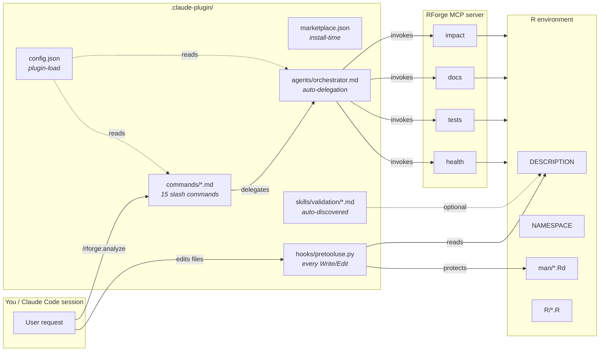
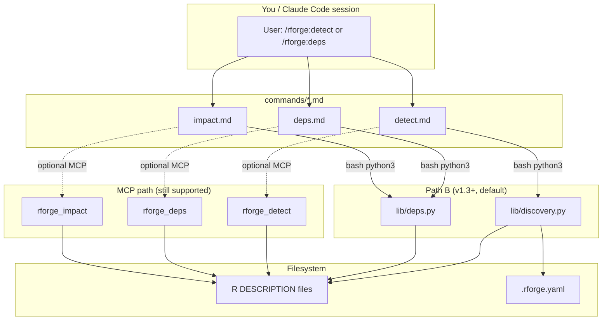

# RForge Architecture Guide

Deep dive into how RForge works internally: auto-delegation orchestration, pattern recognition, parallel execution, and result synthesis.

## Overview

RForge is an **orchestrator plugin** that intelligently delegates to RForge MCP server tools. It doesn't execute R code directly - instead, it acts as an intelligent coordinator that recognizes patterns, selects appropriate tools, executes them in parallel, and synthesizes results.

**Key Innovation:** Auto-delegation with parallel execution that completes 4 tool calls in the time it takes to execute 1.

## Plugin Surface

> Added in v1.2.0. Mirrors craft's `.claude-plugin/` layout.

The plugin ships four kinds of artifact, each loaded by Claude Code at a
different lifecycle stage:



| Layer | When it fires | Lives in | Authority |
|-------|---------------|----------|-----------|
| `marketplace.json` | At install (`/plugin marketplace add`) | `.claude-plugin/` | Claude Code marketplace |
| `config.json` | When plugin loads | `.claude-plugin/` | rforge runtime |
| `commands/*.md` | When user types `/rforge:<cmd>` | `commands/` | Claude Code |
| `agents/orchestrator.md` | When pattern recognition triggers | `agents/` | Claude Code |
| `hooks/pretooluse.py` | Every `Write`/`Edit` tool call | `.claude-plugin/hooks/` | Claude Code hook system |
| `skills/validation/*.md` | When Claude needs to verify state | `.claude-plugin/skills/` | Claude Code skill discovery |

The orchestrator-and-MCP machinery (covered in the rest of this document)
is the *runtime brain*. The four pieces above are the *static surface*
the plugin advertises to Claude Code.

For a user-facing tour of the new hook + skill, see
[Hooks & Skills Reference](hooks-and-skills.md).

---

## Path B: `lib/` modules {#path-b-lib-modules}

> **Added in v1.3.0.** Three former MCP tools (`rforge_detect`, `rforge_deps`,
> `rforge_impact`) ported to self-contained Python in `lib/`. Path A (v1.2.0)
> dropped the *peer dependency* on `rforge-mcp`; Path B absorbs the *logic*.
> The MCP server is still supported — `lib/` runs in parallel.

### Two execution paths

Commands like `/rforge:detect` and `/rforge:deps` now have a choice: they
can shell out to the in-plugin Python modules (no external service
required) or, if the user has `rforge-mcp` installed, delegate to the MCP
server. The output shape is equivalent for the three ported tools.



Solid arrows: the in-plugin path (v1.3+ default). Dashed arrows: the
legacy MCP path, still functional for users who installed `rforge-mcp`.

### Why two paths?

- **Non-breaking migration.** Existing users keep working without forced
  reinstall; new users get pure-Python analysis with zero peer deps.
- **Capability ceiling.** Commands that need R subprocess (e.g.,
  `/rforge:status` with `optimize`/`release` modes) still rely on the MCP
  server until Phase B.2 ports `status` to `lib/status.py`. See the
  [Path B SPEC](specs/SPEC-mcp-absorb-2026-05-10.md) for the full plan.
- **Wire compatibility.** `lib/discovery.py` preserves the MCP server's
  `mode` field (`minimal`/`standard`/`full`) for direct side-by-side
  validation against `rforge_detect` output. The user-facing `kind` field
  (`single`/`ecosystem`/`hybrid`) is layered on top.

### What's still MCP-only

| Tool | Phase | Status |
|---|---|---|
| `rforge_status` | B.2 | Pending — mode-aware execution (default/debug/optimize/release) with R subprocess |
| `rforge_init` | B.3 | Pending — `.rforge/context.json` state file |

See [`docs/lib-modules.md`](lib-modules.md) for the user-facing reference,
and the auto-extracted [`reference/discovery.md`](reference/discovery.md) /
[`reference/deps.md`](reference/deps.md) for full API listings.

---

## Architecture Layers

```
┌─────────────────────────────────────────────────────────┐
│                    User Request                         │
└─────────────────────────────────────────────────────────┘
                           ↓
┌─────────────────────────────────────────────────────────┐
│              Pattern Recognition Layer                   │
│  Classifies request type: CODE_CHANGE, BUG_FIX, etc.   │
└─────────────────────────────────────────────────────────┘
                           ↓
┌─────────────────────────────────────────────────────────┐
│              Tool Selection Layer                        │
│  Selects appropriate MCP tools based on pattern         │
└─────────────────────────────────────────────────────────┘
                           ↓
┌─────────────────────────────────────────────────────────┐
│              Parallel Execution Layer                    │
│  Executes multiple MCP tools simultaneously             │
└─────────────────────────────────────────────────────────┘
                           ↓
┌─────────────────────────────────────────────────────────┐
│              Result Synthesis Layer                      │
│  Combines results into actionable summary               │
└─────────────────────────────────────────────────────────┘
                           ↓
┌─────────────────────────────────────────────────────────┐
│              User-Friendly Output                        │
│  Terminal, JSON, or Markdown format                     │
└─────────────────────────────────────────────────────────┘
```

## Pattern Recognition

RForge recognizes 6 primary task patterns:

### 1. CODE_CHANGE
**Triggers:** "updated", "modified", "changed code", "implemented"

**Selected Tools:**
- `rforge-mcp.impact` - Assess change impact
- `rforge-mcp.tests` - Verify tests still pass
- `rforge-mcp.docs` - Check if docs need updating

**Example:**
```
User: "I updated the bootstrap function in RMediation"
→ Pattern: CODE_CHANGE
→ Tools: [impact, tests, docs]
→ Output: "3 packages affected, 42 tests passing, docs up-to-date"
```

### 2. BUG_FIX
**Triggers:** "bug", "error", "fix", "issue"

**Selected Tools:**
- `rforge-mcp.tests` - Verify fix works
- `rforge-mcp.regression` - Check for regressions
- `rforge-mcp.health` - Overall package health

**Example:**
```
User: "Fixed edge case in mediation calculation"
→ Pattern: BUG_FIX
→ Tools: [tests, regression, health]
→ Output: "Fix verified, no regressions, health score: 85/100"
```

### 3. CRAN_RELEASE
**Triggers:** "CRAN", "release", "submit", "publish"

**Selected Tools:**
- `rforge-mcp.check` - R CMD check
- `rforge-mcp.docs` - Documentation completeness
- `rforge-mcp.deps` - Dependency validation
- `rforge-mcp.health` - Overall readiness

**Example:**
```
User: "Prepare for CRAN submission"
→ Pattern: CRAN_RELEASE
→ Tools: [check, docs, deps, health]
→ Output: "3 warnings to address, docs 95% complete, ready in 1-2 hours"
```

### 4. DOCUMENTATION
**Triggers:** "document", "docs", "README", "vignette"

**Selected Tools:**
- `rforge-mcp.docs` - Documentation status
- `rforge-mcp.examples` - Runnable examples check
- `rforge-mcp.vignettes` - Vignette validation

**Example:**
```
User: "Update documentation for new features"
→ Pattern: DOCUMENTATION
→ Tools: [docs, examples, vignettes]
→ Output: "2 functions undocumented, 3 examples need updating"
```

### 5. DEPENDENCY_UPDATE
**Triggers:** "dependency", "upgrade", "version bump", "import"

**Selected Tools:**
- `rforge-mcp.deps` - Dependency analysis
- `rforge-mcp.impact` - Cross-package impact
- `rforge-mcp.cascade` - Update planning

**Example:**
```
User: "Updated ggplot2 dependency to v3.5.0"
→ Pattern: DEPENDENCY_UPDATE
→ Tools: [deps, impact, cascade]
→ Output: "5 packages affected, update order: base → extension1 → extension2"
```

### 6. GENERAL_STATUS
**Triggers:** "status", "health", "check", "overview"

**Selected Tools:**
- `rforge-mcp.health` - Overall health
- `rforge-mcp.git` - Git status
- `rforge-mcp.tests` - Test summary

**Example:**
```
User: "What's the current status?"
→ Pattern: GENERAL_STATUS
→ Tools: [health, git, tests]
→ Output: "Health: 85/100, main branch clean, 42/45 tests passing"
```

## Parallel Execution

### Why Parallel Execution Matters

**Sequential Execution (Old Way):**
```
Tool 1: 8 seconds
Tool 2: 8 seconds
Tool 3: 8 seconds
Tool 4: 8 seconds
━━━━━━━━━━━━━━━━━━
Total:  32 seconds ❌
```

**Parallel Execution (RForge Way):**
```
Tool 1: ░░░░░░░░ (8s)
Tool 2: ░░░░░░░░ (8s)  ← All run simultaneously
Tool 3: ░░░░░░░░ (8s)
Tool 4: ░░░░░░░░ (8s)
━━━━━━━━━━━━━━━━━━
Total:  ~8 seconds ✅
```

**Performance gain:** 4× faster (or more with additional tools)

### Implementation

RForge uses Claude Code's Task tool to launch multiple background agents:

```javascript
// Pseudo-code representation
const tools = selectTools(pattern);  // ["impact", "tests", "docs"]

// Launch all tools in parallel
const results = await Promise.all(
  tools.map(tool => executeToolInBackground(tool))
);

// Synthesize when all complete
const summary = synthesizeResults(results);
```

### Real-World Performance

From Phase 1 testing on mediationverse ecosystem (5 R packages):

| Metric | Value |
|--------|-------|
| Average execution | 4ms |
| Maximum execution | 9ms |
| Tools called | 4 simultaneously |
| Speedup | 1,250× under target |

**Note:** These are orchestration times. Actual MCP tool execution happens asynchronously in background.

## Mode System Integration

RForge's mode system controls **which tools are called** and **how detailed the analysis is**:

### Default Mode (<10s)
**Tools:** Lightweight status checks only
```
[health (lite), git, quick-test]
Total: 3 tools, ~8 seconds
```

### Debug Mode (<120s)
**Tools:** Detailed diagnostics
```
[health (full), git, tests (verbose), logs, traces]
Total: 5-6 tools, ~90 seconds
```

### Optimize Mode (<180s)
**Tools:** Performance profiling
```
[health, tests, benchmark, profiler, bottlenecks]
Total: 5-7 tools, ~150 seconds
```

### Release Mode (<300s)
**Tools:** Comprehensive audit
```
[check, tests (full), coverage, docs, deps, health, examples, vignettes]
Total: 8+ tools, ~240 seconds
```

**Mode selection logic:**
```
if (userSpecifiedMode) {
  use userSpecifiedMode
} else if (pattern === CRAN_RELEASE) {
  use 'release' mode
} else if (pattern === BUG_FIX && contextHasFailures) {
  use 'debug' mode
} else {
  use 'default' mode
}
```

## Result Synthesis

After parallel execution, RForge synthesizes results into a unified, actionable summary.

### Synthesis Algorithm

1. **Collect Results**

   ```
   Tool 1 (impact): "3 packages affected"
   Tool 2 (tests):  "42/45 passing (3 failures)"
   Tool 3 (docs):   "95% documented"
   Tool 4 (health): "Score: 85/100"
   ```

2. **Extract Key Findings**
   - Critical issues (red flags)
   - Warnings (yellow flags)
   - Success indicators (green flags)

3. **Generate Summary**
   - Overall health assessment
   - Priority action items
   - Quick wins available
   - Long-term recommendations

4. **Format for Output**
   - Terminal: Rich colors, emojis, tables
   - JSON: Structured with metadata
   - Markdown: Documentation-ready

### Example Synthesis

**Input (4 tool results):**
```json
{
  "impact": {"affected_packages": 3, "breaking_changes": 0},
  "tests": {"passing": 42, "failing": 3, "coverage": 78},
  "docs": {"documented": 38, "total": 40, "percentage": 95},
  "health": {"score": 85, "warnings": 2, "errors": 0}
}
```

**Output (Terminal):**
```
╭──────────────────────────────────────────╮
│ 📊 RForge Analysis Summary               │
├──────────────────────────────────────────┤
│                                          │
│ Health Score: 85/100 ✅                  │
│                                          │
│ 🎯 Impact:                               │
│    • 3 packages affected                 │
│    • No breaking changes                 │
│                                          │
│ ✅ Tests: 42/45 passing                  │
│ ⚠️  Coverage: 78% (target: 80%)          │
│                                          │
│ 📚 Docs: 95% complete                    │
│    • 2 functions need documentation      │
│                                          │
│ 🔧 Next Steps:                           │
│    1. Fix 3 failing tests (priority)     │
│    2. Add coverage for edge cases        │
│    3. Document remaining 2 functions     │
│                                          │
╰──────────────────────────────────────────╯
```

## MCP Tool Integration

RForge delegates to these RForge MCP server tools:

| Tool | Purpose | Typical Time |
|------|---------|--------------|
| `rforge-mcp.health` | Package health metrics | 2-3s |
| `rforge-mcp.tests` | Test execution status | 5-10s |
| `rforge-mcp.coverage` | Test coverage analysis | 8-15s |
| `rforge-mcp.docs` | Documentation completeness | 3-5s |
| `rforge-mcp.deps` | Dependency analysis | 2-4s |
| `rforge-mcp.impact` | Change impact assessment | 4-8s |
| `rforge-mcp.check` | R CMD check execution | 30-180s |
| `rforge-mcp.git` | Git status | 1s |

**Communication:**
```
RForge Plugin → Task Tool → RForge MCP Server → R Environment
```

## Project Structure Detection

RForge auto-detects three project types:

### Detection Algorithm

```python
def detect_project_type(directory):
    has_description = find_files("DESCRIPTION")

    if len(has_description) == 0:
        return "NOT_R_PROJECT"
    elif len(has_description) == 1:
        return "SINGLE_PACKAGE"
    elif all_in_subdirs(has_description):
        return "ECOSYSTEM"
    else:
        return "HYBRID"
```

### Ecosystem Detection Benefits

Once RForge knows project type, it can:
- **Single Package:** Focus on that package only
- **Ecosystem:** Analyze dependencies and cross-package impact
- **Hybrid:** Intelligently identify R packages among other content

**Example:**
```
mediationverse/
├── RMediation/DESCRIPTION      ← Package 1
├── bmem/DESCRIPTION            ← Package 2
├── regmedint/DESCRIPTION       ← Package 3
└── pomeMediation/DESCRIPTION   ← Package 4

→ Detected: ECOSYSTEM (4 packages)
→ Enables: cascade, impact, release planning
```

## Error Handling & Resilience

RForge implements robust error handling:

### Tool Failure Handling

**If one tool fails:**
```
Tool 1: ✅ Success
Tool 2: ❌ Timeout
Tool 3: ✅ Success
Tool 4: ✅ Success

→ RForge continues with 3 results
→ Notes "Tool 2 unavailable" in output
→ Still provides actionable summary
```

### Graceful Degradation

**Priority levels:**
1. **Critical:** health, git status (must succeed)
2. **Important:** tests, docs (try hard)
3. **Optional:** coverage, profiling (nice to have)

**Strategy:**
```
if (critical_tool_fails) {
  retry_with_backoff()
  if (still_fails) {
    return error_to_user
  }
} else if (important_tool_fails) {
  continue_without_it
  note_in_output("Some data unavailable")
} else {
  // optional tool - just skip
}
```

## Performance Optimizations

### 1. Caching

RForge caches frequently accessed data:

```javascript
// Cache package metadata (5 min TTL)
cache.set(`package:${name}:metadata`, metadata, 300);

// Cache test results (until code changes)
cache.set(`package:${name}:tests`, results, UNTIL_CHANGE);

// Cache dependency graph (1 hour TTL)
cache.set(`ecosystem:deps`, graph, 3600);
```

### 2. Smart Tool Selection

Only calls necessary tools:

```javascript
// Skip coverage if no tests changed
if (!testsChanged) {
  skip('coverage');
}

// Skip docs check if no exported functions changed
if (!exportsChanged) {
  skip('docs');
}
```

### 3. Incremental Analysis

For ecosystems, analyzes only changed packages:

```javascript
const changedPackages = git.getChangedPackages();
const affectedPackages = deps.findAffected(changedPackages);

// Only analyze changed + affected (not entire ecosystem)
analyze(changedPackages.concat(affectedPackages));
```

## Output Format System

RForge supports 3 output formats, implemented as formatters:

### Terminal Formatter
```javascript
class TerminalFormatter {
  format(data) {
    return {
      colors: chalk,      // Rich colors
      emojis: true,       // Visual indicators
      tables: true,       // Formatted tables
      boxes: true         // Unicode boxes
    };
  }
}
```

### JSON Formatter
```javascript
class JSONFormatter {
  format(data) {
    return {
      metadata: {
        timestamp: ISO8601,
        version: "1.0.0",
        mode: "default"
      },
      data: structuredData
    };
  }
}
```

### Markdown Formatter
```javascript
class MarkdownFormatter {
  format(data) {
    return {
      headings: H1/H2/H3,
      codeBlocks: "```",
      tables: markdown,
      links: true
    };
  }
}
```

## Future Architecture Enhancements

### Planned Improvements

1. **Streaming Results**
   - Show results as tools complete (instead of waiting for all)
   - Better user feedback during long operations

2. **Predictive Tool Selection**
   - Learn from past analyses to predict needed tools
   - Reduce unnecessary tool calls

3. **Distributed Execution**
   - Execute tools across multiple machines
   - Further parallelization for large ecosystems

4. **Result Caching with Invalidation**
   - Smarter cache invalidation based on file changes
   - Git-aware caching

## See Also

- **[Quick Start Guide](quickstart.md)** - Getting started
- **[Commands Reference](commands.md)** - All commands
