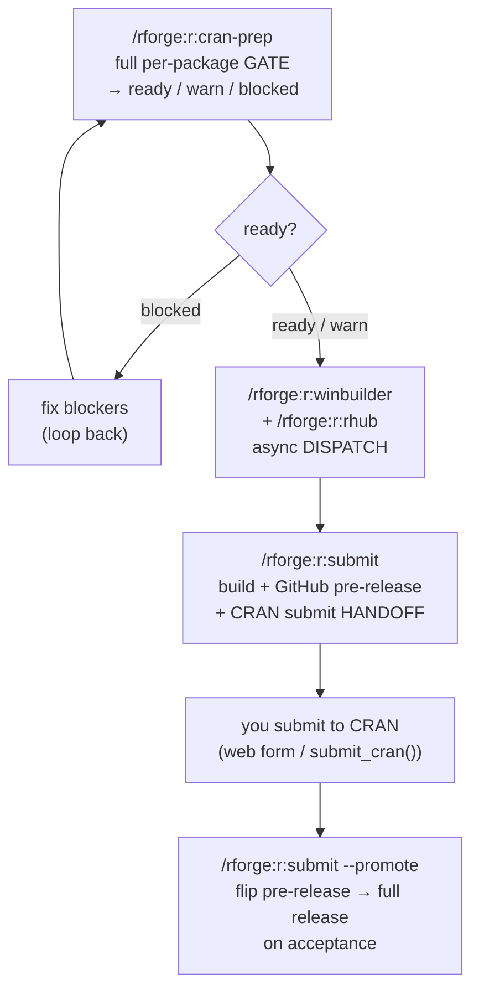

# 📦 CRAN submission commands

!!! tip "TL;DR (30 seconds)"
    - **What:** The `r:` commands that take a package from "code complete" to "live on
      CRAN" — `revdep`, `goodpractice`, `winbuilder`, `rhub`, `cran-prep`, and `submit`.
    - **Why:** Each plays a distinct role on the path to submission: a blocking **gate**, an
      advisory bundle, async multi-platform **dispatch**, the full per-package gate, and the
      submission **handoff**.
    - **The flow:** `r:cran-prep` (gate) → `r:winbuilder` / `r:rhub` (dispatch) →
      `r:submit` (handoff) → `r:submit --promote` (on acceptance).
    - **Safety:** everything that writes a file or hits the network is **recommend-only** —
      `r:submit` **never uploads to CRAN automatically**.
    - **Next:** the task walkthroughs in [CRAN submission with rforge](../tutorials/cran-submission-with-rforge.md)
      and [CRAN release prep](../tutorials/cran-release-prep.md).

> **For whom:** an R-package developer preparing a CRAN submission who wants the *complete*
> behavior and safety model of this command family — every flag, what each engine does,
> what blocks, and what only dispatches or recommends.
> **Prior knowledge:** a package that passes the [dev cycle](dev-cycle.md) (`r:cycle`), and
> an R package registered with `/rforge:init`.

---

## What this family covers

These six commands cover the **submission stretch** of the package lifecycle — after the
inner [dev cycle](dev-cycle.md) and the [quality](quality.md) passes, but before (and
during) CRAN's review. They fall into four tiers:

- **Gate** — runs locally, returns a verdict, and a hard finding **blocks** progress.
- **Advisory** — surfaces suggestions; never blocks, never changes a verdict.
- **Dispatch** — fires an *async* remote check and returns immediately with a `dispatched`
  status; results arrive out-of-band (email / Actions tab).
- **Handoff** — wraps the moment of submission; prepares artifacts, then hands the actual
  CRAN upload back to you.

| Command | Tier | Blocks? | Engine |
|---------|------|---------|--------|
| `r:revdep` | gate (reverse-dep) | yes — broken downstream | `revdepcheck` via `lib.rcmd` |
| `r:goodpractice` | advisory | no | `goodpractice` via `lib.rcmd` |
| `r:winbuilder` | dispatch (async) | no — returns `dispatched` | `devtools::check_win_{devel,release,oldrelease}` / `rhub::rhub_check` via `lib.rcmd` |
| `r:rhub` | dispatch (async) | no — returns `dispatched` | `rhub::rhub_check` via `lib.rcmd` |
| `r:cran-prep` | gate (full per-package) | yes — strict ERROR blocks `ready` | `lib.rcmd` (`cran-prep`) + `lib.cranlint` (Tier 4) |
| `r:submit` | handoff | no — **never auto-submits** | `lib.ghrelease` (+ `lib.runiverse` for `--universe`) |

All are **single-package** — they act on the path you pass (or the current directory). For
ecosystem-level submission *ordering*, use `/rforge:release` (it consumes `cran-prep`'s
verdict and sequences multi-package submissions). For the engine details behind these, see
the [`rcmd`](../reference/rcmd.md), [`cranlint`](../reference/cranlint.md),
[`ghrelease`](../reference/ghrelease.md), and [`runiverse`](../reference/runiverse.md)
references.

## The recommended order



`r:revdep` runs **inside** `r:cran-prep` by default; run it standalone only for a quick
downstream-impact check. `r:goodpractice` is an optional advisory pass you can fold in with
`r:cran-prep --goodpractice`.

---

## `r:revdep` — reverse-dependency gate

Runs `revdepcheck::revdep_check()` against your package's **CRAN downstream** packages — a
hard CRAN obligation for API-changing updates. (Distinct from rforge's *internal* ecosystem
edges in `/rforge:deps` / `/rforge:impact`.) It builds each downstream package, so it can be
slow. If `revdepcheck` is not installed it reports 🟡 plus an install hint.

| Flag | Type | Default | Effect |
|------|------|---------|--------|
| `package` | string | current dir | Package path to check |

```bash
/rforge:r:revdep
```

**Output / status:** `🟢 none broken` / `🟡 new problems` / `🔴 broken downstream`, with
`revdep.broken` and `revdep.new_problems` counts; broken packages point you at
`revdep/problems.md`. Inside `cran-prep`, broken downstream is a **blocker**.

## `r:goodpractice` — advisory best-practice bundle

Runs `goodpractice::gp()` — an **opt-in, advisory** bundle that re-runs `R CMD check`,
`lintr`, and `covr` under the hood, plus extra checks (cyclomatic complexity, TODO/FIXME
scan, DESCRIPTION completeness). It is **not** part of `r:cycle` (that already runs
check/test/document — adding goodpractice would double-run them). Use it as a pre-submission
pass, not on every save. Missing `goodpractice` → 🟡 + install hint.

| Flag | Type | Default | Effect |
|------|------|---------|--------|
| `package` | string | current dir | Package path to check |

```bash
/rforge:r:goodpractice
```

**Output / status:** `🟢 all checks passed` / `🟡 advisories`, listing each entry from
`goodpractice.checks`. Findings are **advisory** — they never change a `ready`/`warn`/`blocked`
verdict.

## `r:winbuilder` — async win-builder dispatch

Submits the package to [win-builder](https://win-builder.r-project.org/) for a remote
Windows check. **Default (`--platform all`) dispatches three flavors** (devel, release,
oldrelease) in sequence. This is an **async dispatch**: nothing returns synchronously —
results are **emailed to the DESCRIPTION Maintainer** (~30 min). A CRAN pre-submission
obligation for Windows-targeting packages; run it at least once per release, typically
after a clean `r:check --as-cran`. Missing `devtools` → 🟡 + hint.

| Flag | Type | Default | Effect |
|------|------|---------|--------|
| `package` | string | current dir | Package path to submit |
| `--platform` | string | `all` | `devel` / `release` / `oldrelease` (one flavor) — `all` (devel + release + oldrelease via devtools) — `rhub` (R-hub v2, results in Actions tab, not email) |

```bash
/rforge:r:winbuilder                        # default: all 3 win-builder flavors
/rforge:r:winbuilder --platform devel       # R-devel only
/rforge:r:winbuilder --platform release     # current R release only
/rforge:r:winbuilder --platform oldrelease  # previous R release only
/rforge:r:winbuilder --platform rhub        # R-hub v2 (GitHub Actions, not email)
```

**Output / status:** `🚀 dispatched` plus `winbuilder.note`. For `all`, each flavor
dispatches in turn — check your inbox for results emails. For `rhub`, check the
repo's GitHub Actions tab instead.

## `r:rhub` — async R-hub v2 dispatch

Runs `rhub::rhub_check()` — an **async dispatch** to R-hub v2, which triggers GitHub Actions
workflows checking the package across many platforms (Linux, macOS, Windows, multiple R
versions). Results appear in the **repo's Actions tab**, not here. Missing `rhub` → 🟡 + hint.

!!! warning "First run commits a workflow file — a GitHub remote is required"
    `rhub::rhub_setup()` (called automatically) is idempotent but writes
    `.github/workflows/rhub.yaml` to the repo on the first run. Subsequent runs skip setup.

| Flag | Type | Default | Effect |
|------|------|---------|--------|
| `package` | string | current dir | Package path to submit |

```bash
/rforge:r:rhub
```

**Output / status:** `🚀 dispatched` plus `rhub.note` and `rhub.run_url` (may be null until
the run-URL capture lands — check the Actions tab).

## `r:cran-prep` — the full per-package gate

The orchestrating gate. It sequences the dev-cycle + quality stages, then the strict check
passes, the Tier-4 advisory stages, and the reverse-dependency check, and **writes
`cran-comments.md`**. Composes with `/rforge:release` (this = single-package gate; release =
cross-package ordering).

**Default stage sequence (in order):** `document` → `lint` → `spell` → `urlcheck` → `test` →
`coverage` → `check` (`--as-cran` + NOTE classifier) → `check (noSuggests)` → `check
(suggests-only)` → `description` / `build-hygiene` / `docs-consistency` (Tier 4) → `revdep`.
It also verifies the PDF reference manual builds (Tier 1b) — `warn` (never block) if no
LaTeX is available.

!!! note "doi.org 403 handling in `urlcheck`"
    `urlcheck` classifies doi.org URLs that return HTTP 403 separately from real broken
    links. 403 responses from doi.org are transient server-side blocks (not dead URLs), so
    they downgrade `urlcheck` status from `error` → `warn` and appear in `doi_blocked_count`
    rather than `broken`. If `urlcheck` reports `🟡 warn` with only doi.org 403s, you may
    proceed to submit — no link is actually broken.

| Flag | Type | Default | Effect |
|------|------|---------|--------|
| `package` | string | current dir | Package path to gate |
| `--goodpractice` | boolean | `false` | Also run the advisory `goodpractice` bundle |
| `--multi-platform` | boolean | `false` | Dispatch win-builder + R-hub (async) |
| `--no-revdep` | boolean | `false` | Skip the reverse-dependency check |
| `--incoming` | boolean | `false` | Add the opt-in `check (incoming)` CRAN-incoming `_R_CHECK_*` pass on top of the default strict passes |

```bash
/rforge:r:cran-prep                    # full default gate, writes cran-comments.md
/rforge:r:cran-prep --no-revdep        # first submission, no dependents
/rforge:r:cran-prep --multi-platform   # also dispatch win-builder + R-hub
/rforge:r:cran-prep --incoming         # add the CRAN-incoming check pass
```

**Output / status — the `ready` verdict:**

| Verdict | Meaning |
|---------|---------|
| `🟢 ready` | All blocking stages clean — proceed to dispatch / submit |
| `🟡 warn` | Passed, but has real NOTEs, advisory findings, or new revdep problems — review first |
| `🔴 blocked` | A blocking stage errored — fix and re-run |

The result table is one row per stage with its status dot; `🔴 blocked` lists the blockers,
`--multi-platform` adds a "Dispatched (async)" section, and the footer reports
`cran-comments.md`'s path.

!!! note "Strict passes run by default; a strict ERROR blocks `ready`"
    The two strict flavor passes — `check (noSuggests)` (`_R_CHECK_DEPENDS_ONLY_=true`) and
    `check (suggests-only)` (`_R_CHECK_SUGGESTS_ONLY_=true`), each with `--run-donttest` —
    run **by default** and emulate CRAN's post-acceptance flavors. A strict-pass **ERROR
    blocks `ready`** and appends the blocker *"noSuggests/donttest check failed"*. These are
    the same passes `r:check --strict` runs.

!!! warning "Behavior change — a package green today can turn red"
    Because the strict passes are on by default, a package that reports 🟢 `ready` under
    `--as-cran` alone can turn 🔴 once `check (noSuggests)` detects a `Suggests` package used
    unconditionally. This is intended. **Fix:** move it to `Imports`, or guard with
    `requireNamespace()` in code **and** `skip_if_not_installed()` in tests.

The three **Tier 4** stages (`description`, `build-hygiene`, `docs-consistency`) are
pure-Python ([`lib.cranlint`](../reference/cranlint.md)), **advisory**, and **never block
`ready`** — they surface as `warn` only. (A `build-hygiene` finding can still block
*indirectly* once R's own "non-standard top-level files" NOTE fires in the `check` stage.)

## `r:submit` — GitHub pre-release + CRAN submit handoff

Wraps the *moment of submission*: it gates on `cran-prep`, builds the exact tarball, cuts a
GitHub **pre-release** of it (not "Latest"), and prints the CRAN submit checklist. A second
invocation (`--promote`) flips the pre-release to a full release once CRAN accepts. Backed by
pure-Python [`lib.ghrelease`](../reference/ghrelease.md) (`gh` is a soft dependency — if it
is absent or unauthed, `r:submit` prints the manual `gh` recipe instead of failing).

!!! danger "It NEVER uploads to CRAN automatically"
    The actual CRAN upload stays a manual step *you* run (`devtools::submit_cran()` or the
    [web form](https://cran.r-project.org/submit.html)). `r:submit` prepares everything up to
    that line and stops. The two channels — passive GitHub pre-release vs. active CRAN submit
    — never share a trigger.

| Flag | Type | Default | Effect |
|------|------|---------|--------|
| `package` | string | current dir | Package path to submit |
| `--promote` | boolean | `false` | Phase 2 — promote the existing pre-release to a full release (after CRAN accepts) |
| `--dry-run` | boolean | `false` | Show the tag, assets, and checklist; touch nothing on GitHub |
| `--no-verify` | boolean | `false` | With `--promote`, skip the optional cran.r-project.org version check |
| `--force` | boolean | `false` | Cut the pre-release even if `cran-prep` is not `ready` (records the override) |
| `--universe` | boolean | `false` | Also verify the package's R-universe early-access build is green (read-only; never uploads) |
| `--universe-name` | string | git remote owner | Override the auto-detected R-universe owner |

```bash
/rforge:r:submit                 # gate → build → GitHub pre-release → print CRAN checklist
/rforge:r:submit --dry-run       # show tag/assets/checklist; touch nothing
/rforge:r:submit --universe      # also report the R-universe early-access build status
/rforge:r:submit --promote       # after CRAN accepts: flip pre-release → full release
```

**Output / status:** Phase 1 prints the "Ready to submit" checklist (pre-release cut, the
CRAN submit line, confirm-via-email, and the `--promote` reminder). Phase 2 (`--promote`)
optionally verifies the version is live on CRAN, then promotes the release in place.

!!! note "Expected behavior — the gate and graceful degradation"
    `r:submit` **refuses** unless `cran-prep` reports `ready` (override with `--force`, which
    records the reasons). If `gh` is absent/unauthed it prints the manual `gh` recipe rather
    than failing. `--promote` with no matching pre-release **warns** with guidance — never a
    destructive action.

!!! tip "`--universe` — install the new version while CRAN reviews"
    `--universe` reads the public R-universe API ([`lib.runiverse`](../reference/runiverse.md))
    and reports per-platform early-access build status plus the install snippet
    (`install.packages("<pkg>", repos = "https://<owner>.r-universe.dev")`). R-universe builds
    automatically on `git push`, so this is **read-only** — it verifies, never uploads — and is
    **advisory**: offline / unregistered → a `warn` envelope that never blocks the CRAN handoff.
    See the [R-universe early-access tutorial](../tutorials/r-universe-early-access.md).

---

## Safety model

Everything in this family that **writes a file or reaches the network** is
**recommend-only** — the orchestrator never auto-runs it. Read-only analyses
(`status`/`deps`/etc.) auto-run; these do not:

| Action | Why it's recommend-only |
|--------|-------------------------|
| `r:cran-prep` | Writes `cran-comments.md` at the package root |
| `r:submit` | Cuts a GitHub release **and** hands off the CRAN upload |
| `r:winbuilder` | Network dispatch to win-builder (emails the Maintainer) |
| `r:rhub` | Network dispatch to R-hub; first run commits a workflow file |
| `r:revdep` | Builds downstream packages (slow, side-effecting) |
| `r:urlcheck` | Network requests to every package URL |

The non-negotiable invariant: **`r:submit` never uploads to CRAN automatically.** It builds
the tarball, cuts the *pre-release*, and prints the submit checklist — the actual upload is
always a manual step you run. The passive channel (a GitHub pre-release, and R-universe's
build-on-push) and the active channel (CRAN submission) never share a trigger, so "CRAN is
explicit" is structurally guaranteed.

!!! warning "Async dispatch is not verification"
    `r:winbuilder` and `r:rhub` return `🚀 dispatched` the instant they fire — that is **not**
    a pass. Results arrive out-of-band: win-builder by **email** (~30 min), R-hub in the
    repo's **Actions tab**. If the local gate is already green you need not wait for them to
    proceed, but you must read the results before relying on multi-platform coverage.

## See also

- [Commands reference](../commands.md) — terse one-line entry for every command
- [`rcmd` reference](../reference/rcmd.md) — the revdep / goodpractice / winbuilder / rhub / cran-prep engines
- [`cranlint` reference](../reference/cranlint.md) — the Tier-4 advisory stages (`description` / `build-hygiene` / `docs-consistency`)
- [`ghrelease` reference](../reference/ghrelease.md) — the `gh` pre-release + promote helpers behind `r:submit`
- [`runiverse` reference](../reference/runiverse.md) — the R-universe early-access check behind `r:submit --universe`
- [CRAN release prep](../tutorials/cran-release-prep.md) — the ecosystem-level release workflow + submission ordering
- [CRAN submission with rforge](../tutorials/cran-submission-with-rforge.md) — the single-package submission walkthrough
- [R-universe early-access](../tutorials/r-universe-early-access.md) — ship binaries to users *while* CRAN reviews
