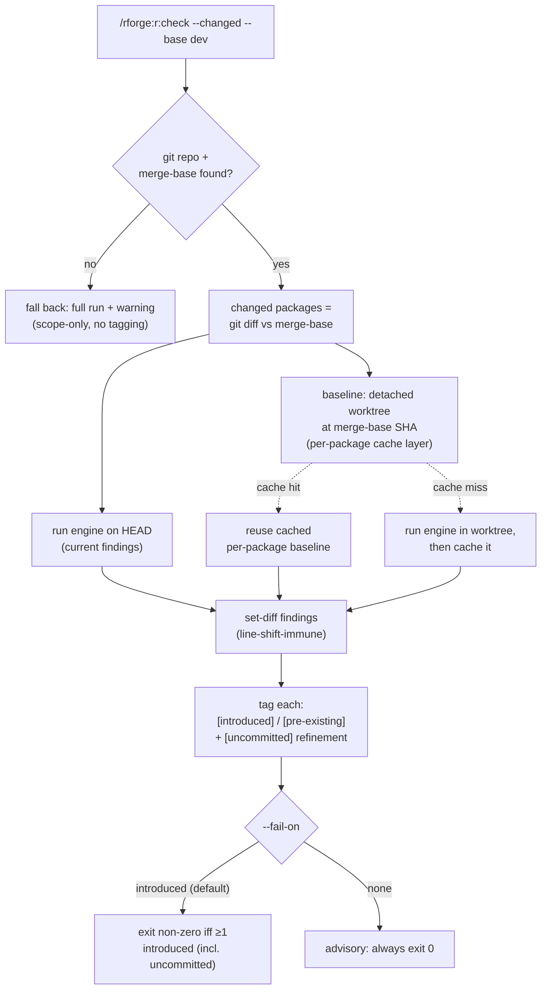

# 🔬 Diff-aware checks (`--changed`)

!!! tip "TL;DR (30 seconds)"
    - **What:** `--changed` on `r:check` / `r:test` / `r:lint` scopes the run to the
      R package(s) you touched on this branch (vs `--base`, default `dev`).
    - **Why:** A full run flags every NOTE / WARNING / lint / failure regardless of
      who caused it. Diff-aware mode separates *your* regressions from inherited debt.
    - **The 3 tags:** every finding is `[introduced]` (new on your branch),
      `[pre-existing]` (already at the fork point), or `[uncommitted]` (an introduced
      finding in a file you haven't committed yet).
    - **Caching:** the merge-base baseline is cached **per package**, so a repeat run
      re-runs only the packages it hasn't already baselined.
    - **CI:** `--fail-on introduced` (default) exits non-zero **only** on findings you
      introduced. **Next:** [R package dev cycle](dev-cycle.md).

---

## The merge-gate question it answers

You branch off `dev`, touch four files, and run a check. It reports a vignette WARNING
and three lints. Did *your* change cause them — or were they already there? A plain run
can't tell you. Diff-aware mode runs the same engine at the fork point, set-diffs the two
finding lists, and tags each one so the answer is mechanical, not a manual `git diff`.

## How it works



The baseline is a **real detached git worktree** checked out at `merge-base(HEAD, --base)`
(created under the system temp dir, always cleaned up) — not a re-run of HEAD, so the
comparison is honest. A **per-package cache layer** sits in front of it: each package's
baseline finding list is stored independently, so a repeat run only spins up a worktree
for packages it hasn't baselined yet.

## Finding tags

| Tag | Meaning |
|-----|---------|
| `[introduced]` | Present on HEAD, absent at the merge-base — **new on your branch**. |
| `[pre-existing]` | Present on **both** HEAD and the merge-base — inherited debt, not yours. |
| `[uncommitted]` | An `[introduced]` finding whose file still has **uncommitted** working-tree changes — you caused it with edits you haven't committed yet. A file-level refinement of `[introduced]` (no extra run); **counts as introduced** for `--fail-on`. |

Tagging uses multiset semantics (a finding on HEAD twice but base once → one copy each).
String findings from `R CMD check` (no file attached) can never become `[uncommitted]`;
they stay `[introduced]`. `[pre-existing]` is never re-tagged, and no finding is ever both.

!!! note "Finding identity is line-shift-immune"
    Lint findings match on `(file, message, linter)` — **not** the raw line number.
    Inserting a blank line above a pre-existing lint will **not** mis-tag it
    `[introduced]`. `R CMD check` / test findings compare by their message string.

## Caching

The merge-base baseline is the expensive half of `--changed` (it runs the same engine a
second time). To avoid re-paying it, the baseline is cached **per package**:

- **What's cached:** each changed package's baseline finding list, stored independently
  under `~/.rforge/baseline-cache/<repo-id>/<sha>-<keyhash>.json`. The HEAD run is **never**
  cached — only the baseline.
- **Cache key:** `(repo, merge-base SHA, kind, package, engine flags)`. Different package,
  `--kind`, or engine flags → different key → independent entry.
- **Cascade win:** when your changed set grows run-over-run (you touch a 4th package after
  baselining 3), the 3 cached packages are reused and only the new one runs. If the whole
  changed set is already cached, the baseline worktree is skipped entirely.
- **Self-invalidating:** the key includes the merge-base SHA. New commits on `--base` move
  the merge-base → new key → automatic miss. There's no stale-baseline trap.
- **LRU-20:** after each write, the repo's cache dir is pruned to the 20 newest entries by
  mtime. A corrupt or unreadable entry is treated as a miss (costs one extra run, never a
  crash).
- **Opt out:** `--no-cache` forces a fresh baseline run **and** skips writing one — use it
  after upgrading an R engine (e.g. `lintr`) that could change the merge-base baseline even
  though the tree is unchanged.
- **Clear it:** `python3 -m lib.changed --clear-cache` (whole cache root, or just this
  repo's dir when run from inside it).

## Flags

These four flags apply identically to `r:check`, `r:test`, and `r:lint`.

| Flag | Type | Default | Effect |
|------|------|---------|--------|
| `--changed` | boolean | `false` | Scope the run to packages changed vs the merge-base and tag every finding via a two-run baseline. |
| `--base <ref>` | string | `dev` | Comparison ref. The diff **and** the baseline run are taken against `merge-base(HEAD, <ref>)`. |
| `--fail-on introduced\|none` | string | `introduced` | Exit policy. `introduced` exits non-zero iff ≥1 introduced finding (`[uncommitted]` counts); `none` tags findings but always exits 0 (advisory). |
| `--no-cache` | boolean | `false` | Bypass the baseline cache — force a fresh merge-base baseline and skip writing it. |

## Examples

```bash
# Tag findings on changed packages vs the fork point with dev (default base)
/rforge:r:check --changed
/rforge:r:test  --changed
/rforge:r:lint  --changed

# Compare against a different base
/rforge:r:check --changed --base main
/rforge:r:lint  --changed --base origin/main

# Advisory: tag but never fail (useful for a first look at a messy branch)
/rforge:r:check --changed --fail-on none

# Force a fresh baseline (e.g. after a lintr upgrade)
/rforge:r:lint --changed --no-cache

# Clear the per-package baseline cache
python3 -m lib.changed --clear-cache
```

A tagged result reads like:

```
[pre-existing]  NOTE: vignette 'intro.Rmd' has long-running examples
[introduced]    WARNING: undocumented argument 'newparam' in foo()
[uncommitted]   object_name_linter: 'My_var' should be snake_case  (R/util.R)
```

### Wiring it into CI

```bash
# Fail the job ONLY if this branch introduced a finding (the default policy).
# Pin --base to the PR target so the merge-base is the true fork point.
/rforge:r:check --changed --base origin/main --fail-on introduced
/rforge:r:test  --changed --base origin/main --fail-on introduced
/rforge:r:lint  --changed --base origin/main --fail-on introduced
```

CI runners check out a fresh clone, so the baseline cache is cold on the first run — the
worktree baseline pays for itself only when a job re-runs against an unchanged merge-base.

!!! warning "Scope & cost"
    - **Commit for accurate `[uncommitted]` tagging.** The baseline is the committed
      merge-base; the `[uncommitted]` refinement is file-level, so all introduced findings
      in a dirty file tag `[uncommitted]`. Commit your work for the cleanest split.
    - **The first run still pays the baseline.** Tagging always costs one extra run on a
      cold cache — the cache only helps *repeat* runs at the same merge-base.
    - **Graceful fallback.** Not a git repo / no merge-base / baseline-worktree failure →
      a full run plus a warning (scope-only, no tagging). "No changes" is a clean no-op,
      not an error.

!!! note "Expected behavior in v2.13.0+"
    `--changed` runs the engine **twice** (HEAD + merge-base baseline) by design. A
    `[pre-existing]` finding is intentionally *not* failed under `--fail-on introduced` —
    that's the whole point. To see every finding regardless of tag, run the command
    without `--changed`.

## See also

- [Command reference (`commands.md`)](../commands.md) — the terse one-line flag listing
- [`changed` reference](../reference/changed.md) — the `lib.changed` engine
  (`merge_base`, `run_baseline`, `scope_check`, `tag_findings`, `cached_baseline`,
  `clear_baseline_cache`)
- [Diff-aware checks tutorial](../tutorials/diff-aware-checks.md) — the task walkthrough
- [R package dev cycle](dev-cycle.md) — the inner loop these checks gate
