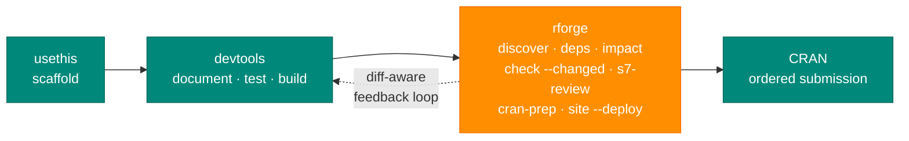
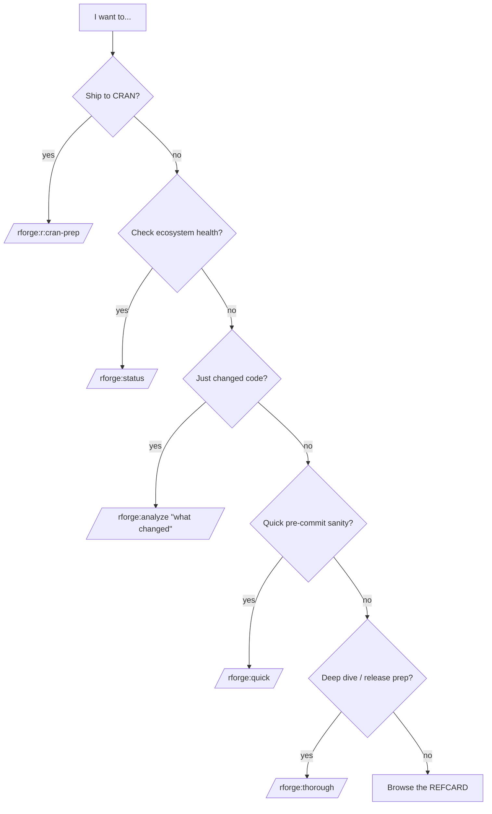

# RForge Plugin

[](https://github.com/Data-Wise/rforge/releases)
[](https://github.com/Data-Wise/rforge/blob/main/LICENSE)
[](https://github.com/Data-Wise/rforge/actions/workflows/ci.yml)

**R package ecosystem orchestrator for Claude Code — {{ rforge.command_count }} commands, R-aware hooks, validation skills.**

!!! tip "TL;DR (30 seconds)"
    - **What:** R package *ecosystem* analysis from inside Claude Code. {{ rforge.command_count }} slash commands.
    - **Why:** Fast feedback on multi-package R repos — discovery, dependencies, change impact, CRAN cascade planning.
    - **How:** `brew install data-wise/tap/rforge`, then `/rforge:analyze "<what changed>"`.
    - **Next:** [Quick Start](QUICK-START.md) (3 min) → [Where to start](#where-to-start) below.

Self-contained R package analysis for Claude Code. Since v1.3.0 the plugin is fully self-sufficient — pure-Python `lib/` modules handle discovery, dependencies, status, and init. **No MCP server, no Node.js** at runtime. The fast ecosystem commands (analysis, deps, status) are pure Python; the `r:*` dev-cycle commands and `/rforge:thorough` shell out to R via `lib/rcmd.py`.

## Where rforge fits



!!! abstract "rforge orchestrates your ecosystem and automates your build cycle"
    **usethis/devtools build one package. rforge automates the whole ecosystem.** rforge
    wraps the standard R toolchain — it doesn't replace it.

    - **`usethis` / `devtools`** scaffold, document, test, and build a *single* package.
    - **rforge** wraps those same tools at the ecosystem level: `r:cycle` runs document → test → check across any package in your workspace, `r:check --changed` scopes to what you edited, `r:cran-prep` runs the multi-pass CRAN gate, and `r:build` builds the binary.
    - rforge also answers the cross-cutting questions usethis/devtools can't: *Which packages exist here? What depends on what? If I change `medfit`, what breaks downstream? In what order do I submit to CRAN?*

## Where to start

<div class="grid cards" markdown>

-   :material-rocket-launch: **Just want it working**

    ---
    3-minute install + first command.

    [:octicons-arrow-right-24: Quick Start](QUICK-START.md)

-   :material-school: **New, have a package to try**

    ---
    Guided 10-minute walkthrough.

    [:octicons-arrow-right-24: Getting started](tutorials/getting-started.md)

-   :material-puzzle: **How it fits with devtools/usethis**

    ---
    Where rforge plugs into the lifecycle.

    [:octicons-arrow-right-24: The R lifecycle](tutorials/rforge-in-the-r-lifecycle.md)

-   :material-graph: **Managing several packages**

    ---
    Cross-package orchestration.

    [:octicons-arrow-right-24: Ecosystem](tutorials/ecosystem-orchestration.md)

-   :material-package-up: **Preparing a CRAN submission**

    ---
    The full submission gate.

    [:octicons-arrow-right-24: CRAN prep](tutorials/cran-release-prep.md)

-   :material-card-text: **Looking up command syntax**

    ---
    All {{ rforge.command_count }} commands, one page.

    [:octicons-arrow-right-24: Reference Card](REFCARD.md)

</div>

## What you'll run daily

Most work runs through these four; the rest of the {{ rforge.command_count }} commands are specialized — see the [Reference Card](REFCARD.md).

<div class="grid cards" markdown>

-   :material-flash: **`/rforge:quick`** · <10s

    ---
    Ultra-fast snapshot. Run before every commit.

-   :material-magnify-scan: **`/rforge:analyze "<change>"`** · ~30s

    ---
    Balanced analysis with impact + recommendations after a change.

-   :material-clipboard-check: **`/rforge:r:cran-prep`** · per-pkg

    ---
    The full CRAN gate; document → strict check → Tier 4 → revdep; writes `cran-comments.md`.

-   :material-layers-triple: **`/rforge:thorough`** · 2-5 min

    ---
    Cross-package ecosystem rollup + submission order.

</div>

## What's new in {{ rforge.version }}

- 🛡️ **`/rforge:r:cran-prep` tarball-check stage** — builds the source tarball, inspects it for build artifacts, then runs `R CMD check --as-cran` on the tarball. Catches CRAN/win-builder failures that a source-tree check hides. See the [CRAN submission guide](guides/cran-submission.md).
- 🪟 **`/rforge:r:winbuilder` fallback** — falls back to `devtools::check_win_*()` when the plugin's `lib/` isn't importable, instead of failing silently.
- 🌐 **`/rforge:r:site --deploy` leak guard** — deploys from a clean worktree so untracked files never leak into `gh-pages`. See the [website guide](guides/website.md).
- 🧪 **CLI dogfood + e2e tests** — new `tests/cli/` shell suites for plugin structure and fixture-based end-to-end checks.

Full release history: [CHANGELOG.md](https://github.com/Data-Wise/rforge/blob/main/CHANGELOG.md).

## How it works

```text
You invoke /rforge:<command>
    ↓
Claude reads commands/<name>.md as its prompt
    ↓
Claude orchestrates pure-Python lib/ modules + Bash tools as needed
    ├── python3 -m lib.discovery   (ecosystem + package detection)
    ├── python3 -m lib.deps        (dependency graph + change impact)
    ├── python3 -m lib.status      (health snapshot)
    └── python3 -m lib.init        (~/.rforge/context.json setup)
    ↓
PreToolUse hook diagnoses risky Write/Edit ops (blocks man/*.Rd edits, etc.)
    ↓
Validation skills run autonomously (description-sync, etc.)
    ↓
Results synthesized into an actionable summary
```

## Requirements

| Requirement | Needed for |
|---|---|
| **Claude Code CLI** | everything (this is a Claude Code plugin) |
| **Python 3.10+** on PATH | the `lib/` modules (`discovery`, `deps`, `status`, `init`) |
| **R 4.0+** (+ optional engines via `lib.rcmd`) | all `r:*` commands and `/rforge:thorough` |

## Which command should I run?



→ Not sure yet? Start with [/rforge:quick](REFCARD.md) or the [Quick Start](QUICK-START.md).

## Installation

```text
/plugin marketplace add Data-Wise/rforge
/plugin install rforge
```

Restart Claude Code so the commands register, then verify with `/help` (look for `/rforge:` entries). Homebrew and from-source options are in [Installation](installation.md).

> **Migrating from v1.2.x?** If `~/.claude/settings.json` still has an `mcpServers.rforge` entry, it's no longer needed — remove it. See the [migration guide](migration/rforge-mcp-deprecation.md).

## Design principles (ADHD-friendly)

1. **Fast feedback** — `/rforge:quick` returns in seconds, not minutes.
2. **Clear structure** — consistent, scannable output across commands.
3. **Visual progress** — you see what's happening as it happens.
4. **Always actionable** — every result ends with next steps.
5. **Interruptible & incremental** — results stream as they complete.

## More documentation

- **[Reference Card](REFCARD.md)** — all {{ rforge.command_count }} commands on one page
- **[Quick-Reference Cards](command-cards.md)** — commands grouped by purpose
- **[Commands](commands.md)** — full per-command reference
- **[Glossary](glossary.md)** — terminology explained
- **[Architecture](architecture.md)** — how the `lib/` modules fit together
- **[Hooks & Skills](hooks-and-skills.md)** — the R-aware `PreToolUse` hook
- **[Configuration](configuration.md)** — CRAN mirror, vignette engine, R version pin, CLAUDE.md budget
- **[Troubleshooting](troubleshooting.md)** — when commands misbehave
- **[Contributing](contributing.md)** — how to help improve rforge
- **[Changelog](changelog.md)** — version history

## License

MIT. Source: <https://github.com/Data-Wise/rforge>
