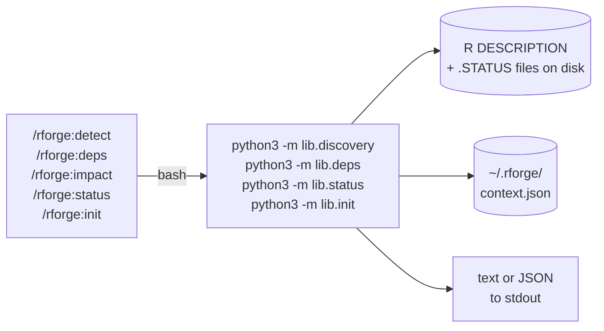

# 🐍 Lib Modules (`lib/`)

!!! tip "TL;DR (30 seconds)"
    - **What:** Pure-Python analysis modules (`discovery`, `deps`, `status`, `init`, `cranlint`) — no R, no Node — plus `rcmd` (v2.2.0), the R dev-cycle/quality/CRAN-submission runner behind the `r:` commands.
    - **Why:** No MCP server, no Node, no external deps — just `python3 -m lib.<module>`, fast and scriptable.
    - **How:** Each takes `--path` and `--format text|json`; importable as a Python API too.
    - **Next:** [Reference API docs](reference/discovery.md) for signatures, or [Architecture](architecture.md#path-b-lib-modules) for fit.

Pure-Python R ecosystem analysis, callable from plugin commands or directly
from any shell. Ships with rforge v1.3+ (no R subprocess, no MCP server, no
external dependencies beyond the stdlib).

> **Background.** As of v1.3.0 the plugin's entire analysis surface lives in
> `lib/` — four self-contained Python modules (`discovery`, `deps`, `status`,
> `init`) that replace all 7 implemented `rforge-mcp` tools. See
> [Path B SPEC](specs/SPEC-mcp-absorb-2026-05-10.md) for the migration plan
> and [reference docs](reference/discovery.md) for auto-generated API listings.

## Why this exists

The original analysis logic ran inside `rforge-mcp` (a separate Node.js server).
v1.2.0 dropped the peer dependency; v1.3.0 absorbs the logic itself. Result:
the plugin's commands no longer require any external service to enumerate
packages, build dependency graphs, reason about change impact, summarize
ecosystem health, or initialize per-user state.



## Modules

| Module | Public functions | CLI entry point |
|---|---|---|
| `lib/discovery.py` | `detect_ecosystem`, `find_r_packages`, `parse_description`, `read_description`, `parse_manifest`, `read_manifest` | `python3 -m lib.discovery --path . --format text\|json` |
| `lib/deps.py` | `build_graph`, `analyze_impact`, `get_all_dependents`, `get_update_order`, `identify_blockers` | `python3 -m lib.deps [--path .] [--format text\|json] [graph\|impact ...]` |
| `lib/rcmd.py` | `run`, `normalize`, `find_package`, `r_snippet`, `_run_cran_prep`, `_cran_prep_envelope`, `render_cran_comments` (v2.2.0 R-runner) | `python3 -m lib.rcmd --kind <kind> [--path .] [--as-cran] [--preview] [--strict] [--incoming] [--articles-only] [--devel] [--goodpractice] [--multi-platform] [--no-revdep]` |
| `lib/cranlint.py` | `lint_description`, `check_build_hygiene`, `check_planning_consistency`, `run_all` (v2.3.0 CRAN-incoming linter) | `python3 -m lib.cranlint --path . [--format text\|json]` |
| `lib/deps_sync.py` | `scan_usage`, `reconcile`, `deps_sync` (v2.5.0 — *intra*-package DESCRIPTION↔usage reconciliation; complements the *inter*-package `lib.deps`) | `python3 -m lib.deps_sync --path . [--write] [--format text\|json]` |
| `lib/ghrelease.py` | `gh_available`, `submission_tag`, `prerelease_cmd`, `promote_cmd`, `manual_recipe` (v2.6.0 — `gh release` command builders for `r:submit`; pure-Python, shells to nothing itself) | used from `commands/r/submit.md` (constructs the `gh` argv it runs) |
| `lib/runiverse.py` | `remote_owner`, `resolve_universe`, `api_url`, `install_snippet`, `fetch_status`, `summarize`, `verify` (v2.7.0 — R-universe early-access status for `r:submit --universe`; pure-stdlib, `urllib`-only, read-only — never uploads) | `python3 -m lib.runiverse --path . [--universe <owner>] [--format text\|json]` |

> **`cranlint` is a pure-stdlib analysis module** like `discovery`/`deps`/`status`/`init`
> — it never touches R. It backs the Tier 4 advisory stages of `r:cran-prep` (v2.3.0):
> `lint_description` (DESCRIPTION incoming nits — non-`Authors@R`, weak `Title`,
> `Description` prose, stale `Date`), `check_build_hygiene` (planning/dev docs that would
> ship in the tarball, each with the exact `.Rbuildignore` regex to add), and
> `check_planning_consistency` (lightweight advisory). `run_all` bundles all three into one
> envelope. These findings are advisory and never block the `ready` verdict on their own
> (though build-hygiene issues still block indirectly via the matching real R CMD check
> NOTE). See [reference/cranlint.md](reference/cranlint.md).

For the rcmd CRAN-incoming flavor flags (`--strict`, `--incoming`): `--strict` makes the
`check` kind run **both** Suggests-withholding flavor passes (`_R_CHECK_DEPENDS_ONLY_` and
`_R_CHECK_SUGGESTS_ONLY_`), each with `--run-donttest`; `--incoming` implies `--strict` and
adds the opt-in CRAN-incoming `_R_CHECK_*` bundle pass. In `cran-prep` the strict passes run
by default and a strict ERROR blocks `ready`; `--incoming` is opt-in.

> **`rcmd` differs from the analysis modules.** `discovery`/`deps`/`status`/`init`
> are pure-stdlib and never touch R. `rcmd` (v2.2.0) shells out to `Rscript`
> running lower-level engines (`rcmdcheck`/`pkgbuild`/`roxygen2`/`testthat`/
> `pkgload`/`covr`/`pkgdown`/`lintr`/`spelling`/`urlchecker`/`styler`) that emit
> JSON, which it normalizes into one envelope. It backs the 17 `r:` dev-cycle +
> quality + CRAN-submission commands and never calls `devtools` (with the exception
> of `r:winbuilder` which requires `devtools::check_win_devel()`). CRAN-submission
> kinds: `revdep`/`goodpractice`/`winbuilder`/`rhub`/`cran-prep` with three tiers:
> **gate** (revdep — blocks submission), **dispatch** (winbuilder/rhub — async,
> non-blocking), **advisory** (goodpractice — opt-in). The `dispatched` status
> is added alongside ok/warn/error for async kinds. See
> [reference/rcmd.md](reference/rcmd.md).

## `lib/discovery.py` — Ecosystem detection

### What it does

Walks a directory tree (depth ≤ 2 by default) for R `DESCRIPTION` files,
parses each into a structured record, and classifies the layout as
`single | ecosystem | hybrid`.

**Ecosystem-manifest enrichment (v2.4.0).** If the root `.rforge.yaml` declares a
`manifest:` path (relative to root), discovery reads that **ecosystem manifest** — a
curated YAML of `role`/`repo`/`cran`/`status_file` per package — and attaches the metadata
to matching packages (by name, case-insensitive). Mismatches surface as **drift**. Parsed by
a vendored YAML-subset reader (`parse_manifest`/`read_manifest`), so the module stays
stdlib-only (no PyYAML). Absent/unreadable manifest → zero behavior change.

### CLI

```bash
# Text (human-readable, with emojis + tree layout)
python3 -m lib.discovery --path . --format text

# JSON (machine-readable)
python3 -m lib.discovery --path ~/projects/r-packages/active --format json
```

### Python API

```python
from lib.discovery import detect_ecosystem

eco = detect_ecosystem(".")
print(eco.kind)           # "single" | "ecosystem" | "hybrid"
print(eco.mode)           # "minimal" | "standard" | "full" (MCP-compatible)
print([p.name for p in eco.packages])
```

### Returned `Ecosystem` dataclass

| Field | Type | Notes |
|---|---|---|
| `root` | `str` | Absolute path that was scanned |
| `packages` | `list[Package]` | One entry per `DESCRIPTION` found |
| `kind` | `"single" \| "ecosystem" \| "hybrid"` | User-facing classification |
| `mode` | `"minimal" \| "standard" \| "full"` | Preserved from `rforge-mcp` for wire compatibility |
| `config_found` | `bool` | `True` if `.rforge.yaml` exists at root |
| `config_path` | `str \| None` | Absolute path to `.rforge.yaml` when present |
| `manifest_path` | `str \| None` | Path to the ecosystem manifest, when configured + found (v2.4.0) |
| `drift` | `Drift` | `manifest_only` / `disk_only` name lists; empty when no manifest (v2.4.0) |

Each `Package` also gains an optional `manifest: ManifestEntry` (the matched curation metadata).

### `.rforge.yaml` config fields

| Field | Purpose |
|---|---|
| `kind: hybrid` | Force the `hybrid` classification (see heuristic below) |
| `manifest: <relative-path>` | Point discovery at an ecosystem manifest to enrich/drift-check against (v2.4.0) |

### Classification heuristic (strict)

- 0–1 packages → `single`
- 2+ packages, no `.rforge.yaml` declaring otherwise → `ecosystem`
- 2+ packages with `kind: hybrid` declared in `.rforge.yaml` → `hybrid`

`hybrid` is opt-in only. Filesystem heuristics (e.g., "sibling non-package
dirs exist") are intentionally NOT used — too fuzzy in practice (a stray
`docs/` directory would flip the classification).

### `Package` dataclass

| Field | Type | Notes |
|---|---|---|
| `name` | `str` | From `Package:` field |
| `version` | `str` | From `Version:` field |
| `path` | `str` | Package root (parent of DESCRIPTION) |
| `category` | `"active" \| "stable" \| "archived"` | Inferred from path (`stable/`, `cran/` → stable; `archived/`, `deprecated/` → archived) |
| `description` | `Description \| None` | Parsed contents of DESCRIPTION |

### DESCRIPTION parser notes

- Handles RFC-822-style continuation lines (indented under previous field)
- Strips version constraints: `dplyr (>= 1.0)` → `"dplyr"`
- Filters out `R` itself from dep lists (it's the runtime, not a package)
- Returns `None` (not an exception) on parse failure / missing `Package:`

## `lib/deps.py` — Dependency graph + impact

### What it does

Given an `Ecosystem`, builds the internal dependency graph (DAG over
internal packages only — external CRAN deps are filtered out), computes
topological build order, detects cycles, and analyzes the downstream blast
radius of changes.

### CLI subcommands

```bash
# Default: print the graph
python3 -m lib.deps --path . --format text
python3 -m lib.deps --path . --format text graph   # explicit

# Impact analysis (requires --package)
python3 -m lib.deps --path . --format text impact \
    --package medfit --change-type breaking

# JSON output
python3 -m lib.deps --path . --format json impact --package medfit --change-type breaking
```

`--change-type` accepts `breaking | feature | fix | internal` (default `feature`).
Optional `--affected-exports name1 name2` adds them to the recommendation list.

### Python API

```python
from lib.discovery import detect_ecosystem
from lib.deps import build_graph, analyze_impact

eco = detect_ecosystem(".")
graph = build_graph(eco)

print(graph.layers)       # [["core"], ["impl"], ["top"]]
print(graph.circular)     # [] if no cycles, else list of cycles

impact = analyze_impact(graph, "core", change_type="breaking")
print(impact.risk_level)             # "high"
print(impact.update_sequence)        # ["core", "impl", "top"]
print(impact.estimated_work)         # "2.0h"
```

### Graph contract

- **Edge convention:** `Edge(from_=importer, to=imported)`.
- **Hard edges only count for topo + cycle detection:** `imports` and
  `depends`. `suggests` and `linkingTo` are recorded as edges but don't
  block layering.
- **Layers contain leaves first** — Layer 0 = packages with no internal
  deps, Layer N = depends only on Layers 0..N−1. This is the correct
  build order.
- **External deps are filtered out** of the graph entirely. They're still
  recoverable from the `Ecosystem` (each `Package.description` has the
  full dep lists).

### Impact heuristic

| Input | Output |
|---|---|
| `breaking` change OR direct dependents > 2 | `risk_level = high` |
| Has direct dependents OR `feature` change | `risk_level = medium` |
| Otherwise (internal/fix with no dependents) | `risk_level = low` |

Work estimate (`estimated_work`): `base + 30 × |direct| + 15 × |indirect|`
minutes, where `base = 60` for breaking, `30` otherwise. Formatted as
`"X min"`, `"X.Yh"`, or `"X day"`. The estimates come straight from the
original `rforge-mcp` heuristic (preserved for side-by-side comparability).

## End-to-end example: mediationverse

Real-world layout: 5 R packages under `~/projects/r-packages/active`.

```bash
$ python3 -m lib.discovery --path ~/projects/r-packages/active --format text
🏗️  Ecosystem: /Users/.../r-packages/active
   Packages: 5 | mode: full | config: not found

   ├─ medfit 0.1.0
   ├─ mediationverse 0.0.0.9000
   ├─ medrobust 0.1.0.9000
   ├─ medsim 0.0.0.9000
   └─ probmed 0.0.0.9000

$ python3 -m lib.deps --path ~/projects/r-packages/active --format text
🔗 DEPENDENCY ANALYSIS

Packages: 5
Internal dependencies: 2

📊 BUILD ORDER (Topological Layers)
  Layer 1: medfit, medrobust, medsim
  Layer 2: mediationverse, probmed

→ DEPENDENCIES
  mediationverse → medfit
  probmed → medfit

🚧 BLOCKING PACKAGES
  • medfit blocks: mediationverse, probmed

📦 EXTERNAL DEPENDENCIES
  S7, checkmate, cli, dplyr, generics, ggplot2, methods, parallel,
  pbapply, rlang, stats, utils

$ python3 -m lib.deps --path ~/projects/r-packages/active \
    impact --package medfit --change-type breaking
📊 IMPACT: medfit (breaking)
  Direct dependents:   2
  Indirect dependents: 0
  Risk level:          high
  Estimated work:      2.0h
  ...
```

## Replacement of `rforge-mcp`

As of v1.3.0 the `lib/` modules **replace** `rforge-mcp` entirely. The MCP
server is no longer required (and is being archived). Anyone migrating from
v1.2.x can remove the `mcpServers.rforge` entry from `~/.claude/settings.json`
— see [`migration/rforge-mcp-deprecation.md`](migration/rforge-mcp-deprecation.md)
for the full migration table mapping old MCP tools to new `lib/` modules.

Field-level wire compatibility: `lib/status.py` reads/writes the same
`.STATUS` shape MCP did, and `lib/init.py` writes the same
`~/.rforge/context.json` schema MCP used — so user state migrates
transparently with no copy step.

## Testing

```bash
python3 -m pytest tests/test_lib_discovery.py tests/test_lib_deps.py tests/test_lib_status.py tests/test_lib_init.py tests/test_rcmd.py -v
```

110 cases cover DESCRIPTION edge cases, FS traversal, classification,
graph construction, cycle detection, impact heuristics, blockers,
`.STATUS` parsing + health-score math, `~/.rforge/context.json`
round-trip with idempotency, and the `rcmd` envelope/normalizer/snippets
(R subprocess mocked, so CI stays R-free). Integrated into
`tests/test-all.sh` (full plugin suite — 30 checks).

## See also

- [Reference: `discovery` API](reference/discovery.md) — auto-extracted signatures + docstrings
- [Reference: `deps` API](reference/deps.md) — auto-extracted signatures + docstrings
- [Reference: `status` API](reference/status.md) — auto-extracted signatures + docstrings
- [Reference: `init` API](reference/init.md) — auto-extracted signatures + docstrings
- [Reference: `cranlint` API](reference/cranlint.md) — auto-extracted signatures + docstrings
- [SPEC: Absorb rforge-mcp (Path B)](specs/SPEC-mcp-absorb-2026-05-10.md) — full migration plan
- [Migration: rforge-mcp deprecation](migration/rforge-mcp-deprecation.md) — old MCP tool → new lib module table
- [Architecture](architecture.md#path-b-lib-modules) — where lib/ fits in the plugin surface
