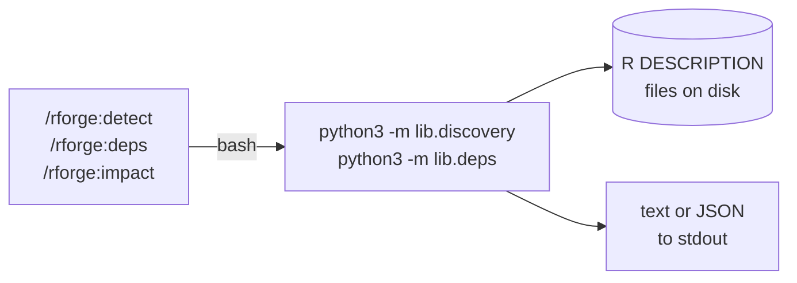

# Lib Modules (`lib/`)

Pure-Python R ecosystem analysis, callable from plugin commands or directly
from any shell. Ships with rforge v1.3+ (no R subprocess, no MCP server, no
external dependencies beyond the stdlib).

> **Background.** As of v1.3.0 the plugin's discovery + dependency analysis
> lives in `lib/` — three former MCP tools (`rforge_detect`, `rforge_deps`,
> `rforge_impact`) ported to two self-contained Python modules. See
> [Path B SPEC](specs/SPEC-mcp-absorb-2026-05-10.md) for the migration plan
> and [reference docs](reference/discovery.md) for auto-generated API listings.

## Why this exists

The original analysis logic ran inside `rforge-mcp` (a separate Node.js server).
v1.2.0 dropped the peer dependency; v1.3.0 absorbs the logic itself. Result:
the plugin's commands no longer require any external service to enumerate
packages, build dependency graphs, or reason about change impact.



## Modules

| Module | Public functions | CLI entry point |
|---|---|---|
| `lib/discovery.py` | `detect_ecosystem`, `find_r_packages`, `parse_description`, `read_description` | `python3 -m lib.discovery --path . --format text\|json` |
| `lib/deps.py` | `build_graph`, `analyze_impact`, `get_all_dependents`, `get_update_order`, `identify_blockers` | `python3 -m lib.deps [--path .] [--format text\|json] [graph\|impact ...]` |

## `lib/discovery.py` — Ecosystem detection

### What it does

Walks a directory tree (depth ≤ 2 by default) for R `DESCRIPTION` files,
parses each into a structured record, and classifies the layout as
`single | ecosystem | hybrid`.

### CLI

```bash
# Text (human-readable, with emojis + tree layout)
python3 -m lib.discovery --path . --format text

# JSON (machine-readable)
python3 -m lib.discovery --path ~/projects/r-packages/active --format json
```

### Python API

```python
from lib.discovery import detect_ecosystem

eco = detect_ecosystem(".")
print(eco.kind)           # "single" | "ecosystem" | "hybrid"
print(eco.mode)           # "minimal" | "standard" | "full" (MCP-compatible)
print([p.name for p in eco.packages])
```

### Returned `Ecosystem` dataclass

| Field | Type | Notes |
|---|---|---|
| `root` | `str` | Absolute path that was scanned |
| `packages` | `list[Package]` | One entry per `DESCRIPTION` found |
| `kind` | `"single" \| "ecosystem" \| "hybrid"` | User-facing classification |
| `mode` | `"minimal" \| "standard" \| "full"` | Preserved from `rforge-mcp` for wire compatibility |
| `config_found` | `bool` | `True` if `.rforge.yaml` exists at root |
| `config_path` | `str \| None` | Absolute path to `.rforge.yaml` when present |

### Classification heuristic (strict)

- 0–1 packages → `single`
- 2+ packages, no `.rforge.yaml` declaring otherwise → `ecosystem`
- 2+ packages with `kind: hybrid` declared in `.rforge.yaml` → `hybrid`

`hybrid` is opt-in only. Filesystem heuristics (e.g., "sibling non-package
dirs exist") are intentionally NOT used — too fuzzy in practice (a stray
`docs/` directory would flip the classification).

### `Package` dataclass

| Field | Type | Notes |
|---|---|---|
| `name` | `str` | From `Package:` field |
| `version` | `str` | From `Version:` field |
| `path` | `str` | Package root (parent of DESCRIPTION) |
| `category` | `"active" \| "stable" \| "archived"` | Inferred from path (`stable/`, `cran/` → stable; `archived/`, `deprecated/` → archived) |
| `description` | `Description \| None` | Parsed contents of DESCRIPTION |

### DESCRIPTION parser notes

- Handles RFC-822-style continuation lines (indented under previous field)
- Strips version constraints: `dplyr (>= 1.0)` → `"dplyr"`
- Filters out `R` itself from dep lists (it's the runtime, not a package)
- Returns `None` (not an exception) on parse failure / missing `Package:`

## `lib/deps.py` — Dependency graph + impact

### What it does

Given an `Ecosystem`, builds the internal dependency graph (DAG over
internal packages only — external CRAN deps are filtered out), computes
topological build order, detects cycles, and analyzes the downstream blast
radius of changes.

### CLI subcommands

```bash
# Default: print the graph
python3 -m lib.deps --path . --format text
python3 -m lib.deps --path . --format text graph   # explicit

# Impact analysis (requires --package)
python3 -m lib.deps --path . --format text impact \
    --package medfit --change-type breaking

# JSON output
python3 -m lib.deps --path . --format json impact --package medfit --change-type breaking
```

`--change-type` accepts `breaking | feature | fix | internal` (default `feature`).
Optional `--affected-exports name1 name2` adds them to the recommendation list.

### Python API

```python
from lib.discovery import detect_ecosystem
from lib.deps import build_graph, analyze_impact

eco = detect_ecosystem(".")
graph = build_graph(eco)

print(graph.layers)       # [["core"], ["impl"], ["top"]]
print(graph.circular)     # [] if no cycles, else list of cycles

impact = analyze_impact(graph, "core", change_type="breaking")
print(impact.risk_level)             # "high"
print(impact.update_sequence)        # ["core", "impl", "top"]
print(impact.estimated_work)         # "2.0h"
```

### Graph contract

- **Edge convention:** `Edge(from_=importer, to=imported)`.
- **Hard edges only count for topo + cycle detection:** `imports` and
  `depends`. `suggests` and `linkingTo` are recorded as edges but don't
  block layering.
- **Layers contain leaves first** — Layer 0 = packages with no internal
  deps, Layer N = depends only on Layers 0..N−1. This is the correct
  build order.
- **External deps are filtered out** of the graph entirely. They're still
  recoverable from the `Ecosystem` (each `Package.description` has the
  full dep lists).

### Impact heuristic

| Input | Output |
|---|---|
| `breaking` change OR direct dependents > 2 | `risk_level = high` |
| Has direct dependents OR `feature` change | `risk_level = medium` |
| Otherwise (internal/fix with no dependents) | `risk_level = low` |

Work estimate (`estimated_work`): `base + 30 × |direct| + 15 × |indirect|`
minutes, where `base = 60` for breaking, `30` otherwise. Formatted as
`"X min"`, `"X.Yh"`, or `"X day"`. The estimates come straight from the
original `rforge-mcp` heuristic (preserved for side-by-side comparability).

## End-to-end example: mediationverse

Real-world layout: 5 R packages under `~/projects/r-packages/active`.

```bash
$ python3 -m lib.discovery --path ~/projects/r-packages/active --format text
🏗️  Ecosystem: /Users/.../r-packages/active
   Packages: 5 | mode: full | config: not found

   ├─ medfit 0.1.0
   ├─ mediationverse 0.0.0.9000
   ├─ medrobust 0.1.0.9000
   ├─ medsim 0.0.0.9000
   └─ probmed 0.0.0.9000

$ python3 -m lib.deps --path ~/projects/r-packages/active --format text
🔗 DEPENDENCY ANALYSIS

Packages: 5
Internal dependencies: 2

📊 BUILD ORDER (Topological Layers)
  Layer 1: medfit, medrobust, medsim
  Layer 2: mediationverse, probmed

→ DEPENDENCIES
  mediationverse → medfit
  probmed → medfit

🚧 BLOCKING PACKAGES
  • medfit blocks: mediationverse, probmed

📦 EXTERNAL DEPENDENCIES
  S7, checkmate, cli, dplyr, generics, ggplot2, methods, parallel,
  pbapply, rlang, stats, utils

$ python3 -m lib.deps --path ~/projects/r-packages/active \
    impact --package medfit --change-type breaking
📊 IMPACT: medfit (breaking)
  Direct dependents:   2
  Indirect dependents: 0
  Risk level:          high
  Estimated work:      2.0h
  ...
```

## Coexistence with `rforge-mcp`

The `lib/` modules **do not replace** the MCP server — they sit alongside
it. Users who have `rforge-mcp` installed keep getting MCP-driven analysis;
users on the standalone path get the same analysis via `python3 lib/...`.

Both implementations should produce equivalent output for the three ported
tools (`rforge_detect`, `rforge_deps`, `rforge_impact`). Known divergences
are documented in the ORCHESTRATE file for each phase (e.g., `.Rcheck`
duplicate handling is identical in both — both scanners pick up the
shadow DESCRIPTION).

## Testing

```bash
python3 -m pytest tests/test_lib_discovery.py tests/test_lib_deps.py -v
```

32 cases cover DESCRIPTION edge cases, FS traversal, classification,
graph construction, cycle detection, impact heuristics, and blockers.
Integrated into `tests/test-all.sh` (full plugin suite — 22 checks).

## See also

- [Reference: `discovery` API](reference/discovery.md) — auto-extracted signatures + docstrings
- [Reference: `deps` API](reference/deps.md) — auto-extracted signatures + docstrings
- [SPEC: Absorb rforge-mcp (Path B)](specs/SPEC-mcp-absorb-2026-05-10.md) — full migration plan
- [Architecture](architecture.md#path-b-lib-modules) — where lib/ fits in the plugin surface
