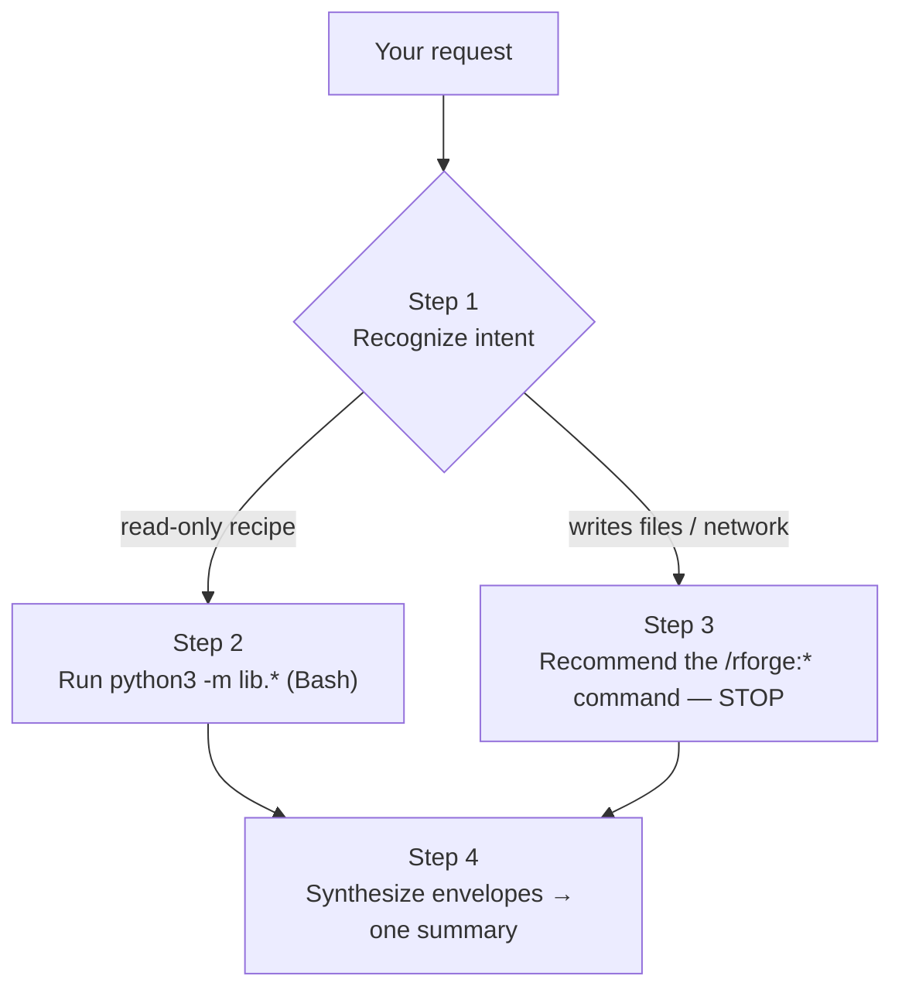

# 🤖 The RForge Orchestrator Agent

!!! tip "TL;DR (30 seconds)"
    - **What:** A Claude Code *agent* that recognizes the **intent** behind an R-package request and runs the matching rforge analyses for you, then synthesizes one summary.
    - **Why:** You don't have to remember which of the {{ rforge.command_count }} commands to run — say *"is this CRAN-ready?"* and it runs the right read-only checks.
    - **Safety:** Only **read-only** analyses run automatically. Anything that writes files or hits the network is **recommended, never executed**.
    - **Next:** [Cookbook: orchestrator worked examples](tutorials/orchestrator-cookbook.md).

The orchestrator is rforge's single agent (`agents/orchestrator.md`). Unlike a slash
command — which you invoke explicitly — the orchestrator is invoked when you ask
Claude an open-ended R-package question and it delegates to the agent. The agent
acts only through **Bash** (running `python3 -m lib.*` and reading the JSON
envelopes) and **Read**; it calls no MCP tools and cannot run `/rforge:*` slash
commands directly.

!!! note "What changed in v2.9.0"
    The orchestrator was rewritten to delegate via the pure-Python `lib/` modules
    (the old MCP-tool delegation was removed when `rforge-mcp` was absorbed in
    v1.3.0). It now has an explicit **7-intent taxonomy**, a **read-only /
    recommend-only safety boundary**, and **per-module envelope synthesis**.

## How it works — 4 steps



### Step 1 — Recognize the intent

The agent maps your request to exactly one of seven intents:

| Intent | You say something like… |
|--------|--------------------------|
| **CODE_CHANGE** | "update / refactor X", "what's the impact of this change" |
| **NEW_FUNCTION** | "add a function", "implement X" |
| **BUG_FIX** | "fix", "broken", "failing", "error" |
| **DEPS_AUDIT** | "dependencies", "imports", "DESCRIPTION" |
| **QUALITY** | "coverage", "lint", "spelling", "code quality" |
| **CRAN_READINESS** | "is this CRAN-ready", "prep for CRAN" |
| **ECOSYSTEM_HEALTH** | "status", "health", "overview" |

If your request is ambiguous, the agent states its best-guess intent and the exact
commands it will run **before** running them.

### Step 2 — Run the read-only recipe

Each intent maps to a fixed set of **read-only** analyses (no source writes, no
network). The five text-defaulting modules are run with `--format json` so the
synthesis step can parse them; `rcmd`/`cranlint` emit JSON unconditionally.

| Intent | Auto-runs (read-only) |
|--------|------------------------|
| CODE_CHANGE | `lib.discovery --format json` · `lib.deps --format json impact --package <pkg>` · `lib.rcmd --kind test` |
| NEW_FUNCTION | `lib.discovery --format json` · `lib.rcmd --kind check` |
| BUG_FIX | `lib.rcmd --kind test` · `lib.deps --format json` |
| DEPS_AUDIT | `lib.deps_sync --format json` · `lib.deps --format json` |
| QUALITY | `lib.rcmd --kind coverage` · `lib.rcmd --kind lint` · `lib.rcmd --kind spell` |
| CRAN_READINESS | `lib.rcmd --kind check` · `lib.cranlint` · `lib.runiverse --format json` |
| ECOSYSTEM_HEALTH | `lib.status --format json` · `lib.discovery --format json` · `lib.deps --format json` |

### Step 3 — The safety boundary (recommend-only)

!!! warning "The orchestrator never auto-runs anything that writes files or reaches the network"
    This mirrors rforge's *never-auto-submit* principle. When your goal implies one
    of these, the agent names the exact command and **stops** — you run it.

| Category | Recommend-only commands |
|----------|--------------------------|
| Regenerate / format / build | `/rforge:r:document`, `/rforge:r:style`, `/rforge:r:build`, `/rforge:r:install`, `/rforge:r:site`, `/rforge:r:cycle` |
| CRAN gate (writes `cran-comments.md`) | `/rforge:r:cran-prep` |
| CRAN / GitHub handoff | `/rforge:r:submit` (`--promote`, `--universe`) |
| External uploads / network | `/rforge:r:winbuilder`, `/rforge:r:rhub`, `/rforge:r:urlcheck` |
| Reverse-dependency (heavy/external) | `/rforge:r:revdep` |
| Dependency patch writes | `/rforge:r:deps-sync --write` |

This boundary is **enforced by a test gate** (`tests/_check_agent_engines.py`): every
`--kind` named in an auto-run recipe must be in the read-only safe set, so a mutating
kind can never silently slip into an auto-run path.

### Step 4 — Synthesize

The agent reads each module's envelope (the shapes differ — `rcmd`/`cranlint` carry
`status`+`messages`/`stages`; `discovery` carries `packages`/`drift`; `deps` carries
`nodes`/`edges`/`impact`) and renders one summary:

```
┌─ RForge Orchestrator ─────────────────────────────┐
│ Intent: <INTENT>                                  │
│ Ran: <commands actually executed>                 │
│ Findings:                                         │
│   • <module>: <key takeaway>                       │
│ 🔴 Blockers: <any error/warn status, verbatim>    │
│ → Next: <recommended /rforge:* command>           │
└───────────────────────────────────────────────────┘
```

A `warn`/`error` status (or a non-empty `engine_missing`) is surfaced verbatim, never
swallowed; a command that fails to run is reported with the command shown.

## When to use it vs. a slash command

| Use the orchestrator when… | Use a slash command when… |
|----------------------------|----------------------------|
| You have a *goal* ("is this CRAN-ready?") and don't want to pick commands | You know exactly which check you want (`/rforge:r:check`) |
| You want several related analyses synthesized into one answer | You want one command's raw output |
| You're exploring an unfamiliar package | You're scripting a fixed step |

## See also

- [Cookbook: orchestrator worked examples](tutorials/orchestrator-cookbook.md)
- [Architecture](architecture.md) — how the agent fits the static surface
- [Commands reference](commands.md) — the commands it recommends
- [lib/ modules](lib-modules.md) — the analysis envelopes it consumes
