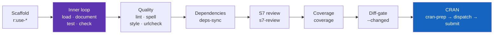

# 🧰 Package Development Guide

The end-to-end map of rforge's R-package-development (`r:`) commands — from scaffolding a
new piece through the inner dev loop, quality gates, and the CRAN handoff. Each stage links
to a **command guide** (the exhaustive per-family reference) and a **tutorial** (a task
walkthrough).

!!! tip "TL;DR (30 seconds)"
    - **What:** the `r:*` commands wrap the standard R toolchain (`devtools`/`usethis`/
      `roxygen2`/`testthat`/`lintr`/…) behind one consistent, structured-output interface.
    - **The loop:** scaffold → **load → document → test → check** → quality → deps → S7 →
      coverage → CRAN.
    - **Two safety rules:** read-only analyses can auto-run; anything that **writes files or
      hits the network** is recommend-only. And `r:submit` **never** uploads to CRAN for you.
    - **Next:** jump to any stage below, or the [Reference Card](REFCARD.md) for the full
      command list.

!!! abstract "rforge complements `devtools`/`usethis` — it doesn't replace them"
    The `r:` commands shell out to the same engines you already use; rforge's value is the
    consistent envelope (structured findings, advisory vs blocking, diff-aware scoping) and
    the ecosystem view. Looking for `create_package()`? That's `usethis`. rforge's
    `r:use-*` commands scaffold *into an existing* package — see [Scaffolding](guides/scaffolding.md).

---

## The lifecycle at a glance



You rarely run all of these in one sitting. The **inner loop** (load/document/test/check)
is what you run dozens of times a day; the rest are gates you reach for at commit time,
before review, or before a CRAN run.

---

## 1. Scaffold structure into an existing package

When you need a new test file, a declared dependency, a vignette, a documented dataset, or
a `CITATION`, the `r:use-*` family drafts it for you — **dry-run by default**, `--write` to
apply.

```bash
/rforge:r:use-test myfun          # draft tests/testthat/test-myfun.R (assertions = TODO)
/rforge:r:use-package stringr     # declare Imports + @importFrom
/rforge:r:use-vignette intro      # vignette skeleton + outline
```

→ **Deep dive:** [Scaffolding command guide](guides/scaffolding.md) ·
[Scaffolding tutorial](tutorials/scaffolding-existing-packages.md)

## 2. The inner dev loop

The tight edit→verify cycle: `load` your changes, `document` to regenerate Rd + NAMESPACE,
`test`, then `check`. `r:cycle` runs document→test→check in one pass.

```bash
/rforge:r:load          # pkgload::load_all() — fast, no install
/rforge:r:document      # roxygen2 → man/*.Rd + NAMESPACE   (writes files)
/rforge:r:test          # testthat — pass/fail/skip counts
/rforge:r:check         # R CMD check, structured NOTEs/WARNINGs
/rforge:r:cycle         # document → test → check, one envelope
```

→ **Deep dive:** [Dev-cycle command guide](guides/dev-cycle.md) ·
[R package dev cycle tutorial](tutorials/r-dev-cycle.md)

## 3. Static quality

`lint` (lintr), `spell` (spelling), `urlcheck` (dead URLs), and `style` (styler —
auto-formats, so it **writes** source).

```bash
/rforge:r:lint
/rforge:r:spell
/rforge:r:style         # rewrites source — recommend-only via the orchestrator
```

→ **Deep dive:** [Quality command guide](guides/quality.md)

## 4. Reconcile dependencies

Make `DESCRIPTION` match what your code actually uses — missing, misclassified, or unused
declarations, with a suggested patch.

```bash
/rforge:r:deps-sync             # report-only
/rforge:r:deps-sync --write     # apply unambiguous adds/moves
```

→ **Deep dive:** [Dependency reconciliation tutorial](tutorials/dependency-reconciliation.md) ·
[`deps_sync` reference](reference/deps_sync.md)

## 5. S7 conventions (modern R OOP)

If your package uses S7, `r:s7-review` is a static, advisory convention checker — naming,
validators, methods, legacy-OOP leftovers, and docs — with an ecosystem (`--eco`) sweep for
cross-package contracts and a runtime (`--runtime`) dispatch check.

```bash
/rforge:r:s7-review                 # static, single-package
/rforge:r:s7-review --eco           # + cross-package contracts across siblings
/rforge:r:s7-review --runtime       # + load-and-introspect dispatch checks
```

→ **Deep dive:** [S7 review command guide](guides/s7-review.md) ·
[S7 convention checking tutorial](tutorials/s7-convention-checking.md)

## 6. Coverage

```bash
/rforge:r:coverage      # covr — overall % + untested lines
```

→ **Deep dive:** [Dev-cycle command guide](guides/dev-cycle.md) (the `r:coverage` section)

## 7. Gate only what you changed

On a feature branch, scope `check`/`test`/`lint` to the packages you touched and tag each
finding `[introduced]` / `[pre-existing]` / `[uncommitted]` so CI blocks *your* regressions,
not inherited debt. The merge-base baseline is cached per package.

```bash
/rforge:r:check --changed --base origin/main --fail-on introduced
```

→ **Deep dive:** [Diff-aware command guide](guides/diff-aware.md) ·
[Diff-aware checks tutorial](tutorials/diff-aware-checks.md)

## 8. CRAN submission

The gated path to CRAN: `cran-prep` (the full gate — document → strict checks → Tier-4
advisory → revdep → writes `cran-comments.md`), the async `winbuilder` / `rhub` dispatch,
then `submit` (GitHub pre-release + a **handoff** — never an automatic upload).

```bash
/rforge:r:cran-prep             # full gate; blocks `ready` on a strict ERROR
/rforge:r:winbuilder            # async win-builder R-devel
/rforge:r:submit                # pre-release tarball + CRAN handoff (you confirm the upload)
/rforge:r:submit --universe     # also verify the R-universe early-access build
```

→ **Deep dive:** [CRAN submission command guide](guides/cran-submission.md) ·
[CRAN release prep](tutorials/cran-release-prep.md) ·
[CRAN submission with rforge](tutorials/cran-submission-with-rforge.md)

---

## The safety model

rforge draws one hard line through every `r:` command:

!!! warning "Read-only auto-runs; writes & network are recommend-only; CRAN is never automatic"
    - **Auto-runnable** (read-only): `load`, `test`, `check`, `coverage`, `lint`, `spell`,
      `s7-review`, and the analysis commands.
    - **Recommend-only** (writes files or hits the network — surfaced as a command for *you*
      to run): `document`, `style`, `build`, `install`, `site`, `deps-sync --write`,
      `cran-prep` (writes `cran-comments.md`), `winbuilder`, `rhub`, `revdep`, `urlcheck`.
    - **`r:submit` never uploads to CRAN automatically.** It prepares the tarball and the
      GitHub pre-release, then hands the CRAN submission back to you. `--promote` flips the
      pre-release to a full release only after CRAN accepts.

    This mirrors the [orchestrator agent](orchestrator.md)'s boundary: ask it for a *goal*
    and it runs the read-only analyses, but names every mutating/network step instead of
    running it.

## See also

- [Reference Card](REFCARD.md) — every command on one page
- [Commands](commands.md) — the terse per-command reference
- [Lib Modules](lib-modules.md) — the pure-Python engines behind the commands
- [Orchestrator Agent](orchestrator.md) — goal-driven command selection
