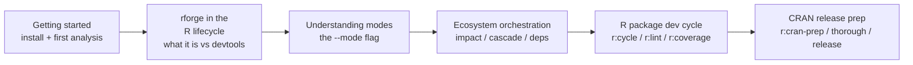

# 📚 Tutorials

!!! tip "TL;DR (30 seconds)"
    - **What:** Step-by-step walkthroughs for the most common rforge workflows.
    - **Why:** Faster to follow a recipe than to assemble one from the REFCARD.
    - **How:** Pick the tutorial matching your scenario below.
    - **Next:** [REFCARD](../REFCARD.md) for command-by-command lookups, or [Architecture](../architecture.md) for design rationale.

Step-by-step guides for common workflows. Each tutorial targets a specific
scenario and walks through the exact commands and expected output.

## Which tutorial first?

| If you're... | Start here | Time |
|---|---|---|
| New to rforge, want to try it on an R package | [Getting started](getting-started.md) | ~10 min |
| Wondering how rforge fits with `devtools`/`usethis` | [rforge in the R package lifecycle](rforge-in-the-r-lifecycle.md) | ~12 min |
| Confused by the `--mode` flag | [Understanding modes](understanding-modes.md) | ~5 min |
| Managing several inter-dependent packages | [Ecosystem orchestration](ecosystem-orchestration.md) | ~15 min |
| Using the 12 `r:` dev-cycle commands daily | [R package dev cycle](r-dev-cycle.md) | ~10 min |
| Preparing a CRAN submission — ecosystem ordering | [CRAN release prep](cran-release-prep.md) | ~15 min |
| Running the full per-package CRAN gate | [CRAN submission with rforge](cran-submission-with-rforge.md) | ~15 min |
| Shipping early-access binaries while CRAN reviews | [R-universe early-access](r-universe-early-access.md) | ~10 min |
| Coming from `rforge-mcp` (the deprecated MCP server) | [Migrating from rforge-mcp](migrate-from-mcp.md) | ~5 min |
| Upgrading from v1.x and hit a renamed-command error | [v2.0.0 rename migration](../migration/v2.0.0-rename.md) | ~2 min |
| Looking up a specific command's syntax | [REFCARD](../REFCARD.md) (not a tutorial) | <1 min |

## Suggested learning path

## Available tutorials

- **[Getting started](getting-started.md)** — Fresh install → first
  analysis on an R package. Covers `/rforge:detect`, `/rforge:status`,
  `/rforge:analyze`. ~10 min, no prior rforge experience required.
- **[rforge in the R package lifecycle](rforge-in-the-r-lifecycle.md)** —
  Where rforge fits *alongside* `devtools`/`usethis`: they build a package,
  rforge orchestrates the ecosystem. Honest about what rforge does and
  doesn't do. ~12 min.
- **[Understanding modes](understanding-modes.md)** — Plain-language guide
  to the `--mode` flag on `/rforge:analyze` (default / debug / optimize /
  release), and why only that one command has modes. ~5 min.
- **[Ecosystem orchestration](ecosystem-orchestration.md)** — The
  multi-package commands with worked examples: `/rforge:deps` (map) →
  `/rforge:impact` (blast radius) → `/rforge:cascade` (plan). ~15 min.
- **[R package dev cycle](r-dev-cycle.md)** — The 12 `r:` commands in daily
  use: `r:load`, `r:document`, `r:test`, `r:check`, `r:cycle` (dev loop) +
  `r:lint`, `r:spell`, `r:urlcheck`, `r:style`, `r:coverage`, `r:build`,
  `r:install`, `r:site` (quality layer). ~10 min.
- **[CRAN release prep](cran-release-prep.md)** — Ecosystem-level pipeline:
  `/rforge:docs:check` → `/rforge:r:cran-prep` → `/rforge:thorough` →
  `/rforge:release`. ~15 min.
- **[CRAN submission with rforge](cran-submission-with-rforge.md)** — Per-package
  CRAN gate: `/rforge:r:cran-prep` → fix blockers → re-run → `--multi-platform`
  → review `cran-comments.md` → `/rforge:release`. ~15 min.
- **[Migrating from rforge-mcp](migrate-from-mcp.md)** — For users
  currently running `rforge-mcp` (the deprecated MCP server). Steps to
  upgrade to v1.3.0+ and clean up the old install. ~5 min.

## Still want more?

Have a workflow that isn't covered? [File an issue](https://github.com/Data-Wise/rforge/issues)
describing the scenario — the tutorial backlog is driven by what users
actually get stuck on. Custom configuration (CRAN mirror, vignette engine)
is documented in [Configuration](../configuration.md).

## Adding a tutorial

If you write a new tutorial, follow these conventions:

- Filename: `<topic>.md` (lowercase, hyphenated, no `TUTORIAL-` prefix —
  the path already says `tutorials/`)
- Open with a short "for whom" and "estimated time" summary
- Use numbered steps, not nested bullet lists, for sequential work
- Include expected output (or a screenshot equivalent) after each step
  so users can verify they're on track
- End with a "next steps" pointer to related docs
- Add the tutorial to `mkdocs.yml` nav under the Tutorials section
