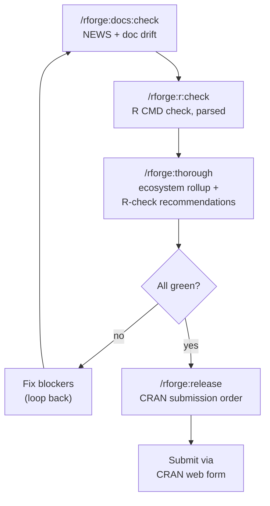

# 📦 CRAN release prep: thorough, r:check, release

!!! tip "TL;DR (30 seconds)"
    - **What:** Take one or more packages from "code complete" to "submitted to CRAN."
    - **Why:** rforge sequences the submission and surfaces drift; R does the heavy `R CMD check`.
    - **How:** `/rforge:docs:check` → `/rforge:r:check` → `/rforge:thorough` → `/rforge:release`.
    - **Next:** Submit via CRAN's web form (rforge plans the order; it doesn't upload).

> **For whom:** Maintainer preparing a CRAN submission (single package or
> ecosystem).
> **Estimated time:** 15 minutes to read; the actual checks take longer
> because `R CMD check` is slow.
> **Prior knowledge:** You've built the package and want to ship it.

!!! warning "Division of labor — read this first"
    rforge does **not** run heavy R checks for you, and it does **not**
    upload to CRAN. It **aggregates** lib-module health, **parses** the
    `R CMD check` output you run, and **plans** the submission order. The
    actual `R CMD check --as-cran` runs in *your* shell with *your* R
    toolchain. This is by design — those checks need R and can take minutes.

## The release pipeline at a glance



## Step 1: Catch documentation drift early

Documentation problems are the most common avoidable CRAN rejection. Check
first, while fixes are cheap:

```text
/rforge:docs:check
```

```text
⚠️ DOCUMENTATION CHECK

NEWS.md: ⚠️ Missing 3 recent changes
  • extract_mediation refactor
  • New bootstrap method
  • Bug fix #234

Examples: ⚠️ 2 outdated
  • README example uses old API
  • Vignette 2 has broken code

Recommendations:
  1. Update NEWS.md (5 min)
  2. Update examples (20 min)
  3. Regenerate vignettes (10 min)
```

!!! note "The description-sync skill backs this up automatically"
    rforge ships a `description-sync` validation skill that checks your
    `DESCRIPTION` `Version:` matches the top entry in `NEWS.md` /
    `CHANGELOG.md` — the single most common pre-CRAN slip. It's pure shell,
    needs no R, and runs autonomously. See [Hooks & Skills](../hooks-and-skills.md).

## Step 2: Run R CMD check with smart parsing

```text
/rforge:r:check --as-cran
```

This invokes `R CMD check --as-cran` via Bash and parses the output into a
scannable summary:

```markdown
## Package Check: medfit v2.0.0

### Status: 🟡

### R CMD Check
- Errors: 0
- Warnings: 0
- Notes: 1
  • checking CRAN incoming feasibility ... NOTE (new submission)

### Tests
- Passed: 187
- Failed: 0

### Documentation
- [x] All exports documented
- [x] Examples run
- [x] README exists

### Recommended Actions
1. The single NOTE is the standard "new submission" note — expected, not a blocker.
```

!!! tip "NOTEs are not all equal"
    A "new submission" NOTE is routine. A NOTE about non-standard files,
    undefined globals, or large installed size needs fixing. rforge's parse
    helps you tell them apart — but the judgment call is yours. Run this on
    each package you're submitting.

`/rforge:r:check` is single-package. For one quick check it's equivalent to
`devtools::check()` — use whichever you prefer; rforge's value-add is the
parsed, consistent summary.

## Step 3: Roll up the whole ecosystem

```text
/rforge:thorough "Prepare mediationverse for CRAN"
```

`/rforge:thorough` runs the status rollup across all packages…

```bash
python3 -m lib.status --path . --format text
```

…and then **recommends the R-side checks for you to run yourself** (it does
not run them — that's Step 2's territory, per package):

```text
Recommended R-side checks (run in your shell):
  R CMD check --as-cran .
  Rscript -e 'devtools::test()'
  Rscript -e 'covr::package_coverage()'
```

Paste the results back and rforge combines them with the lib-status rollup
into a release-readiness summary.

!!! abstract "Why thorough doesn't just run everything"
    Earlier (MCP-era) versions tried to orchestrate background R tasks.
    v1.3.0 deliberately descoped that: R checks are slow, environment-
    specific, and better run in your own terminal where you can see
    progress and re-run individually. `/rforge:thorough` focuses on the fast
    aggregation and points you at the right R commands.

## Step 4: Plan the submission order

For an ecosystem, you can't submit in arbitrary order — CRAN needs each
dependency *approved and available* before its dependents pass incoming
checks. `/rforge:release` computes the sequence:

```text
/rforge:release
```

```text
🚀 CRAN RELEASE PLAN

Submission Order (by dependency):
1. medfit v2.0.0
   Status: ✅ Ready
   Submit: Now

2. probmed v1.5.0
   Status: ⏳ Waiting (needs medfit on CRAN)
   Submit: +2 weeks (after medfit approval)

3. medsim v1.3.0
   Status: ⏳ Waiting
   Submit: +2 weeks

4. mediationverse v1.1.0
   Status: ⏳ Waiting (needs all deps)
   Submit: +4 weeks

Timeline: 4-6 weeks total
```

Add `--detailed` for per-package readiness with reverse-dependency checks:

```text
/rforge:release --detailed
```

If a package isn't ready, the plan tells you exactly what's blocking it:

```text
1. medfit v2.0.0
   Status: ❌ NOT READY
   Blockers:
     • 3 failing tests
     • NEWS.md incomplete
     • R CMD check has 1 actionable NOTE
   Fix time: ~4 hours
```

That's your signal to loop back to Steps 1–2 for that package.

## A realistic single-package release

Most releases are one package, not a whole verse. The condensed flow:

```text
/rforge:docs:check medfit        # 1. drift check
/rforge:r:check --as-cran        # 2. R CMD check (in medfit/)
/rforge:thorough "CRAN prep"     # 3. rollup + recommendations
# ... fix anything flagged, re-run ...
/rforge:release medfit           # 4. confirm it's ready
# → submit via https://cran.r-project.org/submit.html
```

## Pre-submission checklist

- [ ] `/rforge:docs:check` clean (NEWS.md current, examples run)
- [ ] `description-sync` passes (DESCRIPTION version == NEWS top entry)
- [ ] `/rforge:r:check --as-cran` → 0 errors, 0 warnings, only benign NOTEs
- [ ] `devtools::test()` → all passing
- [ ] `covr::package_coverage()` → acceptable for your project
- [ ] `/rforge:release` → package shows ✅ Ready
- [ ] For ecosystems: submit in the order `/rforge:release` gives, waiting
      for each approval before the next

## What's next

- **[Ecosystem orchestration](ecosystem-orchestration.md)** — if the
  release surfaced a needed cross-package change, plan it with
  `/rforge:cascade`.
- **[REFCARD](../REFCARD.md)** — `thorough`, `r:check`, `docs:check`,
  `release` syntax.
- **[Configuration](../configuration.md)** — set your `cran_mirror` and
  `vignette_engine` so checks use the right defaults.
