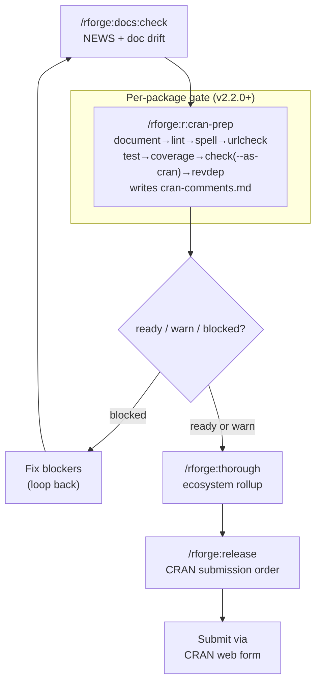

# 📦 CRAN release prep: thorough, r:check, release

!!! tip "TL;DR (30 seconds)"
    - **What:** Take one or more packages from "code complete" to "submitted to CRAN."
    - **Why:** rforge can now run the full per-package gate (`r:cran-prep`) **and** plan ecosystem submission order (`release`).
    - **How (single package):** `/rforge:r:cran-prep` → fix blockers → repeat → `/rforge:release`.
    - **How (ecosystem):** `/rforge:docs:check` → `/rforge:r:cran-prep` per package → `/rforge:thorough` → `/rforge:release`.
    - **Next:** Submit via CRAN's web form (rforge plans the order; it doesn't upload).

> **For whom:** Maintainer preparing a CRAN submission (single package or
> ecosystem).
> **Estimated time:** 15 minutes to read; the actual checks take longer
> because `R CMD check --as-cran` and `revdepcheck` are slow.
> **Prior knowledge:** You've built the package and want to ship it.

!!! note "What rforge runs vs. what you run (v2.2.0+)"
    As of v2.2.0, `/rforge:r:cran-prep` **does** run the heavy checks
    (document → lint → spell → urlcheck → test → coverage → `R CMD check
    --as-cran` → revdepcheck) and writes `cran-comments.md`. It still does
    **not** upload to CRAN — submission is via the CRAN web form.
    For ecosystem-level planning (submission order, cross-package deps),
    `/rforge:thorough` and `/rforge:release` remain orchestration-only.

## The release pipeline at a glance



## Step 1: Catch documentation drift early

Documentation problems are the most common avoidable CRAN rejection. Check
first, while fixes are cheap:

```text
/rforge:docs:check
```

```text
⚠️ DOCUMENTATION CHECK

NEWS.md: ⚠️ Missing 3 recent changes
  • extract_mediation refactor
  • New bootstrap method
  • Bug fix #234

Examples: ⚠️ 2 outdated
  • README example uses old API
  • Vignette 2 has broken code

Recommendations:
  1. Update NEWS.md (5 min)
  2. Update examples (20 min)
  3. Regenerate vignettes (10 min)
```

!!! note "The description-sync skill backs this up automatically"
    rforge ships a `description-sync` validation skill that checks your
    `DESCRIPTION` `Version:` matches the top entry in `NEWS.md` /
    `CHANGELOG.md` — the single most common pre-CRAN slip. It's pure shell,
    needs no R, and runs autonomously. See [Hooks & Skills](../hooks-and-skills.md).

## Step 2: Run the full CRAN-prep gate (v2.2.0+)

For most submissions, use the orchestrating command:

```text
/rforge:r:cran-prep
```

This sequences document → lint → spell → urlcheck → test → coverage →
`R CMD check --as-cran` → revdep and writes `cran-comments.md`. It returns
one of three verdicts:

| Verdict | Meaning |
|---------|---------|
| `ready` | All stages clean — proceed to submission |
| `warn` | Passed but has real NOTEs or new revdep problems — review before submitting |
| `blocked` | At least one stage errored — fix and re-run |

```text
✅ CRAN PREP — medfit v2.0.0

document   ok    ✅
lint       ok    ✅
spell      ok    ✅
urlcheck   ok    ✅
test       ok    ✅  (187 passed)
coverage   ok    ✅  (92%)
check      ok    ✅  1 NOTE (classified spurious — "New submission")
revdep     ok    ✅  no broken packages

Verdict: ready
cran-comments.md written → review before submitting
```

!!! tip "NOTEs are classified automatically"
    `r:cran-prep` tags each NOTE as `spurious` (expected on first submission,
    e.g. "New submission" or "checking CRAN incoming feasibility") or `real`
    (needs attention). Spurious NOTEs do not block `ready`. Real NOTEs
    downgrade the verdict to `warn`.

**Optional flags:**

```text
/rforge:r:cran-prep --no-revdep         # skip revdep (first submission, no dependents)
/rforge:r:cran-prep --goodpractice      # add advisory goodpractice checks
/rforge:r:cran-prep --multi-platform    # dispatch win-builder + R-hub async
```

**For a single targeted check** (no orchestration), use:

```text
/rforge:r:check --as-cran
```

See [CRAN submission with rforge](cran-submission-with-rforge.md) for the
full per-package walkthrough.

## Step 3: Roll up the whole ecosystem

```text
/rforge:thorough "Prepare mediationverse for CRAN"
```

`/rforge:thorough` runs the status rollup across all packages…

```bash
python3 -m lib.status --path . --format text
```

…and then **recommends the R-side checks for you to run yourself** (it does
not run them — that's Step 2's territory, per package):

```text
Recommended R-side checks (run in your shell):
  R CMD check --as-cran .
  Rscript -e 'devtools::test()'
  Rscript -e 'covr::package_coverage()'
```

Paste the results back and rforge combines them with the lib-status rollup
into a release-readiness summary.

!!! abstract "Why thorough doesn't run R checks"
    `/rforge:thorough` is an ecosystem rollup — it aggregates health across
    all packages, not a single one. The per-package R execution lives in
    `/rforge:r:cran-prep` (v2.2.0+). `thorough` focuses on fast cross-package
    aggregation and surfaces drift; `cran-prep` does the heavy single-package
    gate.

## Step 4: Plan the submission order

For an ecosystem, you can't submit in arbitrary order — CRAN needs each
dependency *approved and available* before its dependents pass incoming
checks. `/rforge:release` computes the sequence:

```text
/rforge:release
```

```text
🚀 CRAN RELEASE PLAN

Submission Order (by dependency):
1. medfit v2.0.0
   Status: ✅ Ready
   Submit: Now

2. probmed v1.5.0
   Status: ⏳ Waiting (needs medfit on CRAN)
   Submit: +2 weeks (after medfit approval)

3. medsim v1.3.0
   Status: ⏳ Waiting
   Submit: +2 weeks

4. mediationverse v1.1.0
   Status: ⏳ Waiting (needs all deps)
   Submit: +4 weeks

Timeline: 4-6 weeks total
```

Add `--detailed` for per-package readiness with reverse-dependency checks:

```text
/rforge:release --detailed
```

If a package isn't ready, the plan tells you exactly what's blocking it:

```text
1. medfit v2.0.0
   Status: ❌ NOT READY
   Blockers:
     • 3 failing tests
     • NEWS.md incomplete
     • R CMD check has 1 actionable NOTE
   Fix time: ~4 hours
```

That's your signal to loop back to Steps 1–2 for that package.

## A realistic single-package release

Most releases are one package, not a whole verse. The condensed flow:

```text
/rforge:docs:check medfit        # 1. drift check (NEWS, examples)
/rforge:r:cran-prep              # 2. full gate: runs all checks + writes cran-comments.md
# ... fix anything flagged, re-run until "ready" ...
/rforge:release medfit           # 3. confirm ecosystem readiness + submission order
# → review cran-comments.md, submit via https://cran.r-project.org/submit.html
```

For multi-platform verification before submission:

```text
/rforge:r:cran-prep --multi-platform   # dispatches win-builder + R-hub (async)
/rforge:r:winbuilder                   # or run individually
/rforge:r:rhub
```

## Pre-submission checklist

- [ ] `/rforge:docs:check` clean (NEWS.md current, examples run)
- [ ] `description-sync` passes (DESCRIPTION version == NEWS top entry)
- [ ] `/rforge:r:cran-prep` → verdict `ready` (or `warn` with all NOTEs reviewed)
- [ ] `cran-comments.md` reviewed and accurate — you'll paste this into the CRAN form
- [ ] Multi-platform: win-builder and/or R-hub dispatched and results reviewed
- [ ] `/rforge:release` → package shows ✅ Ready
- [ ] For ecosystems: submit in the order `/rforge:release` gives, waiting
      for each approval before the next

## What's next

- **[Ecosystem orchestration](ecosystem-orchestration.md)** — if the
  release surfaced a needed cross-package change, plan it with
  `/rforge:cascade`.
- **[REFCARD](../REFCARD.md)** — `thorough`, `r:check`, `docs:check`,
  `release` syntax.
- **[Configuration](../configuration.md)** — set your `cran_mirror` and
  `vignette_engine` so checks use the right defaults.
