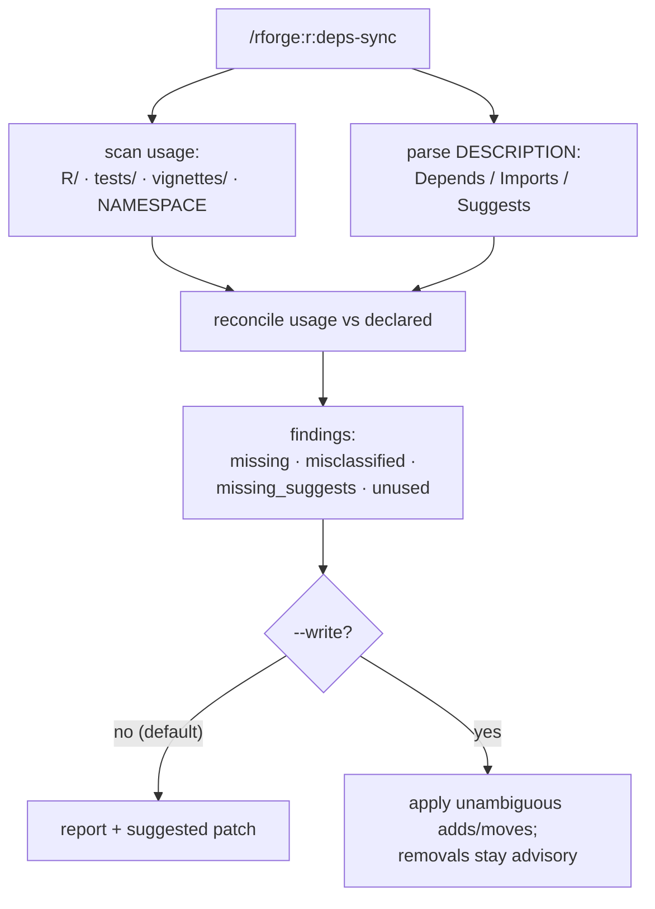

# 🔗 Dependency reconciliation — "does my DESCRIPTION match my code?"

!!! tip "TL;DR (30 seconds)"
    - **What:** `/rforge:r:deps-sync` scans `R/`, `tests/`, `vignettes/` + `NAMESPACE` for
      what your package *actually* uses and compares it against `Depends`/`Imports`/`Suggests`
      in `DESCRIPTION`.
    - **Why:** A package that uses `dplyr::filter()` in `R/` but never declares `dplyr` fails
      `R CMD check` — and a `Suggests` dependency used *unconditionally* fails for users who
      don't install it. Drift between code and `DESCRIPTION` is the most common CRAN reject.
    - **How:** Pure-Python (`lib.deps_sync`), **report-only by default**; `--write` applies the
      unambiguous additions/moves (never the advisory removals).
    - **Next:** [r:check --strict](../guides/cran-submission.md) — the runtime sibling that
      catches a misclassified `Suggests` at check time.

> **For whom:** an R-package author who has added (or removed) library usage in `R/`,
> tests, or vignettes and wants `DESCRIPTION` to match before committing or submitting.
> **Estimated time:** 6 minutes.
> **Prior knowledge:** the difference between `Imports` (loaded at use), `Suggests`
> (optional, must be guarded), and `Depends` (attached) in an R `DESCRIPTION`.

---

## The problem it solves

R's dependency declarations live in `DESCRIPTION`, but the *truth* lives in your code. The
two drift constantly:

- You add `stringr::str_pad()` to a helper and forget to declare `stringr` → `R CMD check`
  NOTE (or a hard failure at a user's site).
- You move a function that used a `Suggests`-only package into the main code path → it now
  runs **unconditionally**, but users who skipped the optional dep get a cryptic error.
- You delete the last use of a package but leave it in `Imports` → a needless install burden.

`deps-sync` does the cross-check mechanically: parse usage (`pkg::`, `library()`,
`@importFrom`, …) across `R/` / `tests/` / `vignettes/`, parse the declared deps, and report
every mismatch with the exact fix.

## How it works



It is **intra-package** — it reconciles one package's `DESCRIPTION` against its own code.
For the *inter-package* ecosystem dependency graph (who imports whom across your packages),
use [`/rforge:deps`](../commands.md#rforgedeps) instead.

## Walkthrough

```bash
# Report-only (the default) — nothing is written
/rforge:r:deps-sync

# Point at a specific package
/rforge:r:deps-sync ~/projects/r-packages/active/medfit
```

A report groups findings by kind and ends with a suggested patch:

```
## Deps-sync: medfit
### Status: 🟡 3 findings
  missing:          stringr   (used in R/format.R, undeclared → add to Imports)
  misclassified:    MASS      (in Suggests, used unconditionally in R/fit.R → move to Imports)
  unused:           tibble    (declared in Imports, no usage found → advisory)
### Suggested patch
  add_imports:      stringr
  move_to_imports:  MASS
  remove_candidates: tibble   (advisory — may be used dynamically; not auto-removed)
```

## Finding classes

| Kind | What it means | Suggested fix |
|------|---------------|---------------|
| `missing` | used in `R/`, not declared anywhere | add to **Imports** |
| `misclassified` | in **Suggests** but used *unconditionally* in `R/` | **move to Imports** (or guard the usage) — the static sibling of `r:check --strict`'s noSuggests pass |
| `missing_suggests` | used only in `tests/` / `vignettes/` (or behind a guard), not declared | add to **Suggests** |
| `unused` | declared, but no usage found | advisory removal candidate — **never auto-removed** (it may be used dynamically) |

!!! warning "`--write` applies adds and moves — not removals"
    `/rforge:r:deps-sync --write` applies the **unambiguous** changes: `missing` → add to
    Imports, `misclassified` → move to Imports, `missing_suggests` → add to Suggests. It
    **never** removes an `unused` dependency automatically — dynamic usage (`get()`,
    `do.call()`, reflection) is invisible to a static scan, so removals stay advisory for
    you to confirm. After a `--write`, run [`/rforge:r:document`](../guides/dev-cycle.md) if
    you changed `@importFrom` tags so `NAMESPACE` regenerates.

!!! tip "Fixing a `misclassified` finding two ways"
    A `Suggests` package used unconditionally has two valid fixes: **move it to Imports**
    (if it's genuinely required), or **guard the usage** — `requireNamespace("pkg")` in code
    *and* `skip_if_not_installed("pkg")` in tests. `deps-sync --write` takes the first;
    choose the second by hand when the dependency really is optional.

## See also

- [Scaffolding command guide](../guides/scaffolding.md) — `r:use-package` adds *one*
  declared dependency; `deps-sync` reconciles *all* of them
- [CRAN submission guide](../guides/cran-submission.md) — `r:check --strict` catches a
  misclassified `Suggests` at check time (the runtime sibling of this static check)
- [`deps_sync` reference](../reference/deps_sync.md) — the `lib.deps_sync` engine
  (`scan_usage`, `reconcile`, `deps_sync`)
- [`/rforge:deps`](../commands.md#rforgedeps) — the *inter*-package ecosystem graph
