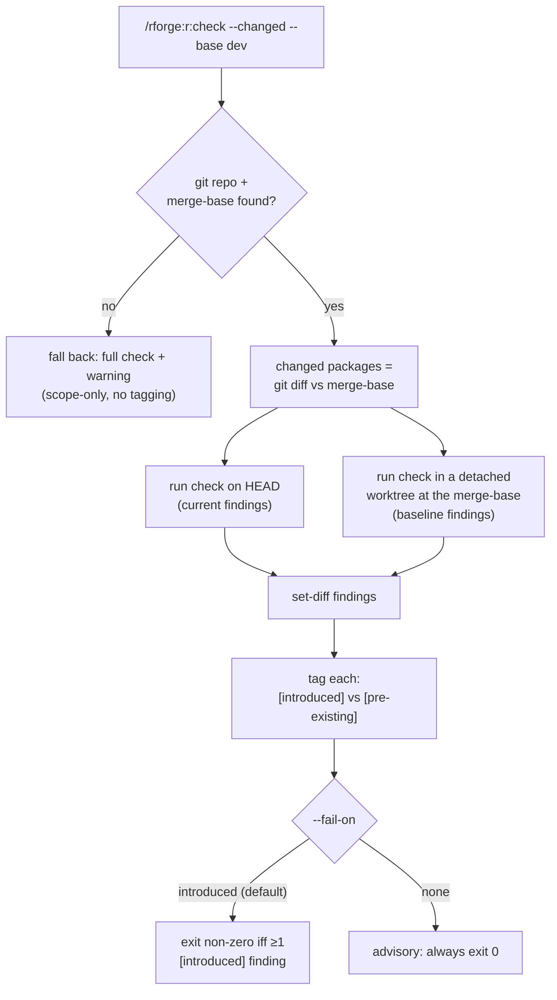

# 🔬 Diff-aware checks — "did *my* change cause this?"

!!! tip "TL;DR (30 seconds)"
    - **What:** `--changed` on `r:check` / `r:test` / `r:lint` scopes the run to the
      package(s) you touched on this branch and tags each finding **`[introduced]`**
      (new on your branch) vs **`[pre-existing]`** (already at the fork point).
    - **Why:** A full `R CMD check` surfaces every NOTE/WARNING regardless of whether
      *your* branch caused it. Diff-aware mode answers the merge-gate question directly.
    - **How:** It runs a second baseline check in a throwaway worktree at
      `git merge-base(HEAD, --base)` and set-diffs the findings.
    - **CI:** `--fail-on introduced` (the default) exits non-zero **only** on findings you
      introduced — so CI blocks regressions you caused, not pre-existing debt.
    - **Next:** [R package dev cycle](r-dev-cycle.md) for the inner loop these gate.

> **For whom:** R package developer (or ecosystem maintainer) preparing a branch for
> merge, who wants to separate "my regressions" from "pre-existing debt."
> **Estimated time:** 8 minutes.
> **Prior knowledge:** A git repo with a feature branch off `dev` (or `main`), and an R
> package registered with `/rforge:init`.

---

## The problem it solves

You branch off `dev`, touch four files, and run `R CMD check`. It reports a vignette
WARNING. Did your change cause it — or has it been there for weeks? Without diff-awareness
you `git diff` by hand and reason about each finding. Diff-aware mode does that for you.

## How it works



The baseline runs in a **real detached git worktree** checked out at the merge-base commit
(cleaned up afterward) — it is not a re-run of HEAD, so the comparison is honest.

## Walkthrough

```bash
# Scope to changed packages + tag findings vs the fork point with dev
/rforge:r:check --changed --base dev

# Same for tests and lint
/rforge:r:test  --changed --base dev
/rforge:r:lint  --changed --base dev
```

A tagged result reads like:

```
[pre-existing]  NOTE: vignette 'intro.Rmd' has long-running examples
[introduced]    WARNING: undocumented argument 'newparam' in foo()
```

The first is debt you inherited; the second is yours to fix before merge.

### Wiring it into CI

```bash
# Fail the job ONLY if this branch introduced a finding (the default)
/rforge:r:check --changed --base origin/main --fail-on introduced

# Advisory mode: tag findings but never fail the job
/rforge:r:check --changed --base origin/main --fail-on none
```

!!! note "Finding identity is line-shift-immune"
    Lint findings are matched on `(file, message, linter)` — **not** the raw line number.
    Inserting a blank line above a pre-existing lint will **not** mis-tag it as
    `[introduced]`.

!!! warning "Scope & cost"
    - The baseline is the **committed** merge-base — uncommitted working-tree findings
      count as HEAD's (commit first for accurate tagging).
    - Each `--changed` run pays one **extra** check (the baseline). There is no cross-run
      cache yet.
    - No git repo / no merge-base / baseline-worktree failure → graceful fallback to a
      full check plus a warning (scope-only, no tagging).

## See also

- [`changed` reference](../reference/changed.md) — the `lib.changed` engine (`merge_base`,
  `run_baseline`, `scope_check`, `tag_findings`)
- [R package dev cycle](r-dev-cycle.md) — the inner loop these checks gate
- [CRAN release prep](cran-release-prep.md) — the full-package strict checks for submission
