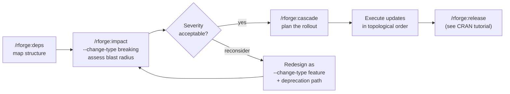

# 🔗 Ecosystem orchestration: impact, cascade, deps

!!! tip "TL;DR (30 seconds)"
    - **What:** Coordinate changes across several inter-dependent R packages.
    - **Why:** A change to a core package ripples outward — these commands show the blast radius *before* you commit.
    - **How:** `/rforge:deps` (map) → `/rforge:impact` (blast radius) → `/rforge:cascade` (plan).
    - **Next:** [CRAN release prep](cran-release-prep.md) once the cascade is done.

> **For whom:** Maintainer of multiple related R packages (a "verse").
> **Estimated time:** 15 minutes.
> **Prior knowledge:** You've run [Getting started](getting-started.md) and
> understand [rforge's role in the lifecycle](rforge-in-the-r-lifecycle.md).

This tutorial uses a running example: an ecosystem of four packages where
`medfit` is the core and `probmed`, `medsim`, and `mediationverse` build on
it.

```text
medfit  ◄── probmed
   ▲    ◄── medsim
   └─────── mediationverse (also ◄── probmed, medsim)
```

## The three commands, and when each fits

| Command | Answers | Run it… |
|---|---|---|
| `/rforge:deps` | *How are these packages wired together?* | First, to understand structure |
| `/rforge:impact` | *If I change X, what breaks?* | Before making a change |
| `/rforge:cascade` | *In what order, and how long, to update everything?* | After deciding to change X |

They form a pipeline: **map → assess → plan.**

## Step 1: Map the dependency graph

```text
/rforge:deps
```

Under the hood this runs the pure-Python deps module — no R required:

```bash
python3 -m lib.deps --path . --format text
```

```text
🔗 DEPENDENCY GRAPH

Level 0 (Core):
  └─ medfit

Level 1 (Implementations):
  ├─ probmed → medfit
  └─ medsim → medfit

Level 2 (Meta):
  └─ mediationverse → medfit, probmed, medsim

Topological order: medfit → {probmed, medsim} → mediationverse
```

**Reading it:** the topological order is the *safe build/update order* —
always leaves-first. You never update `mediationverse` before the packages
it depends on. rforge also flags circular dependencies here if any exist.

!!! tip "Want JSON for scripting?"
    Every ecosystem command takes `--format json`:
    ```bash
    python3 -m lib.deps --path . --format json
    ```
    Pipe it into `jq` to drive your own automation.

## Step 2: Assess the blast radius of a change

You're about to change `extract_mediation()` in `medfit`. Before touching
it, ask what depends on it:

```text
/rforge:impact
```

The command maps to the deps module's impact analysis. For a breaking
change to `medfit`:

```bash
python3 -m lib.deps --path . --format text impact \
    --package medfit --change-type breaking \
    --affected-exports extract_mediation
```

```text
⚠️ IMPACT ANALYSIS

Severity: HIGH (Breaking change)
Affected: 3 packages + indirect

Direct Impact:
  • probmed: 5 functions, 47 test cases
  • medsim: 2 examples, 1 vignette

Indirect Impact:
  • mediationverse: may need meta-update (via probmed, medsim)

Total cascade: 8-12 hours
Recommended: Deprecation path + major version bump
```

**`--change-type` drives the severity.** The realistic options:

| `--change-type` | Meaning | Typical severity |
|---|---|---|
| `breaking` | Signature/behavior change dependents must adapt to | HIGH / CRITICAL |
| `feature` | Additive — new export, backward compatible | LOW / MEDIUM |
| `fix` | Bug fix, no API change | LOW |
| `internal` | No exported surface affected | minimal |

A `feature` change to the same package looks very different:

```bash
python3 -m lib.deps --path . --format text impact \
    --package medfit --change-type feature \
    --affected-exports new_helper
```

```text
📊 IMPACT ANALYSIS

Severity: LOW
Affected: 0 packages (additive export, no dependents call it yet)

Recommended: Minor version bump, no cascade required
```

!!! abstract "Why assess before changing?"
    The difference between a 30-minute change and a two-week cascade is
    often invisible until you see the dependent test counts. `/rforge:impact`
    turns "I hope this is isolated" into a number you can plan around.

## Step 3: Plan the coordinated update

You've decided to go ahead with the breaking change. Now plan the rollout:

```text
/rforge:cascade "medfit 1.0.0 → 2.0.0 breaking"
```

```text
⚠️ CASCADE PLAN: Breaking API change

Phase 1: Preparation (Week 1)
  1. Add deprecation warnings to medfit
  2. Update all docs + write migration guide
  ⏱ 4 hours

Phase 2: Core Package (Week 2)
  1. medfit → 2.0.0 (major bump)
     • Implement breaking change
     • Update all tests
     ⏱ 8 hours

Phase 3: Dependent Updates (Weeks 3-4)
  2. probmed → API migration + tests   ⏱ 6 hours
  3. medsim  → API migration + tests   ⏱ 4 hours

Phase 4: Meta Package (Week 5)
  4. mediationverse → version alignment ⏱ 1 hour

Total: ~23 hours over 5 weeks
Blockers: medfit must reach CRAN before dependents submit
```

Add `--detailed` for the full per-package verification checklist:

```text
/rforge:cascade "medfit 2.0.0 breaking" --detailed
```

**The cascade respects the topological order from Step 1** — core first,
meta last — so you never update a package before its dependencies are ready.

## The full pipeline, end to end



## Worked mini-example: a non-breaking refactor

Not every change is a crisis. Here's the common case — an internal refactor
of `medfit` with no API change:

```text
/rforge:impact          # --change-type internal
→ Severity: minimal, 0 dependents affected

/rforge:quick           # 10s sanity snapshot
→ ✅ ecosystem healthy

# ... make the change, run devtools::test() in medfit ...

/rforge:cascade
→ No cascade needed — change is internal to medfit
```

When impact is minimal, skip the cascade entirely. The tools tell you when
coordination *isn't* needed, which is just as valuable.

## What's next

- **[CRAN release prep](cran-release-prep.md)** — once your cascade is
  executed, turn it into an ordered CRAN submission.
- **[REFCARD](../REFCARD.md)** — `deps`, `impact`, `cascade`, `release`
  syntax at a glance.
- **[deps API reference](../reference/deps.md)** — the underlying
  `lib.deps` call signatures for scripting.
