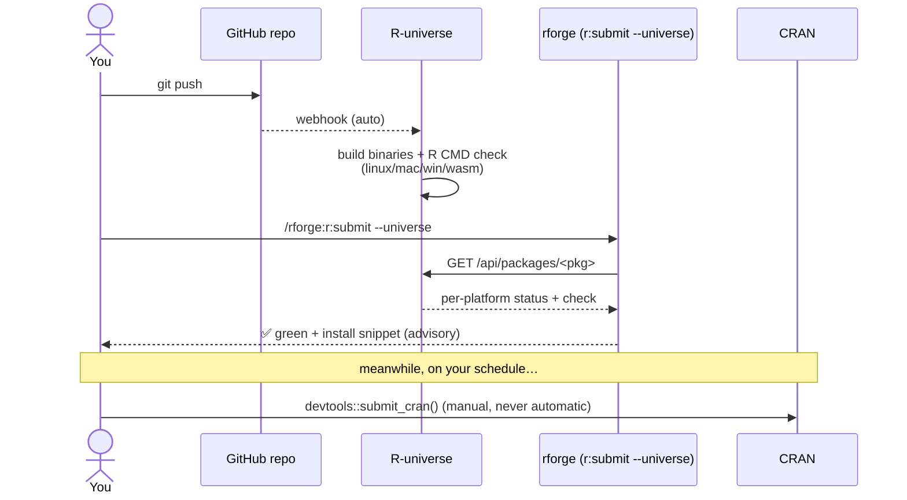

# 🌌 R-universe early-access with rforge

!!! tip "TL;DR (30 seconds)"
    - **What:** Publish your package to [R-universe](https://r-universe.dev) so users get binaries within minutes, then use `r:submit --universe` to verify the build is green — **while CRAN review runs in parallel**.
    - **Why:** CRAN review is human and takes days; R-universe rebuilds from your GitHub repo in minutes and serves CRAN-like binaries. It's also a free multi-platform preflight.
    - **How:** one-time universe setup (a GitHub repo + the R-universe app) → `git push` → `/rforge:r:submit --universe`.
    - **Next:** [CRAN submission with rforge](cran-submission-with-rforge.md) — the early-access check slots in *before* the manual CRAN handoff.

> **For whom:** A package author who wants users to install the new version immediately, without waiting on CRAN's review queue.
> **Estimated time:** ~10 minutes to read; the one-time setup is ~5 minutes, and R-universe builds take a few minutes per package.
> **Prior knowledge:** Your package lives in a public GitHub repo and passes basic `r:cycle` checks.

## Why a second channel?

R-universe and CRAN have **structurally different triggers**, which is what makes early-access safe — automation can never leak from one to the other:

| Channel | Trigger | Nature | Latency |
|---|---|---|---|
| **R-universe** | a `git push` (once registered) | passive / automatic build | minutes |
| **CRAN** | *you* running `devtools::submit_cran()` | active / manual | days |

`r:submit --universe` is **read-only** — R-universe builds on your push, so rforge never uploads anything; it just *verifies* the build went green and reports. The CRAN submission stays exactly as explicit as before.



## Step 1: Create your universe (one-time)

There is **no separate R-universe account** — a universe is tied to your GitHub user/org. Three one-time steps:

**1a. Create the registry repo** named `<owner>.r-universe.dev` (all lowercase). For the GitHub user/org `Data-Wise`, that's `data-wise.r-universe.dev`:

```bash
gh repo create <owner>/<owner-lowercase>.r-universe.dev --public \
  -d "R-universe registry"
```

**1b. Add a `packages.json`** listing the package repos to build, then push it:

```json
[
  { "package": "yourpkg",   "url": "https://github.com/<owner>/yourpkg" },
  { "package": "anotherpkg", "url": "https://github.com/<owner>/anotherpkg" }
]
```

!!! note "Public repos only (by default)"
    R-universe's standard flow builds **public** repos. A private package won't build in a public universe unless you explicitly grant the app access — leave private repos out of `packages.json` until they're public.

**1c. Install the R-universe GitHub App** — this is the step only *you* can do (interactive browser consent):

→ **<https://github.com/apps/r-universe>** → *Install* → grant it on your account (it asks for *commit-status read/write* only).

R-universe then creates a build monorepo at `github.com/r-universe/<owner>` and rebuilds on every push. Your universe goes live at `https://<owner>.r-universe.dev` within a few minutes.

!!! tip "Case doesn't matter for you, but the subdomain is lowercase"
    The `Data-Wise` GitHub org maps to `data-wise.r-universe.dev`. `r:submit --universe` lowercases the owner automatically, so you never have to think about it.

## Step 2: Verify the early-access build

From inside the package directory:

```bash
/rforge:r:submit --universe
```

rforge auto-detects your universe from the git `origin` remote (override with `--universe-name <owner>`), reads the public R-universe API, and reports per-platform status. Real output:

```text
✅ r-universe: ok

RMediation @ data-wise.r-universe.dev (overall: success)
  ✓ linux noble 4.7.0 — build success, check OK
  ✓ linux noble 4.6.0 — build success, check OK
  ✓ mac 4.5.3 — build success, check OK
  ✓ mac 4.6.0 — build success, check OK
  ✓ win 4.7.0 — build success, check OK
  ✓ win 4.5.3 — build success, check OK
  ✓ win 4.6.0 — build success, check OK
  ✓ wasm 4.6.0 — build success

💡 'RMediation' is green on data-wise.r-universe.dev. Early-access install:
  install.packages("RMediation", repos = "https://data-wise.r-universe.dev")
```

Share that `install.packages(...)` line — users get the new version **today**, while CRAN reviews.

## Step 3: Read build vs. check

Each platform row carries **two** signals, and they mean different things:

| Field | What it is | Affects "green"? |
|---|---|---|
| **build `status`** | Did the binary compile & deploy? → *installable* | **Yes** — this is the early-access bar |
| **check `OK`/`NOTE`/`WARNING`/`ERROR`** | R CMD check result | **No** — surfaced as advisory |

A package that **built** is installable even if its check has a `NOTE` — so `r:submit --universe` calls it green but still shows the check result so you can act on it before CRAN. (WebAssembly `wasm` builds binaries but isn't checked — that's why it shows no check.)

## Step 4: It folds into the CRAN flow

When you run the full `r:submit` (CRAN pre-release + handoff), the printed CRAN checklist gains one **advisory** line:

```text
## Ready to submit v1.4.0 to CRAN
- R-universe early-access: green  ← advisory only (with --universe); never blocks
- [ ] Pre-release cut: v1.4.0 …
- [ ] Submit: devtools::submit_cran()
```

It never blocks and never triggers the (still manual) CRAN submission — it's a confidence signal, not a gate.

## Troubleshooting

| Symptom | Meaning | Fix |
|---|---|---|
| `'<pkg>' is not built on <owner>.r-universe.dev yet` | Universe/package not registered | Do Step 1 (repo + `packages.json` + app); wait a few min for the first build |
| `Could not reach <owner>.r-universe.dev (offline or API error)` | No network / transient API error | Status unknown — non-blocking; retry later |
| `Could not determine your R-universe` | No GitHub `origin` remote | Pass `--universe-name <owner>` explicitly |
| Package missing from the universe after ~30 min | Build failed | Check the build log in `github.com/r-universe/<owner>` → Actions |

!!! note "Expected behavior in v2.7.0+"
    `r:submit --universe` is **read-only and advisory** by design. It never uploads, never blocks the CRAN handoff, and degrades to a non-fatal `warn` (with setup guidance) when offline or unregistered — so it's safe to wire into CI.

## Related

- **[CRAN submission with rforge](cran-submission-with-rforge.md)** — the manual CRAN handoff this complements
- **[r:submit command reference](../commands.md#rforgersubmit)** — all flags
- **[`lib.runiverse` API reference](../reference/runiverse.md)** — the backing module
- **[REFCARD](../REFCARD.md)** — all {{ rforge.command_count }} commands on one page
