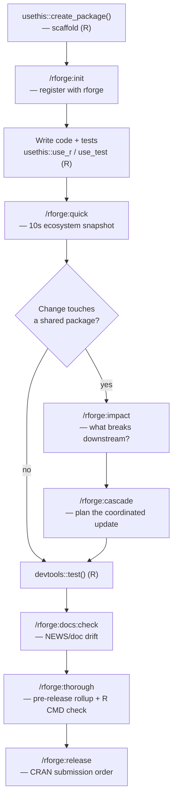

# 🔄 rforge in the R package lifecycle

!!! tip "TL;DR (30 seconds)"
    - **What:** Where rforge fits among the tools you already use to build R packages.
    - **Why:** rforge does *not* scaffold or build packages — it orchestrates an *ecosystem* of them. Knowing the boundary saves confusion.
    - **How:** `usethis`/`devtools` build each package; rforge answers cross-package questions (deps, impact, CRAN order).
    - **Next:** [Ecosystem orchestration](ecosystem-orchestration.md) for the multi-package commands.

> **For whom:** R developer who knows `devtools`/`usethis` and wants to
> understand what rforge adds.
> **Estimated time:** 12 minutes.
> **Prior knowledge:** You've built or maintained at least one R package.

## The one-sentence answer

> **`usethis` and `devtools` operate on a single package. rforge operates on the *set* of packages and the relationships between them.**

rforge is not a replacement for the standard R toolchain — it's a layer
*on top of it*. If you're looking for `create_package()`, `document()`,
or `check()`, those are `usethis`/`devtools` and rforge will never
reimplement them. rforge starts where they stop: once you have one or
more packages on disk, rforge tells you how they relate, what a change
ripples into, and in what order to ship.

## Who does what

| Concern | Tool | Example |
|---|---|---|
| Create a package skeleton | `usethis` | `usethis::create_package("medfit")` |
| Add a function + test + doc | `usethis` / `devtools` | `usethis::use_r("mediate")`, `usethis::use_test("mediate")` |
| Generate `man/*.Rd` from roxygen | `devtools` | `devtools::document()` |
| Run tests | `devtools` / `testthat` | `devtools::test()` |
| Run `R CMD check` | `devtools` / R | `devtools::check()` or `R CMD check --as-cran` |
| **See every package in a repo** | **rforge** | `/rforge:detect` |
| **Map dependencies between them** | **rforge** | `/rforge:deps` |
| **Know what a change breaks downstream** | **rforge** | `/rforge:impact` |
| **Plan a coordinated multi-package update** | **rforge** | `/rforge:cascade` |
| **Order CRAN submissions by dependency** | **rforge** | `/rforge:release` |
| **Roll up health across all packages** | **rforge** | `/rforge:status`, `/rforge:health` |

!!! note "rforge does shell out to R for two commands"
    `/rforge:r:check` and `/rforge:thorough` call `R CMD check` / `devtools`
    under the hood (they need an R toolchain). Every other command runs on
    pure-Python `lib/` modules and needs no R — so discovery, deps, impact,
    and status stay fast even on machines without R installed.

## Where rforge plugs into the standard loop

Here's a typical R development loop with the rforge touchpoints marked. The
R steps are unchanged from how you work today; rforge adds the
**ecosystem-aware** checkpoints.



The mental model: **R tools change one package; rforge tells you what that
change means for the rest.**

## A concrete first session

Say you maintain an ecosystem: a core package `medfit` and three packages
that build on it (`probmed`, `medsim`, `mediationverse`). You've just been
handed the repo.

### 1. See the lay of the land

```text
/rforge:detect
```

```text
🏗️  Ecosystem: /Users/you/r/mediationverse
   Packages: 4 | mode: standard | config: not found

   ├─ medfit 1.0.0
   ├─ probmed 0.1.0
   ├─ medsim 0.3.2
   └─ mediationverse 1.2.0
```

This is the question `devtools` can't answer: *what packages live here, and
are they related?* rforge walked the tree for `DESCRIPTION` files and
classified the layout.

### 2. Understand who depends on whom

```text
/rforge:deps
```

```text
🔗 DEPENDENCY GRAPH

Level 0 (Core):      medfit
Level 1 (Impl.):     probmed → medfit, medsim → medfit
Level 2 (Meta):      mediationverse → medfit, probmed, medsim

Topological order: medfit → {probmed, medsim} → mediationverse
```

Now you know that `medfit` is the thing everything else rests on — so a
change there is high-stakes.

### 3. Register the package you'll work in

```text
cd medfit
/rforge:init
```

`/rforge:init` writes `~/.rforge/context.json` marking `medfit` as the
active package. It's per-user state (one active context at a time), and
it's idempotent — safe to re-run. Switch contexts later by `cd`-ing
elsewhere and running it again.

### 4. Develop using your normal R tools

rforge steps back here. Use `usethis`/`devtools` exactly as you always do:

```r
usethis::use_r("bootstrap")       # create R/bootstrap.R
usethis::use_test("bootstrap")    # create tests/testthat/test-bootstrap.R
# ... write code ...
devtools::document()              # regenerate man/*.Rd from roxygen
devtools::test()                  # run the test suite
```

!!! warning "rforge's hook will stop you editing generated docs"
    If you try to hand-edit a `man/*.Rd` file, rforge's `PreToolUse` hook
    **blocks** it — those are roxygen output. Edit the roxygen comment in
    `R/*.R` and re-run `devtools::document()` instead. See
    [Hooks & Skills](../hooks-and-skills.md).

### 5. Before you commit, check the ecosystem

```text
/rforge:quick
```

A sub-10-second snapshot of all four packages. This is the rforge habit
that replaces "I *think* my change is isolated" with "I *know* whether it
is."

## When to reach for rforge vs. plain R

| You're about to… | Use | Not |
|---|---|---|
| Add a function to one package | `usethis::use_r()` | rforge (it doesn't scaffold) |
| Change a function other packages call | `/rforge:impact` first | committing blind |
| Bump a core package's version | `/rforge:cascade` to plan dependents | bumping each by hand |
| Submit several packages to CRAN | `/rforge:release` for the order | guessing the sequence |
| Just run `R CMD check` on one package | `/rforge:r:check` (smart parsing) **or** `devtools::check()` | — both are fine |

!!! abstract "Rule of thumb"
    If the question is about **one package's internals**, it's an R-tool job.
    If the question is about **how packages relate or ship together**, it's
    an rforge job.

## What's next

- **[Ecosystem orchestration](ecosystem-orchestration.md)** — deep dive on
  `/rforge:impact`, `/rforge:cascade`, `/rforge:deps` with worked examples.
- **[CRAN release prep](cran-release-prep.md)** — `/rforge:thorough`,
  `/rforge:r:check`, `/rforge:release` end to end.
- **[Getting started](getting-started.md)** — if you skipped the basic
  install + first-analysis walkthrough.
- **[REFCARD](../REFCARD.md)** — all 28 commands on one page.
