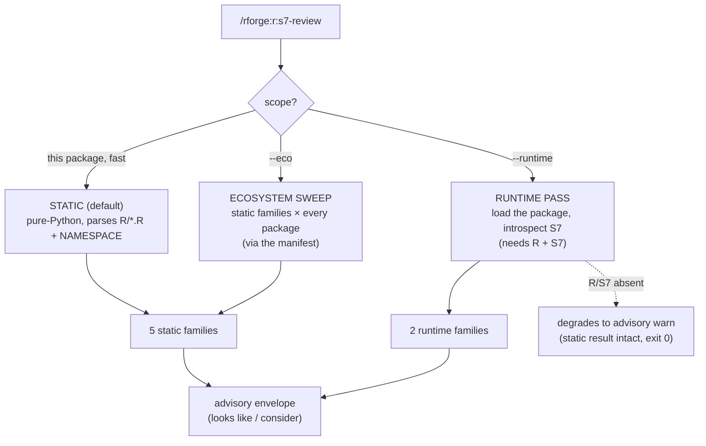

# 🧬 S7 convention checking — `r:s7-review`

!!! tip "TL;DR (30 seconds)"
    - **What:** `r:s7-review` audits [S7](https://rconsortium.github.io/S7/) (the modern R
      OOP system) for convention issues — naming, validators, methods, legacy leftovers,
      and docs.
    - **Static (default):** pure-Python, no R — parses `R/*.R` + `NAMESPACE`. Fast,
      runs anywhere.
    - **`--eco`:** sweep the static families across **every package** in your ecosystem
      manifest, with a per-package + roll-up report.
    - **`--runtime`:** an R-backed pass that *loads* the package and introspects S7 at
      runtime — catches dead generics, non-enforcing validators, and unreachable methods
      that source parsing can't see.
    - **Always advisory** — worded "looks like / consider", never "must"; exit 0 always.
    - **Next:** [R package dev cycle](r-dev-cycle.md) to fix and re-check.

> **For whom:** Author of an R package (or ecosystem) that uses S7 classes/generics.
> **Estimated time:** 10 minutes.
> **Prior knowledge:** A package using S7, registered with `/rforge:init`. `--runtime`
> additionally needs R + the `S7`/`pkgload` packages installed.

---

## The three modes



## The families

| Family | Mode | Example finding codes |
|---|---|---|
| naming | static | `class_name_case`, `generic_name_case`, `prop_name_case` |
| validators | static | `missing_validator`, `validator_return_shape` |
| methods | static | `dangling_method`, `missing_methods_register` |
| legacy | static | `legacy_s4_in_s7`, `legacy_r5_in_s7`, `legacy_s3_generic` |
| docs | static | `undocumented_export`, `prop_type_unresolvable` |
| method-dispatch | `--runtime` | `dead_generic`, `method_on_missing_class` |
| validator-runtime | `--runtime` | `validator_not_enforcing` |

## Walkthrough

### 1. Static review (the default)

```bash
# Audit the current package — pure-Python, no R needed
/rforge:r:s7-review

# A specific package, JSON for tooling
/rforge:r:s7-review path/to/pkg --format json
```

### 2. Ecosystem sweep — `--eco`

```bash
# Run the static families across every package in the manifest
/rforge:r:s7-review --eco
```

Packages are ordered by the manifest's `manifest_order`; a package that fails to parse
becomes a per-package `warn` and never aborts the sweep.

### 3. Runtime pass — `--runtime`

```bash
# Load the package and introspect S7 at runtime
/rforge:r:s7-review --runtime

# Compose: sweep the ecosystem AND run the runtime pass per package
/rforge:r:s7-review --eco --runtime
```

The runtime pass adds three checks source parsing can't make:

- **`dead_generic`** — an S7 generic with **no registered method** (dispatch can never resolve).
- **`validator_not_enforcing`** — a validator whose body is a constant no-op, so it accepts
  a deliberately-invalid property value at runtime (present, but not actually enforcing).
- **`method_on_missing_class`** — a method whose dispatch class has **no resolvable
  namespace binding** (e.g. an inline `new_class()` left in a `method()` call) — nothing
  can ever construct that class, so the method is unreachable.

!!! note "Runtime degrades gracefully"
    `--runtime` needs R + S7 + `pkgload`. When they're absent (or load fails), the runtime
    stages degrade to advisory `warn` ("runtime pass skipped: …") — the static result is
    always intact and the command always exits 0.

!!! tip "Why object identity, not name"
    `method_on_missing_class` resolves classes by **object identity** over the package's
    classes, not by `@name` — so the idiomatic `Foo <- new_class("Bar")` (binding name ≠
    `@name`) is correctly **not** flagged. Base types and imported classes are also excluded.

## See also

- [`s7review` reference](../reference/s7review.md) — the `lib.s7review` engine + family details
- [`rcmd` reference](../reference/rcmd.md) — the `s7runtime` R engine behind `--runtime`
- [Ecosystem orchestration](ecosystem-orchestration.md) — the `--eco` manifest model
- [R package dev cycle](r-dev-cycle.md) — fix findings, then re-review
