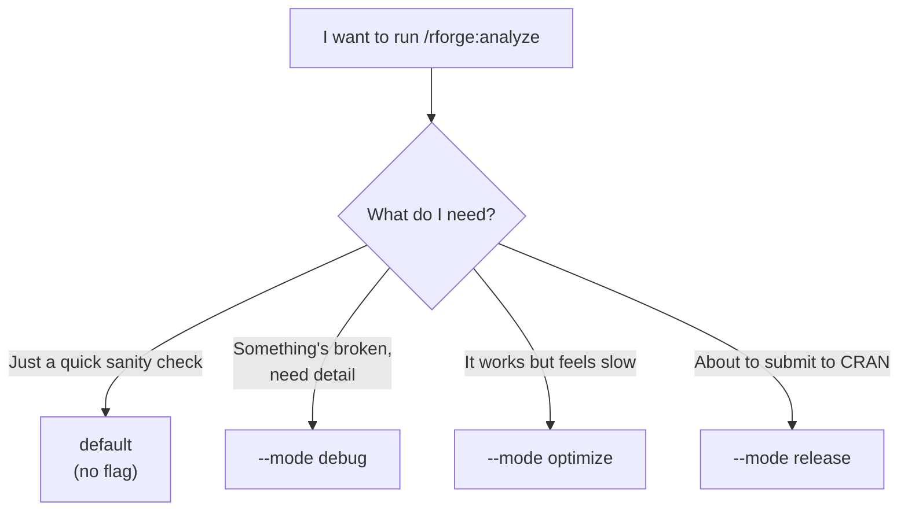

# 🎛️ Understanding modes

!!! tip "TL;DR (30 seconds)"
    - **What:** "Modes" are four depth settings for **one command** — `/rforge:analyze`.
    - **Why:** Same command, dial how deep (and how slow) the analysis goes.
    - **How:** `/rforge:analyze` = fast default. Add `--mode debug` / `optimize` / `release` to go deeper.
    - **The catch:** *Only* `/rforge:analyze` has modes. `/rforge:quick`, `/rforge:status`, and the rest do not.

> **For whom:** Anyone confused by the `--mode` flag (you are not alone —
> this is the most common rforge question).
> **Estimated time:** 5 minutes.

## The one thing to understand first

**A "mode" is just how deep you want `/rforge:analyze` to dig.**

Think of it like a camera:

- **default** = a quick snapshot (point and shoot, < 10 seconds)
- **debug** = zoom in to inspect every detail
- **optimize** = a stopwatch — measure what's *slow*
- **release** = a full inspection before you hand it to someone else (CRAN)

Same camera (`/rforge:analyze`), four settings. You pick the setting with
the `--mode` flag — or you pick nothing and get the fast default.

!!! warning "Modes belong to ONE command"
    This is the part that trips people up. **Only `/rforge:analyze` has
    modes.** `/rforge:quick` is *always* fast. `/rforge:status` is *always*
    a snapshot. They ignore `--mode` entirely. If you find yourself typing
    `/rforge:status --mode debug`, you want `/rforge:analyze --mode debug`
    instead.

## The four modes

| Mode | Plain-English question it answers | Speed | Needs R? |
|---|---|---|---|
| **default** | "Quick — is anything obviously wrong?" | < 10s | no |
| **debug** | "Something's broken — show me *why*, in detail." | < 2 min | no¹ |
| **optimize** | "What's *slow*? Where are the bottlenecks?" | < 3 min | **yes** |
| **release** | "Is this *actually ready* to ship to CRAN?" | < 5 min | **yes** |

¹ debug reads more files and runs the deps graph, but still pure-Python.
optimize and release shell out to R (profiling / `R CMD check`).

## When would I use each? (decision guide)



In words:

- **You made a change and want to make sure nothing obvious broke** →
  `default`. Just run `/rforge:analyze "what I changed"`. No flag.
- **A test is failing and you don't know why** → `--mode debug`. It reads
  every file, traces the full dependency tree, and surfaces root causes.
- **The package loads slowly or a function is sluggish** → `--mode optimize`.
  It profiles your R code and reports the top bottlenecks.
- **You're preparing a CRAN submission** → `--mode release`. It runs the
  `R CMD check`-equivalent validation and gives you a readiness score.

## You usually don't even type the flag

`/rforge:analyze` reads your description and **infers** the mode from
context words. All three of these pick the right mode automatically:

```bash
/rforge:analyze "why are tests failing?"        # → infers debug
/rforge:analyze "the package loads slowly"      # → infers optimize
/rforge:analyze "prepare for CRAN submission"   # → infers release
/rforge:analyze "updated the bootstrap code"    # → stays default
```

So in practice: **describe what you're doing in plain words, and let rforge
choose.** The explicit `--mode` flag is there for when you want to force a
specific depth regardless of wording.

## "But which command should I use at all?"

Modes are a within-`analyze` choice. Here's the bigger picture of which
*command* to reach for — most of the time you won't touch modes:

| Situation | Command | Mode? |
|---|---|---|
| Pre-commit, "is it healthy?" | `/rforge:quick` | n/a — always fast |
| Daily dashboard | `/rforge:status` | n/a — always fast |
| After a change, "what's the impact?" | `/rforge:analyze "..."` | default (auto) |
| Chasing a bug | `/rforge:analyze "..."` | debug (auto/flag) |
| Pre-CRAN, full validation | `/rforge:thorough` | n/a — its own flow |

!!! abstract "Honest simplification"
    For 90% of daily work you only need **`/rforge:quick`** (snapshot) and
    **`/rforge:analyze "what changed"`** (default mode). Reach for the
    explicit `--mode` flag only when the default isn't deep enough. Don't
    overthink it.

## Common confusion, cleared up

| You thought… | Actually… |
|---|---|
| "Every command has modes" | Only `/rforge:analyze` does. |
| "`/rforge:status --mode release` does a CRAN check" | `status` ignores `--mode`. Use `/rforge:analyze --mode release` or `/rforge:thorough`. |
| "I must pick a mode every time" | No — default is automatic. Just run `/rforge:analyze "..."`. |
| "`optimize` checks my code style" | No — it profiles *speed* (bottlenecks, load time), not style. |
| "More mode = always better" | No — deeper modes are slower. Use the lightest one that answers your question. |

## What's next

- **[Getting started](getting-started.md)** — the basic install + first
  commands, if you skipped it.
- **[rforge in the R package lifecycle](rforge-in-the-r-lifecycle.md)** —
  where `/rforge:analyze` fits among your other R tools.
- **[REFCARD](../REFCARD.md)** — every command at a glance.
