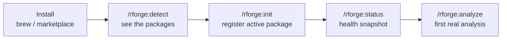
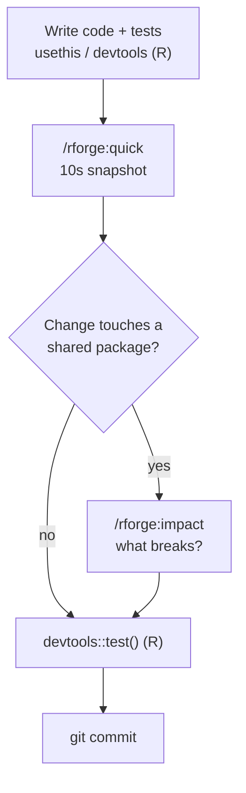
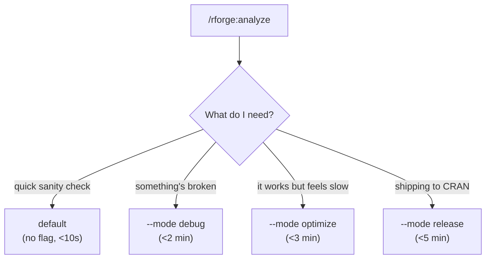
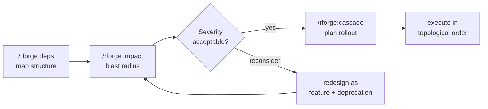
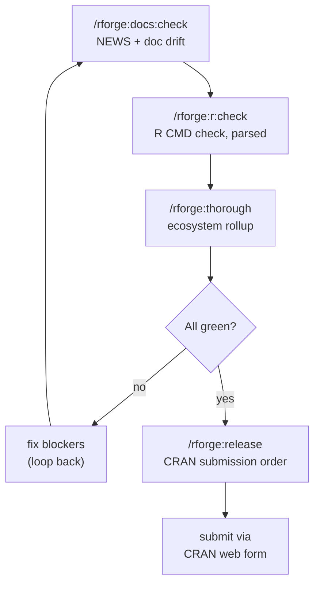
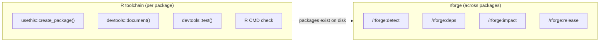

# 📊 Visual Workflows

!!! tip "TL;DR (30 seconds)"
    - **What:** Every rforge workflow as a diagram, on one page.
    - **Why:** Visual learners (and anyone) can see the whole shape before reading the steps.
    - **How:** Find your scenario below → follow the diagram → click through to the matching tutorial.
    - **Next:** [Tutorials](../tutorials/README.md) for the step-by-step versions.

This page collects the rforge workflows as diagrams. Each one links to the
tutorial that walks it through in detail.

## 🚀 First-time onboarding

From zero to your first analysis.

→ [Getting started](../tutorials/getting-started.md) (~10 min)

## 🔁 Daily development loop

The habit: change code with R tools, check the ecosystem with rforge.

→ [rforge in the R package lifecycle](../tutorials/rforge-in-the-r-lifecycle.md) (~12 min)

## 🎛️ Choosing analysis depth (modes)

One command, four depths — let context pick, or force it with `--mode`.

→ [Understanding modes](../tutorials/understanding-modes.md) (~5 min)

## 🔗 Ecosystem orchestration

Map → assess → plan, for multi-package changes.

→ [Ecosystem orchestration](../tutorials/ecosystem-orchestration.md) (~15 min)

## 📦 CRAN release pipeline

Drift check → R CMD check → rollup → submission order.

→ [CRAN release prep](../tutorials/cran-release-prep.md) (~15 min)

## How rforge fits with R's own tools

The boundary in one picture: R tools build a package; rforge orchestrates
the set.

→ [rforge in the R package lifecycle](../tutorials/rforge-in-the-r-lifecycle.md)

## See also

- **[Tutorials](../tutorials/README.md)** — step-by-step versions of every workflow above
- **[REFCARD](../REFCARD.md)** — all 28 commands on one page
- **[Architecture](../architecture.md)** — how the plugin's internals fit together
