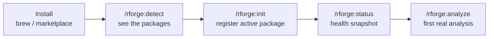
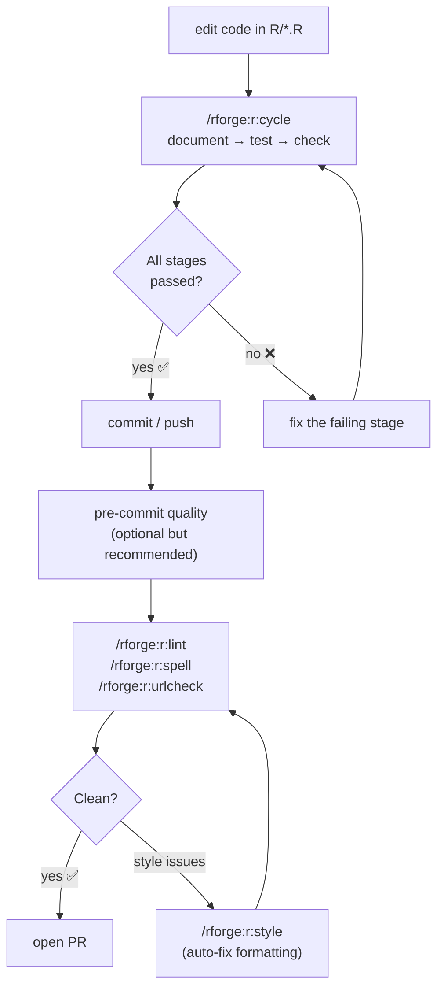
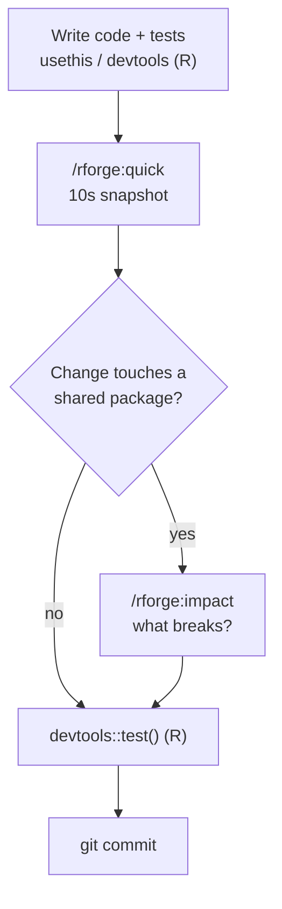
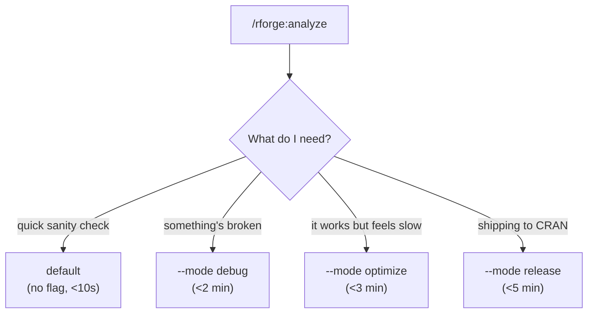
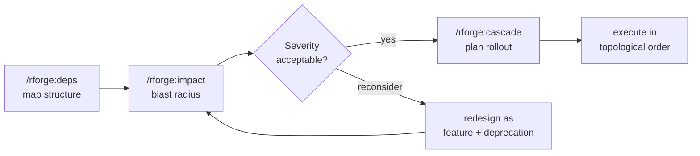
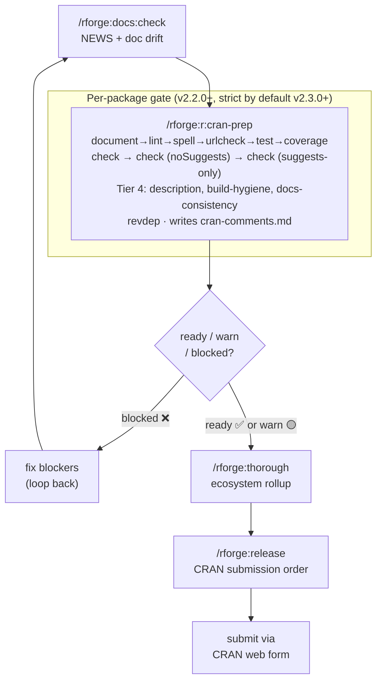
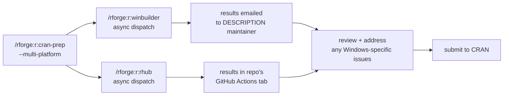
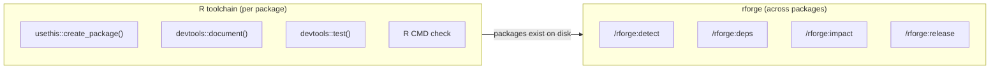

# 📊 Visual Workflows

!!! tip "TL;DR (30 seconds)"
    - **What:** Every rforge workflow as a diagram, on one page.
    - **Why:** Visual learners (and anyone) can see the whole shape before reading the steps.
    - **How:** Find your scenario below → follow the diagram → click through to the matching tutorial.
    - **Next:** [Tutorials](../tutorials/README.md) for the step-by-step versions.

This page collects the rforge workflows as diagrams. Each one links to the
tutorial that walks it through in detail.

## 🚀 First-time onboarding

From zero to your first analysis.

→ [Getting started](../tutorials/getting-started.md) (~10 min)

## 🔁 R package dev cycle

The inner loop: every code change runs through these `r:` commands.

→ [R package dev cycle](../tutorials/r-dev-cycle.md) (~10 min)

## 🔁 Ecosystem daily loop

The habit: change code with R tools, check the ecosystem with rforge.

→ [rforge in the R package lifecycle](../tutorials/rforge-in-the-r-lifecycle.md) (~12 min)

## 🎛️ Choosing analysis depth (modes)

One command, four depths — let context pick, or force it with `--mode`.

→ [Understanding modes](../tutorials/understanding-modes.md) (~5 min)

## 🔗 Ecosystem orchestration

Map → assess → plan, for multi-package changes.

→ [Ecosystem orchestration](../tutorials/ecosystem-orchestration.md) (~15 min)

## 📦 CRAN release pipeline

Per-package gate → ecosystem rollup → submission order.

→ [CRAN submission with rforge](../tutorials/cran-submission-with-rforge.md) (~15 min, per-package gate)
→ [CRAN release prep](../tutorials/cran-release-prep.md) (~15 min, ecosystem pipeline)

!!! warning "Strict passes block `ready` (v2.3.0+)"
    As of v2.3.0 the gate runs two Suggests-withholding flavor passes — `check (noSuggests)` and `check (suggests-only)` — **by default**, each with `--run-donttest`, and a strict ERROR blocks the `ready` verdict. A package that was 🟢 `ready` under `--as-cran` can now turn 🔴 once the noSuggests pass catches a `Suggests` package used unconditionally. The Tier 4 stages (`description`, `build-hygiene`, `docs-consistency`, backed by `lib/cranlint.py`) are advisory and never block on their own. Add `--incoming` for the opt-in CRAN-incoming `_R_CHECK_*` pass.

## 🌐 Multi-platform verification (optional)

Async dispatch to win-builder and R-hub before CRAN submission.

→ [CRAN submission — multi-platform section](../tutorials/cran-submission-with-rforge.md)

## How rforge fits with R's own tools

The boundary in one picture: R tools build a package; rforge orchestrates
the set.

→ [rforge in the R package lifecycle](../tutorials/rforge-in-the-r-lifecycle.md)

## See also

- **[Tutorials](../tutorials/README.md)** — step-by-step versions of every workflow above
- **[REFCARD](../REFCARD.md)** — all 33 commands on one page
- **[Architecture](../architecture.md)** — how the plugin's internals fit together
